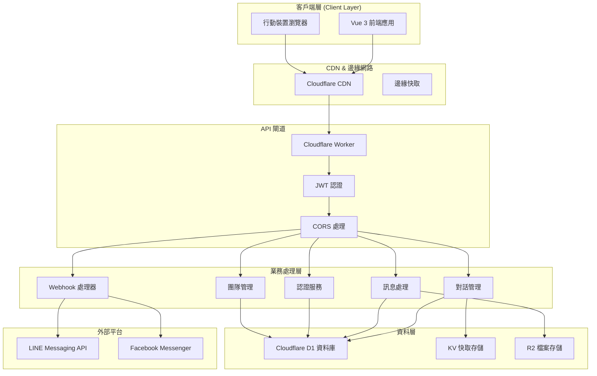
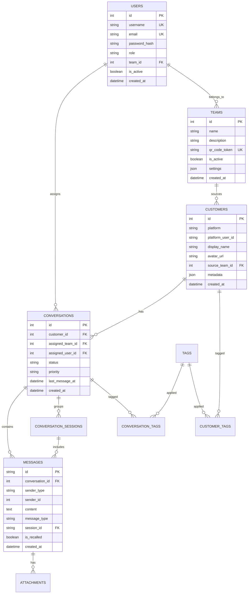
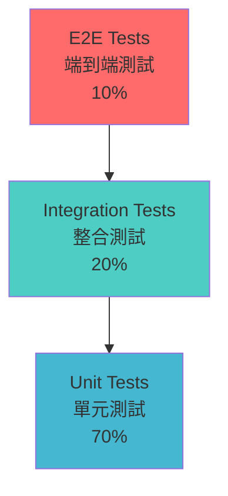
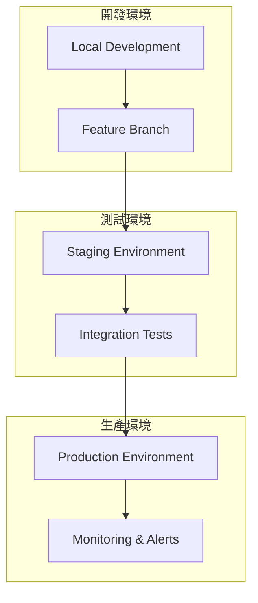
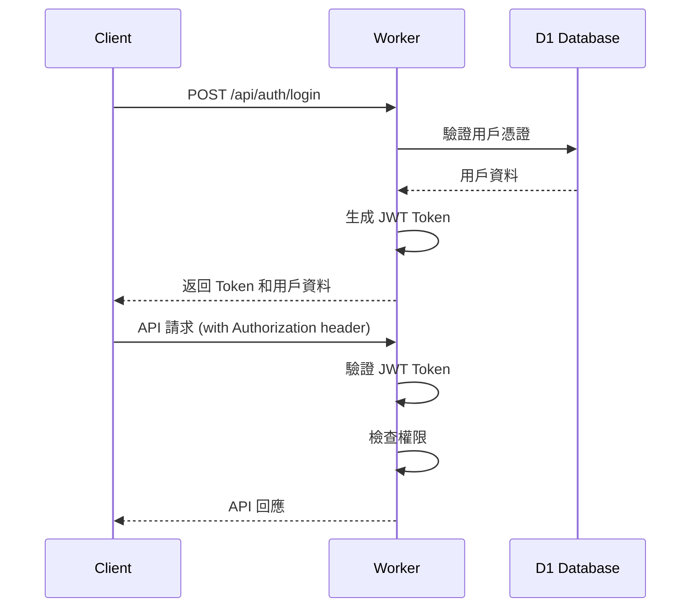
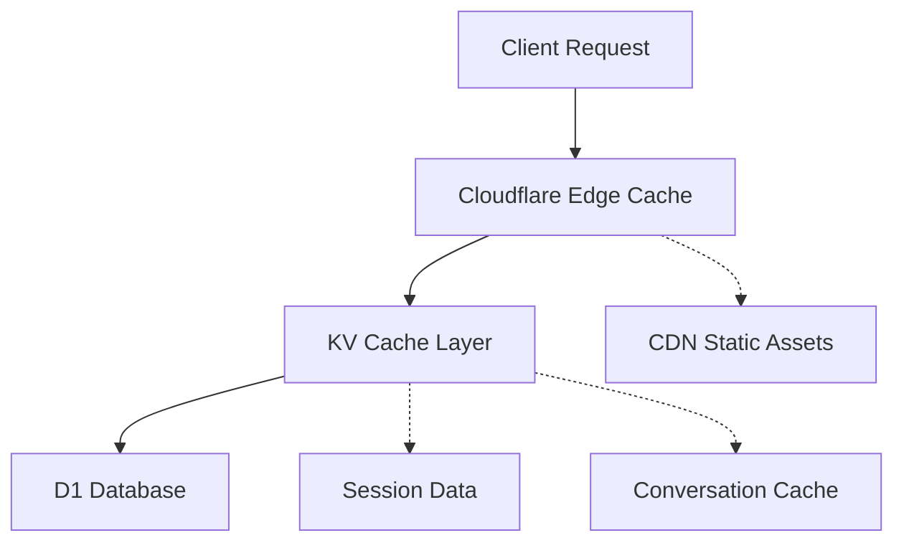

# 設計文檔 (Design Document)

## 概述 (Overview)

多渠道客服系統 MVP 採用現代化的邊緣計算架構，結合 Vue 3 + TypeScript 前端和 Cloudflare Workers 後端，提供高性能、可擴展的客服解決方案。系統設計基於現有的技術棧和架構，確保代碼的可維護性和業務邏輯的清晰性。

### 核心設計原則

1. **邊緣優先**：利用 Cloudflare Workers 的全球邊緣網路，提供低延遲服務
2. **無狀態設計**：所有服務組件無狀態，支援水平擴展
3. **平台抽象**：統一的平台適配器模式，支援多渠道整合
4. **安全第一**：JWT 認證、HTTPS 強制、輸入驗證和 CORS 保護
5. **響應式架構**：前端響應式設計，支援多設備訪問

## 系統架構 (Architecture)

### 整體架構圖



### 技術棧

#### 前端技術棧
- **Vue 3**: 現代化響應式框架，使用 Composition API
- **TypeScript**: 強型別支援，提升代碼品質
- **Pinia**: 狀態管理
- **Vue Router**: 路由管理
- **Vite**: 快速構建工具
- **原生 CSS**: 無框架依賴的樣式設計

#### 後端技術棧
- **Cloudflare Workers**: 邊緣計算平台
- **Hono**: 輕量級 Web 框架
- **TypeScript**: 統一語言棧
- **Cloudflare D1**: SQLite 相容的分散式資料庫
- **Cloudflare KV**: 鍵值存儲
- **Cloudflare R2**: 物件存儲

## 🧩 組件與介面 (Components and Interfaces)

### 前端組件架構

```
frontend/
├── src/
│   ├── views/                    # 頁面組件
│   │   ├── Dashboard.vue         # 儀表板
│   │   ├── Conversations.vue     # 對話列表
│   │   ├── ChatRoom.vue          # 聊天室
│   │   ├── Customers.vue         # 客戶管理
│   │   ├── Teams.vue             # 團隊管理
│   │   ├── Settings.vue          # 系統設定
│   │   └── Reports.vue           # 報表分析
│   ├── components/               # 共用組件
│   │   ├── common/               # 通用組件
│   │   │   ├── Layout.vue        # 佈局組件
│   │   │   ├── Sidebar.vue       # 側邊欄
│   │   │   ├── Header.vue        # 頂部導航
│   │   │   └── Loading.vue       # 載入組件
│   │   ├── chat/                 # 聊天相關組件
│   │   │   ├── MessageList.vue   # 訊息列表
│   │   │   ├── MessageInput.vue  # 訊息輸入
│   │   │   ├── FileUpload.vue    # 檔案上傳
│   │   │   └── EmojiPicker.vue   # 表情選擇
│   │   ├── customer/             # 客戶相關組件
│   │   │   ├── CustomerCard.vue  # 客戶卡片
│   │   │   ├── CustomerInfo.vue  # 客戶資訊
│   │   │   └── TagManager.vue    # 標籤管理
│   │   └── forms/                # 表單組件
│   │       ├── LoginForm.vue     # 登入表單
│   │       ├── UserForm.vue      # 用戶表單
│   │       └── TeamForm.vue      # 團隊表單
│   ├── stores/                   # Pinia 狀態管理
│   │   ├── auth.ts               # 認證狀態
│   │   ├── conversations.ts      # 對話狀態
│   │   ├── messages.ts           # 訊息狀態
│   │   ├── customers.ts          # 客戶狀態
│   │   └── teams.ts              # 團隊狀態
│   ├── api/                      # API 呼叫
│   │   ├── auth.ts               # 認證 API
│   │   ├── conversations.ts      # 對話 API
│   │   ├── messages.ts           # 訊息 API
│   │   ├── customers.ts          # 客戶 API
│   │   └── teams.ts              # 團隊 API
│   ├── types/                    # TypeScript 類型定義
│   │   ├── auth.ts               # 認證類型
│   │   ├── conversation.ts       # 對話類型
│   │   ├── message.ts            # 訊息類型
│   │   ├── customer.ts           # 客戶類型
│   │   └── team.ts               # 團隊類型
│   └── utils/                    # 工具函數
│       ├── api.ts                # API 工具
│       ├── auth.ts               # 認證工具
│       ├── date.ts               # 日期工具
│       └── validation.ts         # 驗證工具
```

### 後端服務架構

```
worker/
├── src/
│   ├── handlers/                 # 請求處理器
│   │   ├── auth.ts               # 認證處理
│   │   ├── webhook.ts            # Webhook 處理
│   │   ├── conversation.ts       # 對話處理
│   │   ├── message.ts            # 訊息處理
│   │   └── admin.ts              # 管理功能
│   ├── services/                 # 業務服務
│   │   ├── AuthService.ts        # 認證服務
│   │   ├── ConversationService.ts # 對話服務
│   │   ├── MessageService.ts     # 訊息服務
│   │   ├── CustomerService.ts    # 客戶服務
│   │   ├── TeamService.ts        # 團隊服務
│   │   └── IntegrationService.ts # 整合服務
│   ├── integrations/             # 平台整合
│   │   ├── PlatformAdapter.ts    # 平台適配器基類
│   │   ├── LineAdapter.ts        # LINE 適配器
│   │   ├── FacebookAdapter.ts    # Facebook 適配器
│   │   └── PlatformFactory.ts    # 平台工廠
│   ├── middleware/               # 中間件
│   │   ├── auth.ts               # 認證中間件
│   │   ├── cors.ts               # CORS 中間件
│   │   ├── rateLimit.ts          # 限流中間件
│   │   └── validation.ts         # 驗證中間件
│   ├── db/                       # 資料庫操作
│   │   ├── repositories/         # 資料存取層
│   │   │   ├── UserRepository.ts # 用戶資料存取
│   │   │   ├── ConversationRepository.ts # 對話資料存取
│   │   │   ├── MessageRepository.ts # 訊息資料存取
│   │   │   └── CustomerRepository.ts # 客戶資料存取
│   │   ├── migrations/           # 資料庫遷移
│   │   └── seeds/                # 測試資料
│   └── types/                    # 共用類型定義
│       ├── api.ts                # API 類型
│       ├── database.ts           # 資料庫類型
│       └── platform.ts           # 平台類型
```

### 核心介面定義

#### 平台適配器介面

```typescript
interface PlatformAdapter {
  platform: Platform;
  
  // 訊息處理
  processIncomingMessage(webhook: WebhookPayload): Promise<ProcessedMessage>;
  sendMessage(message: OutgoingMessage): Promise<SendResult>;
  
  // 用戶資訊
  getUserProfile(platformUserId: string): Promise<UserProfile>;
  
  // Webhook 驗證
  verifyWebhook(signature: string, body: string): boolean;
  
  // 平台特定功能
  getPlatformCapabilities(): PlatformCapabilities;
}
```

#### 訊息服務介面

```typescript
interface MessageService {
  // 發送訊息
  sendMessage(conversationId: number, content: MessageContent, senderId: number): Promise<Message>;
  
  // 接收訊息
  receiveMessage(platformMessage: PlatformMessage): Promise<Message>;
  
  // 訊息撤回
  recallMessage(messageId: string, userId: number): Promise<RecallResult>;
  
  // 獲取訊息歷史
  getMessageHistory(conversationId: number, pagination: Pagination): Promise<Message[]>;
  
  // 訊息搜尋
  searchMessages(query: SearchQuery): Promise<SearchResult>;
}
```

#### 對話服務介面

```typescript
interface ConversationService {
  // 創建對話
  createConversation(customerId: number, platform: Platform): Promise<Conversation>;
  
  // 指派對話
  assignConversation(conversationId: number, assigneeId: number): Promise<void>;
  
  // 轉移對話
  transferConversation(conversationId: number, fromId: number, toId: number): Promise<void>;
  
  // 獲取對話列表
  getConversations(userId: number, filters: ConversationFilters): Promise<Conversation[]>;
  
  // 更新對話狀態
  updateConversationStatus(conversationId: number, status: ConversationStatus): Promise<void>;
}
```

## 📊 資料模型 (Data Models)

### 核心實體關係圖



### 資料模型詳細設計

#### 用戶模型 (User Model)

```typescript
interface User {
  id: number;
  username: string;
  email: string;
  passwordHash: string;
  role: 'admin' | 'manager' | 'agent';
  teamId?: number;
  isActive: boolean;
  avatarUrl?: string;
  lastLoginAt?: Date;
  createdAt: Date;
  updatedAt: Date;
  
  // 關聯
  team?: Team;
  assignedConversations?: Conversation[];
}
```

#### 對話模型 (Conversation Model)

```typescript
interface Conversation {
  id: number;
  customerId: number;
  assignedTeamId?: number;
  assignedUserId?: number;
  status: 'active' | 'closed' | 'pending' | 'transferred';
  priority: 'low' | 'normal' | 'high' | 'urgent';
  subject?: string;
  lastMessageAt?: Date;
  closedAt?: Date;
  metadata?: Record<string, any>;
  createdAt: Date;
  updatedAt: Date;
  
  // 關聯
  customer: Customer;
  assignedTeam?: Team;
  assignedUser?: User;
  messages: Message[];
  sessions: ConversationSession[];
  tags: Tag[];
}
```

#### 訊息模型 (Message Model)

```typescript
interface Message {
  id: string;
  conversationId: number;
  senderType: 'customer' | 'agent' | 'system';
  senderId?: number;
  content: string;
  messageType: 'text' | 'image' | 'video' | 'audio' | 'file' | 'location' | 'sticker';
  platformMessageId?: string;
  direction: 'inbound' | 'outbound';
  replyToMessageId?: string;
  threadId?: string;
  sessionId?: string;
  sessionSequence?: number;
  isRecalled: boolean;
  recallDeadline?: Date;
  recalledAt?: Date;
  isSent: boolean;
  sentAt?: Date;
  deliveryStatus: 'pending' | 'sent' | 'delivered' | 'failed';
  metadata?: Record<string, any>;
  createdAt: Date;
  
  // 關聯
  conversation: Conversation;
  sender?: User;
  replyToMessage?: Message;
  session?: ConversationSession;
  attachments: Attachment[];
}
```

### 資料存取層設計

#### Repository 模式

```typescript
abstract class BaseRepository<T> {
  constructor(protected db: D1Database) {}
  
  abstract findById(id: number | string): Promise<T | null>;
  abstract create(data: Partial<T>): Promise<T>;
  abstract update(id: number | string, data: Partial<T>): Promise<T>;
  abstract delete(id: number | string): Promise<void>;
  abstract findAll(filters?: Record<string, any>): Promise<T[]>;
}

class ConversationRepository extends BaseRepository<Conversation> {
  async findByCustomerId(customerId: number): Promise<Conversation[]> {
    const result = await this.db.prepare(`
      SELECT * FROM conversations 
      WHERE customer_id = ? 
      ORDER BY last_message_at DESC
    `).bind(customerId).all();
    
    return result.results as Conversation[];
  }
  
  async findActiveByUserId(userId: number): Promise<Conversation[]> {
    const result = await this.db.prepare(`
      SELECT * FROM conversations 
      WHERE assigned_user_id = ? AND status = 'active'
      ORDER BY last_message_at DESC
    `).bind(userId).all();
    
    return result.results as Conversation[];
  }
}
```

## 🛡️ 錯誤處理 (Error Handling)

### 錯誤分類與處理策略

#### 1. 業務邏輯錯誤

```typescript
class BusinessError extends Error {
  constructor(
    message: string,
    public code: string,
    public statusCode: number = 400
  ) {
    super(message);
    this.name = 'BusinessError';
  }
}

// 使用範例
if (!conversation) {
  throw new BusinessError('對話不存在', 'CONVERSATION_NOT_FOUND', 404);
}
```

#### 2. 平台整合錯誤

```typescript
class PlatformError extends Error {
  constructor(
    message: string,
    public platform: Platform,
    public originalError?: Error
  ) {
    super(message);
    this.name = 'PlatformError';
  }
}

// 平台適配器中的錯誤處理
async sendMessage(message: OutgoingMessage): Promise<SendResult> {
  try {
    const response = await this.apiClient.post('/messages', message);
    return { success: true, messageId: response.data.id };
  } catch (error) {
    throw new PlatformError(
      `Failed to send message via ${this.platform}`,
      this.platform,
      error
    );
  }
}
```

#### 3. 全域錯誤處理中間件

```typescript
const errorHandler = async (c: Context, next: Next) => {
  try {
    await next();
  } catch (error) {
    console.error('Error:', error);
    
    if (error instanceof BusinessError) {
      return c.json({
        success: false,
        error: error.message,
        code: error.code
      }, error.statusCode);
    }
    
    if (error instanceof PlatformError) {
      return c.json({
        success: false,
        error: '平台整合錯誤',
        platform: error.platform
      }, 502);
    }
    
    // 未知錯誤
    return c.json({
      success: false,
      error: '系統內部錯誤'
    }, 500);
  }
};
```

### 錯誤監控與日誌

```typescript
class ErrorLogger {
  static async logError(error: Error, context: Record<string, any>) {
    const logEntry = {
      timestamp: new Date().toISOString(),
      error: {
        name: error.name,
        message: error.message,
        stack: error.stack
      },
      context,
      severity: this.getSeverity(error)
    };
    
    // 記錄到 KV 或外部日誌服務
    await this.writeToLog(logEntry);
    
    // 嚴重錯誤發送警報
    if (logEntry.severity === 'critical') {
      await this.sendAlert(logEntry);
    }
  }
  
  private static getSeverity(error: Error): 'low' | 'medium' | 'high' | 'critical' {
    if (error instanceof BusinessError) return 'medium';
    if (error instanceof PlatformError) return 'high';
    return 'critical';
  }
}
```

## 🧪 測試策略 (Testing Strategy)

### 測試金字塔



### 單元測試

```typescript
// 訊息服務測試範例
describe('MessageService', () => {
  let messageService: MessageService;
  let mockDb: jest.Mocked<D1Database>;
  
  beforeEach(() => {
    mockDb = createMockD1Database();
    messageService = new MessageService(mockDb);
  });
  
  describe('sendMessage', () => {
    it('should send text message successfully', async () => {
      // Arrange
      const conversationId = 1;
      const content = { text: 'Hello World' };
      const senderId = 1;
      
      mockDb.prepare.mockReturnValue({
        bind: jest.fn().mockReturnValue({
          run: jest.fn().mockResolvedValue({ success: true })
        })
      });
      
      // Act
      const result = await messageService.sendMessage(conversationId, content, senderId);
      
      // Assert
      expect(result).toBeDefined();
      expect(result.content).toBe('Hello World');
      expect(mockDb.prepare).toHaveBeenCalledWith(expect.stringContaining('INSERT INTO messages'));
    });
    
    it('should handle send failure', async () => {
      // Arrange
      mockDb.prepare.mockReturnValue({
        bind: jest.fn().mockReturnValue({
          run: jest.fn().mockRejectedValue(new Error('Database error'))
        })
      });
      
      // Act & Assert
      await expect(
        messageService.sendMessage(1, { text: 'Hello' }, 1)
      ).rejects.toThrow('Database error');
    });
  });
});
```

### 整合測試

```typescript
// 平台整合測試範例
describe('LINE Integration', () => {
  let lineAdapter: LineAdapter;
  let testServer: TestServer;
  
  beforeAll(async () => {
    testServer = await createTestServer();
    lineAdapter = new LineAdapter({
      channelSecret: 'test-secret',
      channelAccessToken: 'test-token'
    });
  });
  
  it('should process incoming LINE message', async () => {
    // Arrange
    const webhookPayload = createLineWebhookPayload({
      type: 'message',
      message: { type: 'text', text: 'Hello' }
    });
    
    // Act
    const result = await lineAdapter.processIncomingMessage(webhookPayload);
    
    // Assert
    expect(result.platform).toBe('line');
    expect(result.content.text).toBe('Hello');
    expect(result.sender.platformUserId).toBeDefined();
  });
});
```

### E2E 測試

```typescript
// 端到端測試範例
describe('Customer Service Flow', () => {
  let browser: Browser;
  let page: Page;
  
  beforeAll(async () => {
    browser = await chromium.launch();
    page = await browser.newPage();
  });
  
  it('should handle complete customer service flow', async () => {
    // 1. 客服登入
    await page.goto('/login');
    await page.fill('[data-testid=username]', 'agent1');
    await page.fill('[data-testid=password]', 'password');
    await page.click('[data-testid=login-button]');
    
    // 2. 查看對話列表
    await page.waitForSelector('[data-testid=conversation-list]');
    const conversations = await page.$$('[data-testid=conversation-item]');
    expect(conversations.length).toBeGreaterThan(0);
    
    // 3. 點擊對話進入聊天室
    await conversations[0].click();
    await page.waitForSelector('[data-testid=chat-room]');
    
    // 4. 發送回覆
    await page.fill('[data-testid=message-input]', 'Hello, how can I help you?');
    await page.click('[data-testid=send-button]');
    
    // 5. 驗證訊息已發送
    await page.waitForSelector('[data-testid=sent-message]');
    const sentMessage = await page.textContent('[data-testid=sent-message]');
    expect(sentMessage).toContain('Hello, how can I help you?');
  });
});
```

### 測試資料管理

```typescript
class TestDataFactory {
  static createUser(overrides: Partial<User> = {}): User {
    return {
      id: Math.floor(Math.random() * 1000),
      username: `user${Date.now()}`,
      email: `test${Date.now()}@example.com`,
      role: 'agent',
      isActive: true,
      createdAt: new Date(),
      updatedAt: new Date(),
      ...overrides
    };
  }
  
  static createConversation(overrides: Partial<Conversation> = {}): Conversation {
    return {
      id: Math.floor(Math.random() * 1000),
      customerId: 1,
      status: 'active',
      priority: 'normal',
      createdAt: new Date(),
      updatedAt: new Date(),
      ...overrides
    };
  }
  
  static createMessage(overrides: Partial<Message> = {}): Message {
    return {
      id: `msg_${Date.now()}`,
      conversationId: 1,
      senderType: 'customer',
      content: 'Test message',
      messageType: 'text',
      direction: 'inbound',
      isRecalled: false,
      isSent: true,
      deliveryStatus: 'delivered',
      createdAt: new Date(),
      ...overrides
    };
  }
}
```

## 🚀 部署與擴展 (Deployment and Scaling)

### 部署架構



### CI/CD 流程

```yaml
# .github/workflows/deploy.yml
name: Deploy Multi-Channel Platform System

on:
  push:
    branches: [main, develop]
  pull_request:
    branches: [main]

jobs:
  test:
    runs-on: ubuntu-latest
    steps:
      - uses: actions/checkout@v3
      - uses: actions/setup-node@v3
        with:
          node-version: '18'
      
      - name: Install dependencies
        run: |
          cd frontend && npm ci
          cd ../worker && npm ci
      
      - name: Run tests
        run: |
          cd frontend && npm run test
          cd ../worker && npm run test
      
      - name: Build
        run: |
          cd frontend && npm run build
          cd ../worker && npm run build

  deploy-staging:
    needs: test
    if: github.ref == 'refs/heads/develop'
    runs-on: ubuntu-latest
    steps:
      - uses: actions/checkout@v3
      
      - name: Deploy to Staging
        run: |
          cd worker
          npx wrangler deploy --env staging
          
      - name: Deploy Frontend to Staging
        run: |
          cd frontend
          npm run build:staging
          npx wrangler pages deploy dist --project-name multi-channel-platform-frontend-staging

  deploy-production:
    needs: test
    if: github.ref == 'refs/heads/main'
    runs-on: ubuntu-latest
    steps:
      - uses: actions/checkout@v3
      
      - name: Deploy to Production
        run: |
          cd worker
          npx wrangler deploy --env production
          
      - name: Deploy Frontend to Production
        run: |
          cd frontend
          npm run build:production
          npx wrangler pages deploy dist --project-name multi-channel-platform-frontend
```

### 擴展策略

#### 水平擴展

1. **Cloudflare Workers 自動擴展**
   - 基於請求量自動擴展
   - 全球邊緣節點部署
   - 零冷啟動時間

2. **資料庫擴展**
   - D1 自動分片
   - 讀寫分離
   - 快取層優化

#### 垂直擴展

1. **效能優化**
   - 查詢優化
   - 索引優化
   - 快取策略

2. **資源管理**
   - 記憶體使用優化
   - CPU 使用優化
   - 網路頻寬優化

### 監控與警報

```typescript
// 監控指標收集
class MetricsCollector {
  static async recordMetric(name: string, value: number, tags: Record<string, string> = {}) {
    const metric = {
      name,
      value,
      tags,
      timestamp: Date.now()
    };
    
    // 發送到監控服務
    await fetch('https://metrics.example.com/api/metrics', {
      method: 'POST',
      headers: { 'Content-Type': 'application/json' },
      body: JSON.stringify(metric)
    });
  }
  
  static async recordResponseTime(endpoint: string, duration: number) {
    await this.recordMetric('response_time', duration, { endpoint });
  }
  
  static async recordError(error: Error, context: Record<string, any>) {
    await this.recordMetric('error_count', 1, {
      error_type: error.name,
      ...context
    });
  }
}

// 使用範例
const startTime = Date.now();
try {
  const result = await messageService.sendMessage(conversationId, content, senderId);
  await MetricsCollector.recordResponseTime('/api/messages/send', Date.now() - startTime);
  return result;
} catch (error) {
  await MetricsCollector.recordError(error, { conversationId, senderId });
  throw error;
}
```

這個設計文檔提供了完整的系統架構設計，涵蓋了前後端架構、資料模型、錯誤處理、測試策略和部署方案。設計遵循現代軟體開發最佳實踐，確保系統的可維護性、可擴展性和高可用性。

## 安全性設計 (Security Design)

### 認證與授權

#### JWT 認證流程



#### 權限控制矩陣

| 功能 | Admin | Agent | 
|------|-------|-------|
| 查看對話列表 | ✅ | ✅ |
| 發送訊息 | ✅ | ✅ |
| 指派對話 | ✅ | ❌ |
| 團隊管理 | ✅ | ❌ |
| 系統設定 | ✅ | ❌ |

### 資料安全

#### 敏感資料處理

```typescript
// 密碼雜湊
import bcrypt from 'bcryptjs';

class PasswordService {
  static async hash(password: string): Promise<string> {
    const saltRounds = 12;
    return bcrypt.hash(password, saltRounds);
  }
  
  static async verify(password: string, hash: string): Promise<boolean> {
    return bcrypt.compare(password, hash);
  }
}

// Webhook 簽名驗證
class WebhookSecurity {
  static async verifyLineSignature(body: string, signature: string, secret: string): Promise<boolean> {
    const encoder = new TextEncoder();
    const key = await crypto.subtle.importKey(
      'raw',
      encoder.encode(secret),
      { name: 'HMAC', hash: 'SHA-256' },
      false,
      ['sign']
    );

    const signatureBuffer = await crypto.subtle.sign('HMAC', key, encoder.encode(body));
    const hash = btoa(String.fromCharCode(...new Uint8Array(signatureBuffer)));

    return hash === signature;
  }
}
```

## 效能優化設計 (Performance Optimization)

### 快取策略

#### 多層快取架構



#### 快取實現

```typescript
class CacheService {
  constructor(private kv: KVNamespace) {}
  
  async get<T>(key: string): Promise<T | null> {
    const cached = await this.kv.get(key);
    return cached ? JSON.parse(cached) : null;
  }
  
  async set<T>(key: string, value: T, ttl: number = 3600): Promise<void> {
    await this.kv.put(key, JSON.stringify(value), { expirationTtl: ttl });
  }
  
  async invalidate(pattern: string): Promise<void> {
    // 實現快取失效邏輯
    const keys = await this.kv.list({ prefix: pattern });
    await Promise.all(keys.keys.map(key => this.kv.delete(key.name)));
  }
}

// 使用範例
class ConversationService {
  constructor(private cache: CacheService, private db: D1Database) {}
  
  async getConversation(id: string): Promise<Conversation | null> {
    const cacheKey = `conversation:${id}`;
    
    // 先檢查快取
    let conversation = await this.cache.get<Conversation>(cacheKey);
    
    if (!conversation) {
      // 從資料庫查詢
      conversation = await this.db.prepare('SELECT * FROM conversations WHERE id = ?')
        .bind(id).first() as Conversation;
      
      if (conversation) {
        // 快取 5 分鐘
        await this.cache.set(cacheKey, conversation, 300);
      }
    }
    
    return conversation;
  }
}
```

### 資料庫優化

#### 索引策略

```sql
-- 對話查詢優化
CREATE INDEX idx_conversations_status_updated ON conversations(status, updated_at DESC);
CREATE INDEX idx_conversations_assigned_user ON conversations(assigned_user_id, status);

-- 訊息查詢優化
CREATE INDEX idx_messages_conversation_created ON messages(conversation_id, created_at DESC);
CREATE INDEX idx_messages_sender_type ON messages(sender_type, created_at DESC);

-- 用戶查詢優化
CREATE INDEX idx_users_platform_user ON users(platform, platform_user_id);
CREATE INDEX idx_users_email ON users(email);
```

#### 查詢優化

```typescript
class OptimizedQueries {
  // 分頁查詢對話列表
  static async getConversationsPaginated(
    db: D1Database, 
    page: number = 1, 
    pageSize: number = 20,
    filters: ConversationFilters = {}
  ): Promise<PaginatedResponse<Conversation>> {
    const offset = (page - 1) * pageSize;
    
    let whereClause = 'WHERE 1=1';
    const params: any[] = [];
    
    if (filters.status) {
      whereClause += ' AND status = ?';
      params.push(filters.status);
    }
    
    if (filters.assignedTo) {
      whereClause += ' AND assigned_user_id = ?';
      params.push(filters.assignedTo);
    }
    
    // 查詢總數
    const countQuery = `SELECT COUNT(*) as total FROM conversations ${whereClause}`;
    const countResult = await db.prepare(countQuery).bind(...params).first();
    const total = countResult?.total || 0;
    
    // 查詢資料
    const dataQuery = `
      SELECT c.*, u.name as customer_name, a.name as agent_name
      FROM conversations c
      LEFT JOIN customers u ON c.customer_id = u.id
      LEFT JOIN agents a ON c.assigned_user_id = a.id
      ${whereClause}
      ORDER BY c.last_message_at DESC
      LIMIT ? OFFSET ?
    `;
    
    const result = await db.prepare(dataQuery)
      .bind(...params, pageSize, offset)
      .all();
    
    return {
      items: result.results as Conversation[],
      total,
      page,
      pageSize
    };
  }
}
```

## 監控與可觀測性 (Monitoring and Observability)

### 指標收集

#### 業務指標

```typescript
class BusinessMetrics {
  static async recordConversationMetrics(conversation: Conversation) {
    const metrics = {
      'conversation.created': 1,
      'conversation.response_time': this.calculateResponseTime(conversation),
      'conversation.platform': conversation.customer?.platform || 'unknown'
    };
    
    await this.sendMetrics(metrics);
  }
  
  static async recordMessageMetrics(message: Message) {
    const metrics = {
      'message.sent': 1,
      'message.type': message.messageType,
      'message.platform': message.platform,
      'message.length': message.content.length
    };
    
    await this.sendMetrics(metrics);
  }
  
  private static async sendMetrics(metrics: Record<string, any>) {
    // 發送到監控系統
    console.log('Business Metrics:', metrics);
  }
}
```

#### 技術指標

```typescript
class TechnicalMetrics {
  static async recordApiMetrics(endpoint: string, duration: number, status: number) {
    const metrics = {
      'api.request.duration': duration,
      'api.request.count': 1,
      'api.request.status': status,
      'api.endpoint': endpoint
    };
    
    await this.sendMetrics(metrics);
  }
  
  static async recordDatabaseMetrics(query: string, duration: number) {
    const metrics = {
      'db.query.duration': duration,
      'db.query.count': 1,
      'db.query.type': this.getQueryType(query)
    };
    
    await this.sendMetrics(metrics);
  }
}
```

### 健康檢查

```typescript
class HealthCheck {
  static async checkSystem(env: Bindings): Promise<HealthStatus> {
    const checks = await Promise.allSettled([
      this.checkDatabase(env.DB),
      this.checkKV(env.SESSIONS),
      this.checkR2(env.R2_BUCKET),
      this.checkExternalAPIs(env)
    ]);
    
    const results = checks.map((check, index) => ({
      name: ['database', 'kv', 'r2', 'external_apis'][index],
      status: check.status === 'fulfilled' ? 'healthy' : 'unhealthy',
      details: check.status === 'fulfilled' ? check.value : check.reason
    }));
    
    const overallStatus = results.every(r => r.status === 'healthy') ? 'healthy' : 'unhealthy';
    
    return {
      status: overallStatus,
      timestamp: new Date().toISOString(),
      checks: results
    };
  }
  
  private static async checkDatabase(db: D1Database): Promise<string> {
    await db.prepare('SELECT 1').first();
    return 'Database connection successful';
  }
  
  private static async checkKV(kv: KVNamespace): Promise<string> {
    await kv.put('health_check', 'ok', { expirationTtl: 60 });
    const result = await kv.get('health_check');
    if (result !== 'ok') throw new Error('KV read/write failed');
    return 'KV storage operational';
  }
}

interface HealthStatus {
  status: 'healthy' | 'unhealthy';
  timestamp: string;
  checks: Array<{
    name: string;
    status: 'healthy' | 'unhealthy';
    details: any;
  }>;
}
```

這個設計文檔現在包含了完整的系統架構設計，涵蓋了安全性、效能優化、監控等關鍵方面，確保系統的可維護性、可擴展性和高可用性。