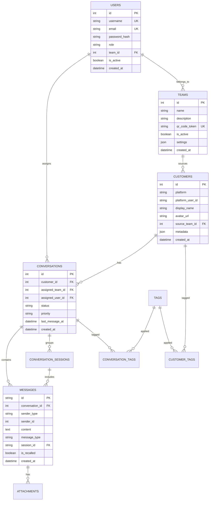
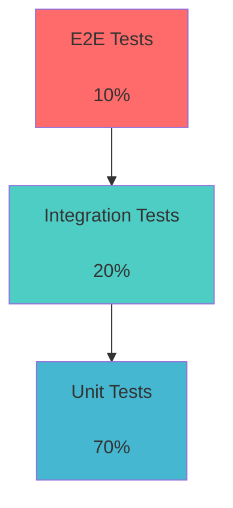
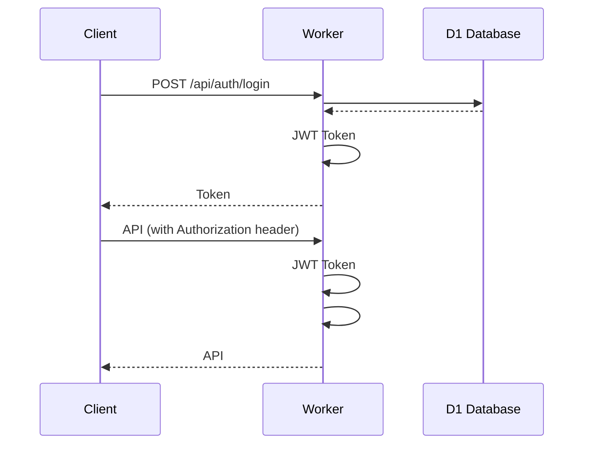
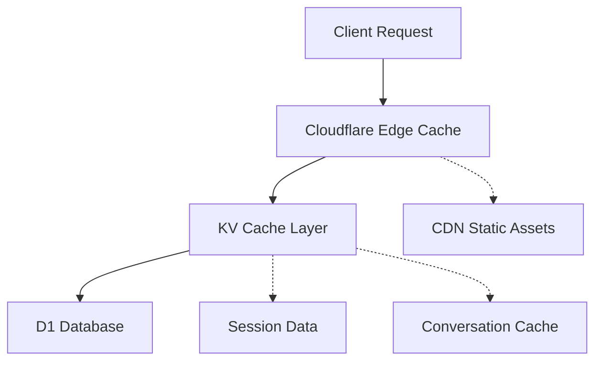

# (Design Document)

## (Overview)

 MVP Vue 3 + TypeScript Cloudflare Workers


1. **** Cloudflare Workers
2. ****
3. ****
4. ****JWT HTTPS CORS
5. ****

## (Architecture)


```mermaid
graph TB
 subgraph " (Client Layer)"
 A[Vue 3 ]
 B[]
 end

 subgraph "CDN & "
 C[Cloudflare CDN]
 D[]
 end

 subgraph "API "
 E[Cloudflare Worker]
 F[JWT ]
 G[CORS ]
 end

 subgraph ""
 H[Webhook ]
 I[]
 J[]
 K[]
 L[]
 end

 subgraph ""
 M[Cloudflare D1 ]
 N[KV ]
 O[R2 ]
 end

 subgraph ""
 P[LINE Messaging API]
 Q[Facebook Messenger]
 end

 A --> C
 B --> C
 C --> E
 E --> F
 F --> G
 G --> H
 G --> I
 G --> J
 G --> K
 G --> L

 H --> P
 H --> Q

 I --> M
 J --> M
 K --> M
 L --> M

 I --> N
 J --> O
```


- **Vue 3**: Composition API
- **TypeScript**:
- **Pinia**:
- **Vue Router**:
- **Vite**:
- ** CSS**:


- **Cloudflare Workers**:
- **Hono**: Web
- **TypeScript**:
- **Cloudflare D1**: SQLite
- **Cloudflare KV**:
- **Cloudflare R2**:

## (Components and Interfaces)


```
frontend/
 src/
 views/ #
 Dashboard.vue #
 Conversations.vue #
 ChatRoom.vue #
 Customers.vue #
 Teams.vue #
 Settings.vue #
 Reports.vue #
 components/ #
 common/ #
 Layout.vue #
 Sidebar.vue #
 Header.vue #
 Loading.vue #
 chat/ #
 MessageList.vue #
 MessageInput.vue #
 FileUpload.vue #
 EmojiPicker.vue #
 customer/ #
 CustomerCard.vue #
 CustomerInfo.vue #
 TagManager.vue #
 forms/ #
 LoginForm.vue #
 UserForm.vue #
 TeamForm.vue #
 stores/ # Pinia
 auth.ts #
 conversations.ts #
 messages.ts #
 customers.ts #
 teams.ts #
 api/ # API
 auth.ts # API
 conversations.ts # API
 messages.ts # API
 customers.ts # API
 teams.ts # API
 types/ # TypeScript
 auth.ts #
 conversation.ts #
 message.ts #
 customer.ts #
 team.ts #
 utils/ #
 api.ts # API
 auth.ts #
 date.ts #
 validation.ts #
```


```
worker/
 src/
 handlers/ #
 auth.ts #
 webhook.ts # Webhook
 conversation.ts #
 message.ts #
 admin.ts #
 services/ #
 AuthService.ts #
 ConversationService.ts #
 MessageService.ts #
 CustomerService.ts #
 TeamService.ts #
 IntegrationService.ts #
 integrations/ #
 PlatformAdapter.ts #
 LineAdapter.ts # LINE
 FacebookAdapter.ts # Facebook
 PlatformFactory.ts #
 middleware/ #
 auth.ts #
 cors.ts # CORS
 rateLimit.ts #
 validation.ts #
 db/ #
 repositories/ #
 UserRepository.ts #
 ConversationRepository.ts #
 MessageRepository.ts #
 CustomerRepository.ts #
 migrations/ #
 seeds/ #
 types/ #
 api.ts # API
 database.ts #
 platform.ts #
```


```typescript
interface PlatformAdapter {
 platform: Platform;

 //
 processIncomingMessage(webhook: WebhookPayload): Promise<ProcessedMessage>;
 sendMessage(message: OutgoingMessage): Promise<SendResult>;

 //
 getUserProfile(platformUserId: string): Promise<UserProfile>;

 // Webhook
 verifyWebhook(signature: string, body: string): boolean;

 //
 getPlatformCapabilities(): PlatformCapabilities;
}
```


```typescript
interface MessageService {
 //
 sendMessage(conversationId: number, content: MessageContent, senderId: number): Promise<Message>;

 //
 receiveMessage(platformMessage: PlatformMessage): Promise<Message>;

 //
 recallMessage(messageId: string, userId: number): Promise<RecallResult>;

 //
 getMessageHistory(conversationId: number, pagination: Pagination): Promise<Message[]>;

 //
 searchMessages(query: SearchQuery): Promise<SearchResult>;
}
```


```typescript
interface ConversationService {
 //
 createConversation(customerId: number, platform: Platform): Promise<Conversation>;

 //
 assignConversation(conversationId: number, assigneeId: number): Promise<void>;

 //
 transferConversation(conversationId: number, fromId: number, toId: number): Promise<void>;

 //
 getConversations(userId: number, filters: ConversationFilters): Promise<Conversation[]>;

 //
 updateConversationStatus(conversationId: number, status: ConversationStatus): Promise<void>;
}
```

## (Data Models)





#### (User Model)

```typescript
interface User {
 id: number;
 username: string;
 email: string;
 passwordHash: string;
 role: 'admin' | 'manager' | 'agent';
 teamId?: number;
 isActive: boolean;
 avatarUrl?: string;
 lastLoginAt?: Date;
 createdAt: Date;
 updatedAt: Date;

 //
 team?: Team;
 assignedConversations?: Conversation[];
}
```

#### (Conversation Model)

```typescript
interface Conversation {
 id: number;
 customerId: number;
 assignedTeamId?: number;
 assignedUserId?: number;
 status: 'active' | 'closed' | 'pending' | 'transferred';
 priority: 'low' | 'normal' | 'high' | 'urgent';
 subject?: string;
 lastMessageAt?: Date;
 closedAt?: Date;
 metadata?: Record<string, any>;
 createdAt: Date;
 updatedAt: Date;

 //
 customer: Customer;
 assignedTeam?: Team;
 assignedUser?: User;
 messages: Message[];
 sessions: ConversationSession[];
 tags: Tag[];
}
```

#### (Message Model)

```typescript
interface Message {
 id: string;
 conversationId: number;
 senderType: 'customer' | 'agent' | 'system';
 senderId?: number;
 content: string;
 messageType: 'text' | 'image' | 'video' | 'audio' | 'file' | 'location' | 'sticker';
 platformMessageId?: string;
 direction: 'inbound' | 'outbound';
 replyToMessageId?: string;
 threadId?: string;
 sessionId?: string;
 sessionSequence?: number;
 isRecalled: boolean;
 recallDeadline?: Date;
 recalledAt?: Date;
 isSent: boolean;
 sentAt?: Date;
 deliveryStatus: 'pending' | 'sent' | 'delivered' | 'failed';
 metadata?: Record<string, any>;
 createdAt: Date;

 //
 conversation: Conversation;
 sender?: User;
 replyToMessage?: Message;
 session?: ConversationSession;
 attachments: Attachment[];
}
```


#### Repository

```typescript
abstract class BaseRepository<T> {
 constructor(protected db: D1Database) {}

 abstract findById(id: number | string): Promise<T | null>;
 abstract create(data: Partial<T>): Promise<T>;
 abstract update(id: number | string, data: Partial<T>): Promise<T>;
 abstract delete(id: number | string): Promise<void>;
 abstract findAll(filters?: Record<string, any>): Promise<T[]>;
}

class ConversationRepository extends BaseRepository<Conversation> {
 async findByCustomerId(customerId: number): Promise<Conversation[]> {
 const result = await this.db.prepare(`
 SELECT * FROM conversations
 WHERE customer_id = ?
 ORDER BY last_message_at DESC
 `).bind(customerId).all();

 return result.results as Conversation[];
 }

 async findActiveByUserId(userId: number): Promise<Conversation[]> {
 const result = await this.db.prepare(`
 SELECT * FROM conversations
 WHERE assigned_user_id = ? AND status = 'active'
 ORDER BY last_message_at DESC
 `).bind(userId).all();

 return result.results as Conversation[];
 }
}
```

## (Error Handling)


#### 1.

```typescript
class BusinessError extends Error {
 constructor(
 message: string,
 public code: string,
 public statusCode: number = 400
 ) {
 super(message);
 this.name = 'BusinessError';
 }
}

//
if (!conversation) {
 throw new BusinessError('', 'CONVERSATION_NOT_FOUND', 404);
}
```

#### 2.

```typescript
class PlatformError extends Error {
 constructor(
 message: string,
 public platform: Platform,
 public originalError?: Error
 ) {
 super(message);
 this.name = 'PlatformError';
 }
}

//
async sendMessage(message: OutgoingMessage): Promise<SendResult> {
 try {
 const response = await this.apiClient.post('/messages', message);
 return { success: true, messageId: response.data.id };
 } catch (error) {
 throw new PlatformError(
 `Failed to send message via ${this.platform}`,
 this.platform,
 error
 );
 }
}
```

#### 3.

```typescript
const errorHandler = async (c: Context, next: Next) => {
 try {
 await next();
 } catch (error) {
 console.error('Error:', error);

 if (error instanceof BusinessError) {
 return c.json({
 success: false,
 error: error.message,
 code: error.code
 }, error.statusCode);
 }

 if (error instanceof PlatformError) {
 return c.json({
 success: false,
 error: '',
 platform: error.platform
 }, 502);
 }

 //
 return c.json({
 success: false,
 error: ''
 }, 500);
 }
};
```


```typescript
class ErrorLogger {
 static async logError(error: Error, context: Record<string, any>) {
 const logEntry = {
 timestamp: new Date().toISOString(),
 error: {
 name: error.name,
 message: error.message,
 stack: error.stack
 },
 context,
 severity: this.getSeverity(error)
 };

 // KV
 await this.writeToLog(logEntry);

 //
 if (logEntry.severity === 'critical') {
 await this.sendAlert(logEntry);
 }
 }

 private static getSeverity(error: Error): 'low' | 'medium' | 'high' | 'critical' {
 if (error instanceof BusinessError) return 'medium';
 if (error instanceof PlatformError) return 'high';
 return 'critical';
 }
}
```

## (Testing Strategy)





```typescript
//
describe('MessageService', () => {
 let messageService: MessageService;
 let mockDb: jest.Mocked<D1Database>;

 beforeEach(() => {
 mockDb = createMockD1Database();
 messageService = new MessageService(mockDb);
 });

 describe('sendMessage', () => {
 it('should send text message successfully', async () => {
 // Arrange
 const conversationId = 1;
 const content = { text: 'Hello World' };
 const senderId = 1;

 mockDb.prepare.mockReturnValue({
 bind: jest.fn().mockReturnValue({
 run: jest.fn().mockResolvedValue({ success: true })
 })
 });

 // Act
 const result = await messageService.sendMessage(conversationId, content, senderId);

 // Assert
 expect(result).toBeDefined();
 expect(result.content).toBe('Hello World');
 expect(mockDb.prepare).toHaveBeenCalledWith(expect.stringContaining('INSERT INTO messages'));
 });

 it('should handle send failure', async () => {
 // Arrange
 mockDb.prepare.mockReturnValue({
 bind: jest.fn().mockReturnValue({
 run: jest.fn().mockRejectedValue(new Error('Database error'))
 })
 });

 // Act & Assert
 await expect(
 messageService.sendMessage(1, { text: 'Hello' }, 1)
 ).rejects.toThrow('Database error');
 });
 });
});
```


```typescript
//
describe('LINE Integration', () => {
 let lineAdapter: LineAdapter;
 let testServer: TestServer;

 beforeAll(async () => {
 testServer = await createTestServer();
 lineAdapter = new LineAdapter({
 channelSecret: 'test-secret',
 channelAccessToken: 'test-token'
 });
 });

 it('should process incoming LINE message', async () => {
 // Arrange
 const webhookPayload = createLineWebhookPayload({
 type: 'message',
 message: { type: 'text', text: 'Hello' }
 });

 // Act
 const result = await lineAdapter.processIncomingMessage(webhookPayload);

 // Assert
 expect(result.platform).toBe('line');
 expect(result.content.text).toBe('Hello');
 expect(result.sender.platformUserId).toBeDefined();
 });
});
```

### E2E

```typescript
//
describe('Customer Service Flow', () => {
 let browser: Browser;
 let page: Page;

 beforeAll(async () => {
 browser = await chromium.launch();
 page = await browser.newPage();
 });

 it('should handle complete customer service flow', async () => {
 // 1.
 await page.goto('/login');
 await page.fill('[data-testid=username]', 'agent1');
 await page.fill('[data-testid=password]', 'password');
 await page.click('[data-testid=login-button]');

 // 2.
 await page.waitForSelector('[data-testid=conversation-list]');
 const conversations = await page.$$('[data-testid=conversation-item]');
 expect(conversations.length).toBeGreaterThan(0);

 // 3.
 await conversations[0].click();
 await page.waitForSelector('[data-testid=chat-room]');

 // 4.
 await page.fill('[data-testid=message-input]', 'Hello, how can I help you?');
 await page.click('[data-testid=send-button]');

 // 5.
 await page.waitForSelector('[data-testid=sent-message]');
 const sentMessage = await page.textContent('[data-testid=sent-message]');
 expect(sentMessage).toContain('Hello, how can I help you?');
 });
});
```


```typescript
class TestDataFactory {
 static createUser(overrides: Partial<User> = {}): User {
 return {
 id: Math.floor(Math.random() * 1000),
 username: `user${Date.now()}`,
 email: `test${Date.now()}@example.com`,
 role: 'agent',
 isActive: true,
 createdAt: new Date(),
 updatedAt: new Date(),
 ...overrides
 };
 }

 static createConversation(overrides: Partial<Conversation> = {}): Conversation {
 return {
 id: Math.floor(Math.random() * 1000),
 customerId: 1,
 status: 'active',
 priority: 'normal',
 createdAt: new Date(),
 updatedAt: new Date(),
 ...overrides
 };
 }

 static createMessage(overrides: Partial<Message> = {}): Message {
 return {
 id: `msg_${Date.now()}`,
 conversationId: 1,
 senderType: 'customer',
 content: 'Test message',
 messageType: 'text',
 direction: 'inbound',
 isRecalled: false,
 isSent: true,
 deliveryStatus: 'delivered',
 createdAt: new Date(),
 ...overrides
 };
 }
}
```

## (Deployment and Scaling)


```mermaid
graph TB
 subgraph ""
 A[Local Development]
 B[Feature Branch]
 end

 subgraph ""
 C[Staging Environment]
 D[Integration Tests]
 end

 subgraph ""
 E[Production Environment]
 F[Monitoring & Alerts]
 end

 A --> B
 B --> C
 C --> D
 D --> E
 E --> F
```

### CI/CD

```yaml
# .github/workflows/deploy.yml
name: Deploy Multi-Channel Platform System

on:
 push:
 branches: [main, develop]
 pull_request:
 branches: [main]

jobs:
 test:
 runs-on: ubuntu-latest
 steps:
 - uses: actions/checkout@v3
 - uses: actions/setup-node@v3
 with:
 node-version: '18'

 - name: Install dependencies
 run: |
 cd frontend && npm ci
 cd ../worker && npm ci

 - name: Run tests
 run: |
 cd frontend && npm run test
 cd ../worker && npm run test

 - name: Build
 run: |
 cd frontend && npm run build
 cd ../worker && npm run build

 deploy-staging:
 needs: test
 if: github.ref == 'refs/heads/develop'
 runs-on: ubuntu-latest
 steps:
 - uses: actions/checkout@v3

 - name: Deploy to Staging
 run: |
 cd worker
 npx wrangler deploy --env staging

 - name: Deploy Frontend to Staging
 run: |
 cd frontend
 npm run build:staging
 npx wrangler pages deploy dist --project-name multi-channel-platform-frontend-staging

 deploy-production:
 needs: test
 if: github.ref == 'refs/heads/main'
 runs-on: ubuntu-latest
 steps:
 - uses: actions/checkout@v3

 - name: Deploy to Production
 run: |
 cd worker
 npx wrangler deploy --env production

 - name: Deploy Frontend to Production
 run: |
 cd frontend
 npm run build:production
 npx wrangler pages deploy dist --project-name multi-channel-platform-frontend
```


1. **Cloudflare Workers **
 -
 -
 -

2. ****
 - D1
 -
 -


1. ****
 -
 -
 -

2. ****
 -
 - CPU
 -


```typescript
//
class MetricsCollector {
 static async recordMetric(name: string, value: number, tags: Record<string, string> = {}) {
 const metric = {
 name,
 value,
 tags,
 timestamp: Date.now()
 };

 //
 await fetch('https://metrics.example.com/api/metrics', {
 method: 'POST',
 headers: { 'Content-Type': 'application/json' },
 body: JSON.stringify(metric)
 });
 }

 static async recordResponseTime(endpoint: string, duration: number) {
 await this.recordMetric('response_time', duration, { endpoint });
 }

 static async recordError(error: Error, context: Record<string, any>) {
 await this.recordMetric('error_count', 1, {
 error_type: error.name,
 ...context
 });
 }
}

//
const startTime = Date.now();
try {
 const result = await messageService.sendMessage(conversationId, content, senderId);
 await MetricsCollector.recordResponseTime('/api/messages/send', Date.now() - startTime);
 return result;
} catch (error) {
 await MetricsCollector.recordError(error, { conversationId, senderId });
 throw error;
}
```


## (Security Design)


#### JWT




| | Admin | Agent |
|------|-------|-------|
| | | |
| | | |
| | | |
| | | |
| | | |


```typescript
//
import bcrypt from 'bcryptjs';

class PasswordService {
 static async hash(password: string): Promise<string> {
 const saltRounds = 12;
 return bcrypt.hash(password, saltRounds);
 }

 static async verify(password: string, hash: string): Promise<boolean> {
 return bcrypt.compare(password, hash);
 }
}

// Webhook
class WebhookSecurity {
 static async verifyLineSignature(body: string, signature: string, secret: string): Promise<boolean> {
 const encoder = new TextEncoder();
 const key = await crypto.subtle.importKey(
 'raw',
 encoder.encode(secret),
 { name: 'HMAC', hash: 'SHA-256' },
 false,
 ['sign']
 );

 const signatureBuffer = await crypto.subtle.sign('HMAC', key, encoder.encode(body));
 const hash = btoa(String.fromCharCode(...new Uint8Array(signatureBuffer)));

 return hash === signature;
 }
}
```

## (Performance Optimization)





```typescript
class CacheService {
 constructor(private kv: KVNamespace) {}

 async get<T>(key: string): Promise<T | null> {
 const cached = await this.kv.get(key);
 return cached ? JSON.parse(cached) : null;
 }

 async set<T>(key: string, value: T, ttl: number = 3600): Promise<void> {
 await this.kv.put(key, JSON.stringify(value), { expirationTtl: ttl });
 }

 async invalidate(pattern: string): Promise<void> {
 //
 const keys = await this.kv.list({ prefix: pattern });
 await Promise.all(keys.keys.map(key => this.kv.delete(key.name)));
 }
}

//
class ConversationService {
 constructor(private cache: CacheService, private db: D1Database) {}

 async getConversation(id: string): Promise<Conversation | null> {
 const cacheKey = `conversation:${id}`;

 //
 let conversation = await this.cache.get<Conversation>(cacheKey);

 if (!conversation) {
 //
 conversation = await this.db.prepare('SELECT * FROM conversations WHERE id = ?')
 .bind(id).first() as Conversation;

 if (conversation) {
 // 5
 await this.cache.set(cacheKey, conversation, 300);
 }
 }

 return conversation;
 }
}
```


```sql
--
CREATE INDEX idx_conversations_status_updated ON conversations(status, updated_at DESC);
CREATE INDEX idx_conversations_assigned_user ON conversations(assigned_user_id, status);

--
CREATE INDEX idx_messages_conversation_created ON messages(conversation_id, created_at DESC);
CREATE INDEX idx_messages_sender_type ON messages(sender_type, created_at DESC);

--
CREATE INDEX idx_users_platform_user ON users(platform, platform_user_id);
CREATE INDEX idx_users_email ON users(email);
```


```typescript
class OptimizedQueries {
 //
 static async getConversationsPaginated(
 db: D1Database,
 page: number = 1,
 pageSize: number = 20,
 filters: ConversationFilters = {}
 ): Promise<PaginatedResponse<Conversation>> {
 const offset = (page - 1) * pageSize;

 let whereClause = 'WHERE 1=1';
 const params: any[] = [];

 if (filters.status) {
 whereClause += ' AND status = ?';
 params.push(filters.status);
 }

 if (filters.assignedTo) {
 whereClause += ' AND assigned_user_id = ?';
 params.push(filters.assignedTo);
 }

 //
 const countQuery = `SELECT COUNT(*) as total FROM conversations ${whereClause}`;
 const countResult = await db.prepare(countQuery).bind(...params).first();
 const total = countResult?.total || 0;

 //
 const dataQuery = `
 SELECT c.*, u.name as customer_name, a.name as agent_name
 FROM conversations c
 LEFT JOIN customers u ON c.customer_id = u.id
 LEFT JOIN agents a ON c.assigned_user_id = a.id
 ${whereClause}
 ORDER BY c.last_message_at DESC
 LIMIT ? OFFSET ?
 `;

 const result = await db.prepare(dataQuery)
 .bind(...params, pageSize, offset)
 .all();

 return {
 items: result.results as Conversation[],
 total,
 page,
 pageSize
 };
 }
}
```

## (Monitoring and Observability)


```typescript
class BusinessMetrics {
 static async recordConversationMetrics(conversation: Conversation) {
 const metrics = {
 'conversation.created': 1,
 'conversation.response_time': this.calculateResponseTime(conversation),
 'conversation.platform': conversation.customer?.platform || 'unknown'
 };

 await this.sendMetrics(metrics);
 }

 static async recordMessageMetrics(message: Message) {
 const metrics = {
 'message.sent': 1,
 'message.type': message.messageType,
 'message.platform': message.platform,
 'message.length': message.content.length
 };

 await this.sendMetrics(metrics);
 }

 private static async sendMetrics(metrics: Record<string, any>) {
 //
 console.log('Business Metrics:', metrics);
 }
}
```


```typescript
class TechnicalMetrics {
 static async recordApiMetrics(endpoint: string, duration: number, status: number) {
 const metrics = {
 'api.request.duration': duration,
 'api.request.count': 1,
 'api.request.status': status,
 'api.endpoint': endpoint
 };

 await this.sendMetrics(metrics);
 }

 static async recordDatabaseMetrics(query: string, duration: number) {
 const metrics = {
 'db.query.duration': duration,
 'db.query.count': 1,
 'db.query.type': this.getQueryType(query)
 };

 await this.sendMetrics(metrics);
 }
}
```


```typescript
class HealthCheck {
 static async checkSystem(env: Bindings): Promise<HealthStatus> {
 const checks = await Promise.allSettled([
 this.checkDatabase(env.DB),
 this.checkKV(env.SESSIONS),
 this.checkR2(env.R2_BUCKET),
 this.checkExternalAPIs(env)
 ]);

 const results = checks.map((check, index) => ({
 name: ['database', 'kv', 'r2', 'external_apis'][index],
 status: check.status === 'fulfilled' ? 'healthy' : 'unhealthy',
 details: check.status === 'fulfilled' ? check.value : check.reason
 }));

 const overallStatus = results.every(r => r.status === 'healthy') ? 'healthy' : 'unhealthy';

 return {
 status: overallStatus,
 timestamp: new Date().toISOString(),
 checks: results
 };
 }

 private static async checkDatabase(db: D1Database): Promise<string> {
 await db.prepare('SELECT 1').first();
 return 'Database connection successful';
 }

 private static async checkKV(kv: KVNamespace): Promise<string> {
 await kv.put('health_check', 'ok', { expirationTtl: 60 });
 const result = await kv.get('health_check');
 if (result !== 'ok') throw new Error('KV read/write failed');
 return 'KV storage operational';
 }
}

interface HealthStatus {
 status: 'healthy' | 'unhealthy';
 timestamp: string;
 checks: Array<{
 name: string;
 status: 'healthy' | 'unhealthy';
 details: any;
 }>;
}
```

