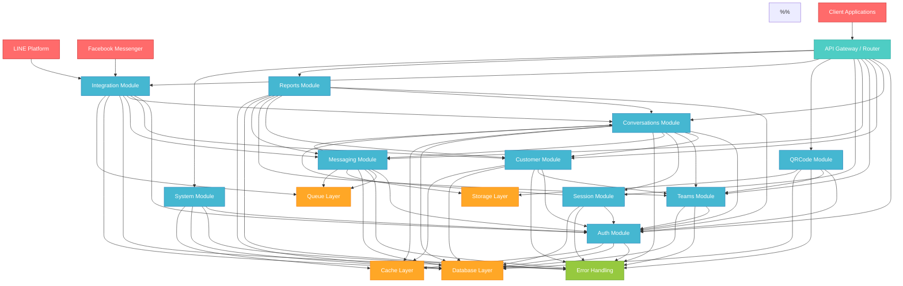
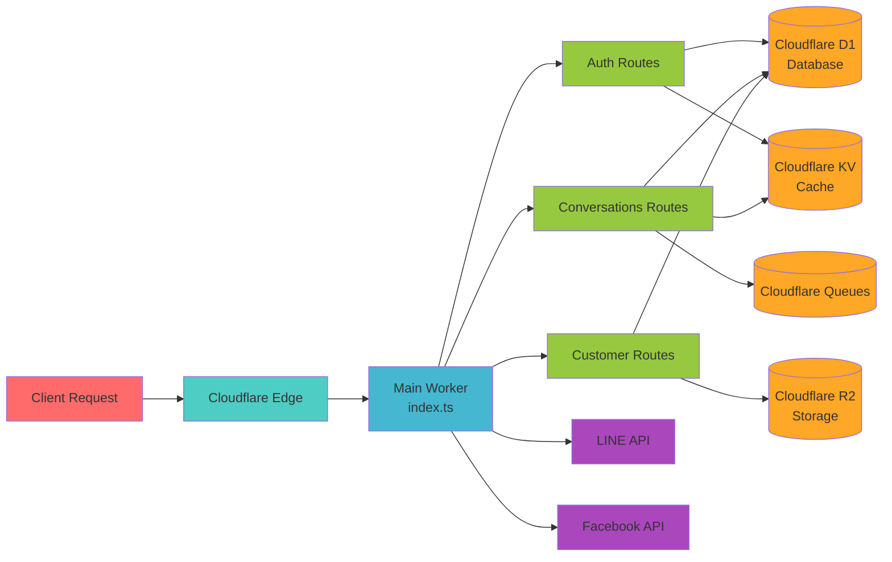

# Module Dependency Diagram

## (Architecture Overview)

Multi-Channel Integration System

### (High-Level Architecture)



## (Dependency Matrix)


| | Auth | Conv | Customer | Teams | Messaging | Session | QRCode | Integration | Reports | System | Error | DB | Cache | Storage | Queue |
|-------------|------|------|----------|-------|-----------|---------|--------|-------------|---------|---------|-------|----|----|---------|-------|
| **Auth** | | | | | | | | | | | | | | | |
| **Conversations** | | | | | | | | | | | | | | | |
| **Customer** | | | | | | | | | | | | | | | |
| **Teams** | | | | | | | | | | | | | | | |
| **Messaging** | | | | | | | | | | | | | | | |
| **Session** | | | | | | | | | | | | | | | |
| **QRCode** | | | | | | | | | | | | | | | |
| **Integration** | | | | | | | | | | | | | | | |
| **Reports** | | | | | | | | | | | | | | | |
| **System** | | | | | | | | | | | | | | | |

### (Legend)
- ****:
- ****:

## (Detailed Dependency Analysis)

### Auth Module ()
```
Auth Module
 Dependencies: None (Core module)
 Dependents:
 Conversations
 Customer
 Teams
 Messaging
 Session
 QRCode
 Integration
 Reports
 System
```

****: JWT
****:

### Conversations Module ()
```
Conversations Module
 Dependencies:
 Auth ()
 Customer ()
 Teams ()
 Session ()
 Messaging ()
 Dependents:
 Messaging
 Session
 Integration
 Reports
```

****:
****:
- Auth:
- Customer:
- Teams:
- Session:
- Messaging:

### Customer Module ()
```
Customer Module
 Dependencies:
 Auth ()
 Teams ()
 Dependents:
 Conversations
 Integration
 Reports
```

****:
****:
- Auth:
- Teams:

### Teams Module ()
```
Teams Module
 Dependencies:
 Auth ()
 Dependents:
 Conversations
 Customer
 QRCode
 Reports
```

****:
****:
- Auth:

### Messaging Module ()
```
Messaging Module
 Dependencies:
 Auth ()
 Conversations ()
 Queue ()
 Storage ()
 Dependents:
 Conversations
 Integration
 Reports
```

****:
****:
- Auth:
- Conversations:
- Queue:
- Storage:

### Session Module ()
```
Session Module
 Dependencies:
 Auth ()
 Conversations ()
 Dependents:
 Conversations
```

****:
****:
- Auth:
- Conversations:

### QRCode Module ()
```
QRCode Module
 Dependencies:
 Auth ()
 Teams ()
 Storage ()
 Dependents: None
```

****: QR
****:
- Auth: QR
- Teams: QR
- Storage: QR

### Integration Module ()
```
Integration Module
 Dependencies:
 Auth (API)
 Customer ()
 Conversations ()
 Messaging ()
 Queue (Webhook)
 Dependents:
 Reports
```

****: Webhook
****:
- Auth: API
- Customer:
- Conversations:
- Messaging:
- Queue: Webhook

### Reports Module ()
```
Reports Module
 Dependencies:
 Auth ()
 Conversations ()
 Customer ()
 Teams ()
 Messaging ()
 Dependents: None
```

****:
****:
- Auth:
- :

### System Module ()
```
System Module
 Dependencies:
 Auth ()
 Cache ()
 Dependents: None
```

****:
****:
- Auth:
- Cache:

## (Shared Services Dependencies)

### Error Handling Service
```
Error Handling
 Used by: All modules
 Provides:
 Unified error types
 Error logging
 Recovery strategies
 Error reporting
 Dependencies: None
```

### Database Layer
```
Database Layer (D1 + Drizzle)
 Used by: All modules
 Provides:
 Type-safe queries
 Schema management
 Transaction support
 Connection pooling
 Dependencies: None
```

### Cache Layer
```
Cache Layer (KV)
 Used by:
 Auth (Session cache)
 Conversations (Query cache)
 Customer (Profile cache)
 System (Config cache)
 Provides:
 Session storage
 Query caching
 Configuration cache
 Dependencies: None
```

### Storage Layer
```
Storage Layer (R2)
 Used by:
 Messaging (Attachments)
 QRCode (Images)
 Provides:
 File upload
 Image processing
 CDN integration
 Dependencies: None
```

### Queue Layer
```
Queue Layer (Cloudflare Queues)
 Used by:
 Messaging (Delayed messages)
 Integration (Webhook processing)
 Provides:
 Message queuing
 Delayed execution
 Batch processing
 Dependencies: None
```

## (Circular Dependency Check)

### (No Circular Dependencies)


1. **Auth Module**:
2. ****:
3. ****:

### (Dependency Levels)

```
Level 0 (Infrastructure):
 Error Handling
 Database
 Cache
 Storage
 Queue

Level 1 (Core):
 Auth Module

Level 2 (Basic Business):
 Teams Module
 Customer Module

Level 3 (Advanced Business):
 Session Module
 QRCode Module
 System Module

Level 4 (Composite):
 Conversations Module
 Messaging Module
 Integration Module

Level 5 (Analytics):
 Reports Module
```

## (Module Communication Patterns)

### 1. (Direct Dependency)
```typescript
// Conversations Auth
import { authenticateUser } from '@auth/services/auth';
```

### 2. (Event-Driven)
```typescript
// Queue
await context.env.QUEUE.send({
 type: 'message.sent',
 data: messageData
});
```

### 3. (Shared Database)
```typescript
//
const conversation = await db.select().from(conversations);
```

### 4. API (API Calls)
```typescript
// API
const response = await fetch('/api/customers/profile', {
 headers: { 'Authorization': `Bearer ${token}` }
});
```

## (Deployment Dependencies)

### Cloudflare Workers


## (Performance Impact Analysis)

### (High-Frequency Dependencies)
1. **Auth Database**:
2. **Conversations Cache**:
3. **Messaging Queue**:

### (Optimization Recommendations)
1. ****: Auth token
2. ****:
3. ****: IntegrationQueueWebhook
4. ****:

## (Security Boundaries)

### (Permission Checkpoints)
```
Client Request

API Gateway (Rate Limiting)

Auth Module (JWT Validation)

Business Module (Role Check)

Database Access (Row-level Security)
```

### (Secure Inter-module Communication)
-
-
-

## (Maintenance Guidelines)

### (Adding New Module)
1.
2. (index.ts)
3.
4.
5.

### (Modifying Existing Dependencies)
1.
2.
3.
4.

### (Performance Monitoring)
-
-
-
-

---

****: 1.0.0
****: 2024-01-01
****: Multi-Channel Integration System Architecture Team