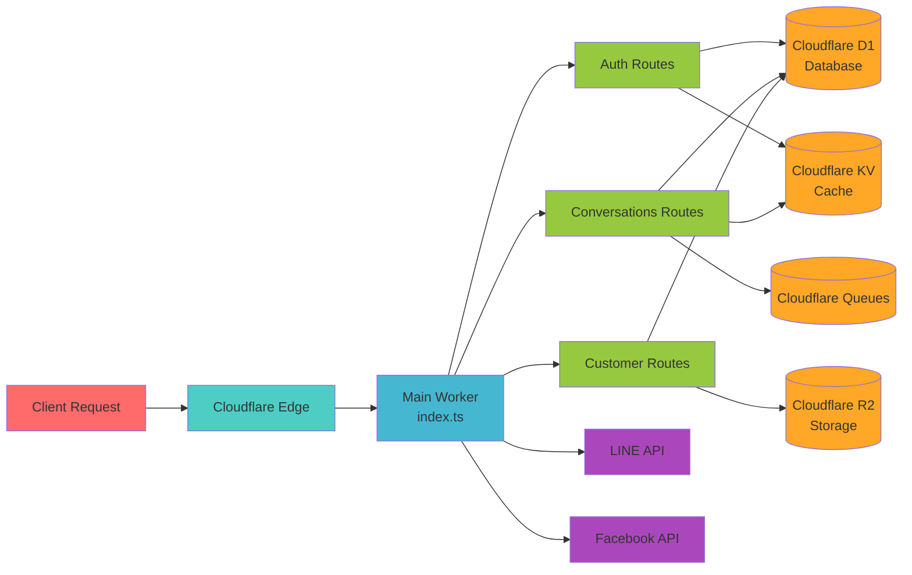

# 模組間依賴關係圖
# Module Dependency Diagram

## 架構總覽 (Architecture Overview)

本文檔展示了Multi-Channel Integration System的模組化架構及其依賴關係。

### 高層架構圖 (High-Level Architecture)


## 依賴關係矩陣 (Dependency Matrix)

### 模組間依賴表

| 模組 → 依賴 | Auth | Conv | Customer | Teams | Messaging | Session | QRCode | Integration | Reports | System | Error | DB | Cache | Storage | Queue |
|-------------|------|------|----------|-------|-----------|---------|--------|-------------|---------|---------|-------|----|----|---------|-------|
| **Auth** | ❌ | ❌ | ❌ | ❌ | ❌ | ❌ | ❌ | ❌ | ❌ | ❌ | ✅ | ✅ | ✅ | ❌ | ❌ |
| **Conversations** | ✅ | ❌ | ✅ | ✅ | ✅ | ✅ | ❌ | ❌ | ❌ | ❌ | ✅ | ✅ | ✅ | ❌ | ❌ |
| **Customer** | ✅ | ❌ | ❌ | ✅ | ❌ | ❌ | ❌ | ❌ | ❌ | ❌ | ✅ | ✅ | ✅ | ❌ | ❌ |
| **Teams** | ✅ | ❌ | ❌ | ❌ | ❌ | ❌ | ❌ | ❌ | ❌ | ❌ | ✅ | ✅ | ❌ | ❌ | ❌ |
| **Messaging** | ✅ | ✅ | ❌ | ❌ | ❌ | ❌ | ❌ | ❌ | ❌ | ❌ | ✅ | ✅ | ❌ | ✅ | ✅ |
| **Session** | ✅ | ✅ | ❌ | ❌ | ❌ | ❌ | ❌ | ❌ | ❌ | ❌ | ✅ | ✅ | ❌ | ❌ | ❌ |
| **QRCode** | ✅ | ❌ | ❌ | ✅ | ❌ | ❌ | ❌ | ❌ | ❌ | ❌ | ✅ | ✅ | ❌ | ✅ | ❌ |
| **Integration** | ✅ | ✅ | ✅ | ❌ | ✅ | ❌ | ❌ | ❌ | ❌ | ❌ | ✅ | ✅ | ❌ | ❌ | ✅ |
| **Reports** | ✅ | ✅ | ✅ | ✅ | ✅ | ❌ | ❌ | ❌ | ❌ | ❌ | ✅ | ✅ | ❌ | ❌ | ❌ |
| **System** | ✅ | ❌ | ❌ | ❌ | ❌ | ❌ | ❌ | ❌ | ❌ | ❌ | ✅ | ✅ | ✅ | ❌ | ❌ |

### 圖例 (Legend)
- ✅ **直接依賴**: 模組直接導入並使用另一個模組的功能
- ❌ **無依賴**: 模組不依賴另一個模組

## 詳細依賴分析 (Detailed Dependency Analysis)

### 🔐 Auth Module (認證模組)
```
Auth Module
├── Dependencies: None (Core module)
└── Dependents:
    ├── Conversations
    ├── Customer
    ├── Teams
    ├── Messaging
    ├── Session
    ├── QRCode
    ├── Integration
    ├── Reports
    └── System
```

**職責**: 提供JWT認證、用戶管理、權限驗證
**被依賴原因**: 所有模組都需要認證和授權功能

### 💬 Conversations Module (對話模組)
```
Conversations Module
├── Dependencies:
│   ├── Auth (認證和權限)
│   ├── Customer (客戶信息)
│   ├── Teams (團隊分配)
│   ├── Session (會話管理)
│   └── Messaging (消息處理)
└── Dependents:
    ├── Messaging
    ├── Session
    ├── Integration
    └── Reports
```

**職責**: 對話生命週期管理、對話分配、轉移
**依賴原因**:
- Auth: 需要驗證用戶權限
- Customer: 需要客戶信息
- Teams: 需要團隊分配邏輯
- Session: 需要會話上下文
- Messaging: 需要消息發送功能

### 👥 Customer Module (客戶模組)
```
Customer Module
├── Dependencies:
│   ├── Auth (權限控制)
│   └── Teams (團隊關聯)
└── Dependents:
    ├── Conversations
    ├── Integration
    └── Reports
```

**職責**: 客戶資料管理、平台用戶映射
**依賴原因**:
- Auth: 權限驗證
- Teams: 客戶與團隊關聯

### 🏢 Teams Module (團隊模組)
```
Teams Module
├── Dependencies:
│   └── Auth (權限控制)
└── Dependents:
    ├── Conversations
    ├── Customer
    ├── QRCode
    └── Reports
```

**職責**: 團隊管理、成員分配、權限繼承
**依賴原因**:
- Auth: 團隊權限管理

### 💌 Messaging Module (消息模組)
```
Messaging Module
├── Dependencies:
│   ├── Auth (發送權限)
│   ├── Conversations (對話上下文)
│   ├── Queue (延時消息)
│   └── Storage (附件存儲)
└── Dependents:
    ├── Conversations
    ├── Integration
    └── Reports
```

**職責**: 消息發送、延時消息、消息撤回
**依賴原因**:
- Auth: 消息發送權限
- Conversations: 對話上下文
- Queue: 延時消息隊列
- Storage: 附件和媒體文件

### 🔧 Session Module (會話模組)
```
Session Module
├── Dependencies:
│   ├── Auth (會話權限)
│   └── Conversations (對話關聯)
└── Dependents:
    └── Conversations
```

**職責**: 對話會話管理、主題檢測、會話分析
**依賴原因**:
- Auth: 會話訪問權限
- Conversations: 會話與對話關聯

### 📱 QRCode Module (二維碼模組)
```
QRCode Module
├── Dependencies:
│   ├── Auth (創建權限)
│   ├── Teams (團隊關聯)
│   └── Storage (圖片存儲)
└── Dependents: None
```

**職責**: QR碼生成、管理、追蹤
**依賴原因**:
- Auth: QR碼創建權限
- Teams: QR碼團隊分配
- Storage: QR碼圖片存儲

### 🔗 Integration Module (整合模組)
```
Integration Module
├── Dependencies:
│   ├── Auth (API權限)
│   ├── Customer (用戶映射)
│   ├── Conversations (對話創建)
│   ├── Messaging (消息轉發)
│   └── Queue (Webhook處理)
└── Dependents:
    └── Reports
```

**職責**: 外部平台整合、Webhook處理、平台配置
**依賴原因**:
- Auth: API訪問權限
- Customer: 平台用戶映射
- Conversations: 創建新對話
- Messaging: 轉發平台消息
- Queue: 異步處理Webhook

### 📊 Reports Module (報告模組)
```
Reports Module
├── Dependencies:
│   ├── Auth (報告權限)
│   ├── Conversations (對話數據)
│   ├── Customer (客戶數據)
│   ├── Teams (團隊數據)
│   └── Messaging (消息統計)
└── Dependents: None
```

**職責**: 數據分析、報告生成、儀表板
**依賴原因**:
- Auth: 報告查看權限
- 其他模組: 獲取各種業務數據

### ⚙️ System Module (系統模組)
```
System Module
├── Dependencies:
│   ├── Auth (管理員權限)
│   └── Cache (系統配置)
└── Dependents: None
```

**職責**: 系統監控、配置管理、健康檢查
**依賴原因**:
- Auth: 系統管理權限
- Cache: 系統配置緩存

## 共享服務依賴 (Shared Services Dependencies)

### 🚨 Error Handling Service
```
Error Handling
├── Used by: All modules
├── Provides:
│   ├── Unified error types
│   ├── Error logging
│   ├── Recovery strategies
│   └── Error reporting
└── Dependencies: None
```

### 🗄️ Database Layer
```
Database Layer (D1 + Drizzle)
├── Used by: All modules
├── Provides:
│   ├── Type-safe queries
│   ├── Schema management
│   ├── Transaction support
│   └── Connection pooling
└── Dependencies: None
```

### 💾 Cache Layer
```
Cache Layer (KV)
├── Used by:
│   ├── Auth (Session cache)
│   ├── Conversations (Query cache)
│   ├── Customer (Profile cache)
│   └── System (Config cache)
├── Provides:
│   ├── Session storage
│   ├── Query caching
│   └── Configuration cache
└── Dependencies: None
```

### 📁 Storage Layer
```
Storage Layer (R2)
├── Used by:
│   ├── Messaging (Attachments)
│   └── QRCode (Images)
├── Provides:
│   ├── File upload
│   ├── Image processing
│   └── CDN integration
└── Dependencies: None
```

### 📬 Queue Layer
```
Queue Layer (Cloudflare Queues)
├── Used by:
│   ├── Messaging (Delayed messages)
│   └── Integration (Webhook processing)
├── Provides:
│   ├── Message queuing
│   ├── Delayed execution
│   └── Batch processing
└── Dependencies: None
```

## 循環依賴檢查 (Circular Dependency Check)

### ❌ 無循環依賴 (No Circular Dependencies)

經過分析，當前架構沒有循環依賴問題：

1. **Auth Module**: 不依賴任何其他業務模組
2. **基礎設施層**: 被所有模組使用但不依賴業務模組
3. **依賴方向**: 始終從高層模組指向低層模組

### ✅ 依賴層級 (Dependency Levels)

```
Level 0 (Infrastructure):
├── Error Handling
├── Database
├── Cache
├── Storage
└── Queue

Level 1 (Core):
├── Auth Module

Level 2 (Basic Business):
├── Teams Module
└── Customer Module

Level 3 (Advanced Business):
├── Session Module
├── QRCode Module
└── System Module

Level 4 (Composite):
├── Conversations Module
├── Messaging Module
└── Integration Module

Level 5 (Analytics):
└── Reports Module
```

## 模組通信模式 (Module Communication Patterns)

### 1. 直接依賴 (Direct Dependency)
```typescript
// Conversations 模組直接使用 Auth 服務
import { authenticateUser } from '@auth/services/auth';
```

### 2. 事件驅動 (Event-Driven)
```typescript
// 使用 Queue 進行異步通信
await context.env.QUEUE.send({
  type: 'message.sent',
  data: messageData
});
```

### 3. 共享數據庫 (Shared Database)
```typescript
// 通過共享數據庫表進行數據交換
const conversation = await db.select().from(conversations);
```

### 4. API調用 (API Calls)
```typescript
// 模組間通過內部API調用通信
const response = await fetch('/api/customers/profile', {
  headers: { 'Authorization': `Bearer ${token}` }
});
```

## 部署依賴圖 (Deployment Dependencies)

### Cloudflare Workers 部署架構


## 性能影響分析 (Performance Impact Analysis)

### 高頻率依賴 (High-Frequency Dependencies)
1. **Auth → Database**: 每個請求都需要認證
2. **Conversations → Cache**: 頻繁的對話查詢
3. **Messaging → Queue**: 大量消息處理

### 優化建議 (Optimization Recommendations)
1. **緩存策略**: Auth token緩存，減少資料庫查詢
2. **批量操作**: 報告模組批量查詢數據
3. **異步處理**: Integration使用Queue處理Webhook
4. **連接池**: 資料庫連接復用

## 安全邊界 (Security Boundaries)

### 權限驗證點 (Permission Checkpoints)
```
Client Request
    ↓
API Gateway (Rate Limiting)
    ↓
Auth Module (JWT Validation)
    ↓
Business Module (Role Check)
    ↓
Database Access (Row-level Security)
```

### 模組間安全通信 (Secure Inter-module Communication)
- 所有模組間通信都通過統一的認證機制
- 敏感數據在模組間傳遞時進行加密
- 錯誤信息不暴露內部實現細節

## 維護指南 (Maintenance Guidelines)

### 添加新模組 (Adding New Module)
1. 確定依賴關係，避免循環依賴
2. 實現標準化接口 (index.ts)
3. 添加錯誤處理集成
4. 更新依賴關係圖
5. 添加單元測試

### 修改現有依賴 (Modifying Existing Dependencies)
1. 評估變更影響範圍
2. 更新所有相關模組
3. 執行完整測試套件
4. 更新文檔

### 性能監控 (Performance Monitoring)
- 監控模組間調用頻率
- 追蹤資料庫查詢性能
- 監控緩存命中率
- 記錄錯誤恢復成功率

---

**文檔版本**: 1.0.0
**最後更新**: 2024-01-01
**維護團隊**: Multi-Channel Integration System Architecture Team