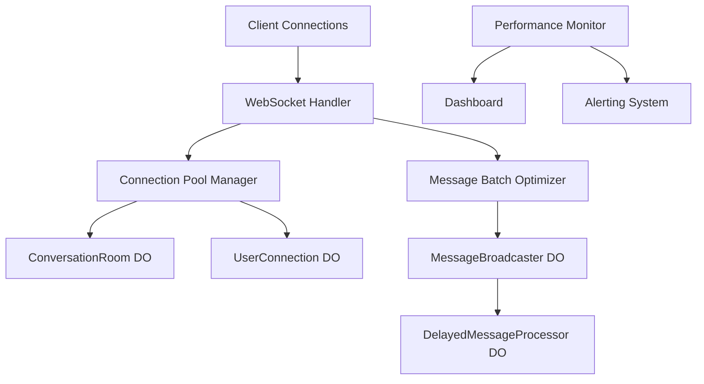

# Load Testing and Performance Optimization Guide

> ****: Multi-Channel Support MVP - WebSocket Real-time System
> ****: 2.0.0
> ****: 2025-01-XX


1. [](#)
2. [](#)
3. [](#)
4. [](#)
5. [](#)
6. [](#)
7. [](#)
8. [](#)


 WebSocket + Durable Objects


| | | |
|------|--------|--------|
| **** | 1,000+ | 10,000+ |
| **** | 100+ msg/s | 1,000+ msg/s |
| ** (P95)** | < 500ms | < 1000ms |
| **** | < 1% | < 5% |
| **** | > 95% | > 90% |
| **** | < 1MB/conn | < 2MB/conn |





1. **** (`ConnectionPoolManager`)
 -
 -
 -

2. **** (`MessageBatchOptimizer`)
 -
 -
 -

3. **** (`PerformanceMonitor`)
 -
 -
 -


### WebSocket

****: `scripts/load-testing/websocket-load-test.ts`

```bash

npm run test:load:websocket -- \
 --url wss://localhost:8787/api/websocket/connect \
 --connections 1000 \
 --rate 50 \
 --messages 100 \
 --duration 300


npm run test:load:websocket -- \
 --url wss://localhost:8787/api/websocket/connect \
 --connections 5000 \
 --rate 100 \
 --messages 500 \
 --duration 600 \
 --rooms 50 \
 --token "your-auth-token"
```

****:
- WebSocket
-
-
-

### Durable Objects

****: `scripts/load-testing/durable-objects-stress-test.ts`

```bash
# Durable Objects
npm run test:stress:do -- \
 --url https://localhost:8787 \
 --rooms 100 \
 --users 1000 \
 --messages 500 \
 --duration 300 \
 --concurrency 50


npm run test:stress:do -- \
 --url https://localhost:8787 \
 --rooms 20 \
 --users 200 \
 --messages 100 \
 --enable-locks true \
 --lock-contention true
```

****:
- ConversationRoom
- MessageBroadcaster
- UserConnection
-
-


****: `tools/performance/benchmark-suite.ts`

```bash

npm run benchmark -- \
 --url https://localhost:8787 \
 --websocket-url wss://localhost:8787/api/websocket/connect \
 --iterations 1000 \
 --suites latency,throughput,memory,websocket,durableobjects


npm run benchmark -- \
 --suites latency,websocket \
 --iterations 500 \
 --format json \
 --output benchmark-results.json
```


****: `tools/performance/memory-profiler.ts`

```bash

npm run profile:memory -- \
 --url https://localhost:8787 \
 --websocket-url wss://localhost:8787/api/websocket/connect \
 --duration 300 \
 --connections 10 \
 --messages 1000 \
 --threshold 50


npm run profile:memory -- \
 --gc true \
 --output ./memory-profiles
```

****:
-
-
- Durable Objects
-
-


****: `scripts/stress-testing/connection-storm-test.ts`

```bash

npm run test:storm:connections -- \
 --url wss://localhost:8787/api/websocket/connect \
 --waves 10 \
 --connections 100 \
 --interval 5000 \
 --hold-time 2000 \
 --rapid-ratio 0.3


npm run test:storm:connections -- \
 --waves 20 \
 --connections 500 \
 --interval 1000 \
 --rapid-ratio 0.5 \
 --concurrent-waves 5
```

****:
- /
-
-
-
-


****: `scripts/stress-testing/message-flood-test.ts`

```bash

npm run test:flood:messages -- \
 --url https://localhost:8787 \
 --websocket-url wss://localhost:8787/api/websocket/connect \
 --messages 10000 \
 --rate 100 \
 --connections 50 \
 --size 1024


npm run test:flood:messages -- \
 --messages 50000 \
 --rate 500 \
 --connections 100 \
 --burst-intervals true \
 --burst-multiplier 10
```

****:
-
-
-
-
-


**ConnectionPoolManager **:

```typescript
const poolConfig = {
 maxPoolSize: 10000, //
 maxConnectionsPerUser: 10, //
 connectionTimeoutMs: 30000, //
 idleTimeoutMs: 300000, // (5)
 heartbeatIntervalMs: 30000, //
 cleanupIntervalMs: 60000, //
 enableConnectionReuse: true, //
 enableSmartThrottling: true, //
 enableAutomaticScaling: true //
};
```


**MessageBatchOptimizer **:

```typescript
const batchConfig = {
 maxBatchSize: 100, //
 maxBatchDelayMs: 100, //
 adaptiveBatching: true, //
 compressionEnabled: true, //
 deduplicationEnabled: true, //
 maxMemoryUsageMB: 50, //
 strategySwitchThreshold: 0.8 //
};
```


1. ****
 ```typescript
 //
 const optimizedPool = getConnectionPoolManager({
 maxPoolSize: process.env.NODE_ENV === 'production' ? 50000 : 1000,
 heartbeatIntervalMs: 15000, //
 cleanupIntervalMs: 30000, //
 enableSmartThrottling: true
 });
 ```

2. ****
 ```typescript
 //
 const optimizer = getMessageBatchOptimizer({
 maxBatchSize: 200, //
 maxBatchDelayMs: 50, //
 compressionEnabled: true, //
 adaptiveBatching: true //
 });
 ```

3. **Durable Objects **
 ```typescript
 //
 const roomConfig = {
 MAX_CONNECTIONS: 500, //
 MAX_MESSAGE_HISTORY: 100, //
 HEARTBEAT_INTERVAL: 20000, //
 LOCK_TTL: 15000 //
 };
 ```


****: `src/monitoring/performance-dashboard.ts`

****: `https://your-domain.com/dashboard`

****:
-
-
-
-
-


**PerformanceMonitor **:

```typescript
const monitorConfig = {
 monitoringIntervalMs: 10000, // 10
 alerting: {
 enabled: true,
 webhookUrl: process.env.ALERT_WEBHOOK,
 emailRecipients: ['admin@company.com']
 },
 thresholds: {
 latency: { warning: 500, critical: 1000, unit: 'ms' },
 throughput: { warning: 50, critical: 25, unit: 'ops/s' },
 errorRate: { warning: 0.05, critical: 0.1, unit: 'ratio' },
 memoryUsage: { warning: 80, critical: 95, unit: 'percent' },
 connectionCount: { warning: 8000, critical: 9500, unit: 'count' }
 }
};
```


1. **WebSocket **
 -
 -
 -
 -
 -

2. **Durable Objects **
 -
 -
 -
 -
 -

3. ****
 - CPU
 -
 -
 -
 -


1. ****
 ```bash
 #
 npm run benchmark -- --suites latency --iterations 1000

 #
 npm run test:network-latency

 # Durable Objects
 npm run test:stress:do -- --rooms 10 --users 100
 ```

2. ****
 ```bash
 #
 curl https://your-domain.com/api/websocket/metrics

 #
 npm run test:storm:connections -- --waves 5 --connections 50
 ```

3. ****
 ```bash
 #
 npm run profile:memory -- --duration 180 --connections 5

 #
 npm run profile:memory -- --gc true --threshold 30
 ```


1. ****
 ```bash
 #
 npm run benchmark:baseline
 ```

2. ****
 ```bash
 #
 npm run analyze:performance
 ```

3. ****
 ```bash
 #
 npm run benchmark:compare
 ```


- [ ] WebSocket
- [ ]
- [ ] Durable Objects
- [ ]
- [ ]
- [ ]
- [ ]
- [ ]
- [ ]
- [ ]


1. ****
 ```bash
 #
 npm run test:production-readiness

 #
 npm run benchmark:production
 ```

2. ****
 ```bash
 #
 npm run deploy:monitoring

 #
 npm run test:alerts
 ```

3. ****
 -
 -
 -
 -


1. **** ()
 -
 -
 -

2. **** ()
 -
 -
 -

3. **** ()
 -
 -
 -

---

** **: [](mailto:tech-support@company.com)
** **: [](../architecture/) | [API ](../api/) | [](../deployment/)