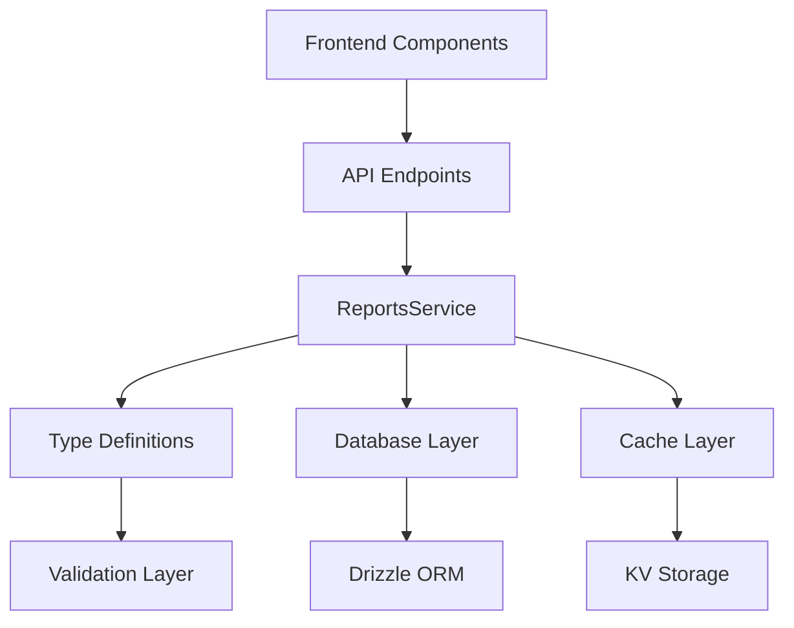

 19 API


- ****: v2.0.0
- ****: v1.0.0
- ****: 2025-09-26
- ****:


```

 Frontend Layer
 Vue 3 Components + TypeScript +

 API Gateway
 Hono Router + Authentication + Rate Limiting

 Service Layer
 ReportsService.ts -

 Type System
 TypeScript + Zod

 Data Layer
 Cloudflare D1 (SQLite) + Drizzle ORM

 Cache Layer
 Cloudflare KV + R2 Storage

```





### Phase 1: (10)
| | | | |
|------|------|------|------|
| | `conversation_summary` | | |
| | `agent_performance` | | |
| | `team_analytics` | | |
| | `customer_satisfaction` | | |
| | `platform_usage` | | |
| | `message_statistics` | | |
| | `response_time_analysis` | | |
| | `workload_distribution` | | |
| | `system_health` | | |
| | `custom` | | |
| | `cost_analysis` | | |
| SLA | `sla_compliance` | | |
| | `anomaly_detection` | | |
| | `audit_trail` | | |
| | `resource_utilization` | | |

### Phase 2: (5)
| | | | |
|------|------|------|------|
| | `trend_forecast` | | 30 |
| | `customer_insights` | | |
| | `channel_integration` | | |
| | `goal_achievement` | | KPI |
| | `automation_effectiveness` | | ROI |

### Phase 3: (4)
| | | | |
|------|------|------|------|
| | `security_risk` | | |
| | `knowledge_base` | | |
| | `call_quality` | | |
| | `executive_summary` | | |

## API


```
Base URL: /api/reports
Authentication: Bearer Token (JWT)
Content-Type: application/json
```

### 1. API
```http
POST /api/reports/generate
```


```typescript
interface ReportGenerationParams {
 type: ReportType; //
 format: ReportFormat; // : 'excel' | 'pdf' | 'json' | 'csv' | 'html'
 dateRange: {
 startDate: string; // ISO 8601
 endDate: string; // ISO 8601
 };
 filters?: Record<string, any>; //
 options?: {
 includeCharts?: boolean; //
 includeSummary?: boolean; //
 template?: string; //
 };
}
```


```typescript
interface GeneratedReport {
 id: string; // ID
 type: ReportType; //
 format: ReportFormat; //
 status: ReportStatus; // : 'pending' | 'generating' | 'completed' | 'failed' | 'expired'
 title: string; //
 description?: string; //
 generatedAt: string; //
 expiresAt: string; //
 downloadUrl?: string; //
 fileSize?: number; //
 data?: any; // JSON
 metadata: {
 generatedBy: string; //
 executionTime: number; //
 recordCount: number; //
 version: string; //
 };
 errors?: string[]; //
}
```

### 2. API
```http
GET /api/reports/preview/{type}
```


```typescript
interface ReportPreview {
 type: ReportType;
 title: string;
 description: string;
 estimatedSize: number; //
 availableFormats: ReportFormat[]; //
 requiredPermissions: string[]; //
 sampleData: any; //
 config: {
 defaultFilters: Record<string, any>;
 supportedDateRanges: string[];
 maxDateRange: number; //
 };
}
```

### 3. API
```http
GET /api/reports/{reportId}/status
```


```typescript
interface ReportStatus {
 id: string;
 status: 'pending' | 'generating' | 'completed' | 'failed' | 'expired';
 progress?: number; // (0-100)
 estimatedCompletion?: string; //
 error?: string; //
 createdAt: string;
 updatedAt: string;
}
```

### 4. API
```http
GET /api/reports?page=1&limit=20&type=conversation_summary&status=completed
```


```typescript
interface ReportListQuery {
 page?: number; // : 1
 limit?: number; // : 20
 type?: ReportType; //
 status?: ReportStatus; //
 startDate?: string; //
 endDate?: string; //
 createdBy?: string; //
 sortBy?: 'createdAt' | 'updatedAt' | 'type' | 'status';
 sortOrder?: 'asc' | 'desc';
}
```


```typescript
interface ReportListResponse {
 reports: ReportBase[];
 pagination: {
 total: number; //
 totalPages: number; //
 currentPage: number; //
 limit: number; //
 hasNext: boolean; //
 hasPrev: boolean; //
 };
 filters: {
 appliedFilters: Record<string, any>;
 availableFilters: Record<string, any[]>;
 };
}
```

### 5. API
```http
DELETE /api/reports/{reportId}
```


```typescript
interface DeleteResponse {
 success: boolean;
 message: string;
 deletedAt: string;
}
```

### 6. API
```http
GET /api/reports/statistics?timeRange=last_30_days
```


```typescript
interface ReportStatistics {
 totalReports: number;
 reportsByType: Record<ReportType, number>;
 reportsByFormat: Record<ReportFormat, number>;
 reportsByStatus: Record<ReportStatus, number>;
 generationTrends: Array<{
 date: string;
 count: number;
 avgExecutionTime: number;
 }>;
 topUsers: Array<{
 userId: string;
 username: string;
 reportCount: number;
 }>;
 systemMetrics: {
 avgExecutionTime: number; //
 successRate: number; //
 totalStorage: number; //
 peakUsageTime: string; //
 };
}
```


### Phase 2

#### 1. (TrendForecastReportData)
```typescript
interface TrendForecastReportData {
 forecastSummary: {
 forecastPeriod: number; //
 confidence: number; // (0-100)
 accuracy: number; // (0-100)
 lastUpdate: string; // ISO 8601
 };

 conversationTrends: {
 historical: Array<{
 date: string; // YYYY-MM-DD
 actual: number; //
 trend: 'increasing' | 'stable' | 'decreasing';
 }>;
 predicted: Array<{
 date: string; //
 predicted: number; //
 confidenceLow: number; //
 confidenceHigh: number; //
 scenario: 'optimistic' | 'realistic' | 'pessimistic';
 }>;
 };

 demandForecast: {
 peakHours: Array<{
 hour: number; // (0-23)
 predictedVolume: number; //
 requiredAgents: number; //
 }>;
 seasonalPatterns: Array<{
 period: string; // /
 pattern: string; //
 multiplier: number; //
 }>;
 specialEvents: Array<{
 date: string; //
 event: string; //
 expectedImpact: number; //
 type: string; //
 }>;
 };

 riskAssessment: {
 overloadRisk: number; //
 understaffingRisk: number; //
 systemCapacityRisk: number; //
 mitigationSuggestions: Array<{
 risk: string; //
 suggestion: string; //
 priority: 'high' | 'medium' | 'low';
 }>;
 };

 modelPerformance: {
 mape: number; //
 rmse: number; //
 lastTraining: string; //
 dataQuality: number; // (0-100)
 };
}
```

#### 2. (CustomerInsightsReportData)
```typescript
interface CustomerInsightsReportData {
 segmentAnalysis: {
 segments: Array<{
 name: string; //
 size: number; //
 characteristics: string[]; //
 averageValue: number; //
 satisfactionScore: number; //
 }>;
 segmentationCriteria: {
 behavioral: string[]; //
 demographic: string[]; //
 psychographic: string[]; //
 };
 };

 churnPrediction: {
 overallChurnRate: number; //
 riskCustomers: number; //
 retentionStrategies: Array<{
 riskLevel: 'high' | 'medium' | 'low';
 customerCount: number;
 recommendedActions: string[];
 }>;
 predictiveFactors: Array<{
 factor: string; //
 weight: number; // (0-1)
 }>;
 };

 lifecycleAnalysis: {
 newCustomers: number;
 activeCustomers: number;
 returningCustomers: number;
 dormantCustomers: number;
 lifecycleStages: Array<{
 stage: string; //
 count: number; //
 conversionRate?: number; //
 retentionRate?: number; //
 satisfactionScore?: number; //
 churnRisk?: number; //
 }>;
 };

 behaviorPatterns: {
 commonJourneys: Array<{
 name: string; //
 frequency: number; //
 steps: string[]; //
 conversionRate: number; //
 }>;
 interactionPreferences: Array<{
 channel: string; //
 preference: number; //
 }>;
 };
}
```

#### 3. (ChannelIntegrationReportData)
```typescript
interface ChannelIntegrationReportData {
 channelMetrics: Array<{
 channelId: string; // ID
 channelName: string; //
 platform: string; // (LINE, Facebook, etc.)
 isActive: boolean; //
 connectionStatus: 'connected' | 'disconnected' | 'error';
 performance: {
 messageVolume: number; //
 responseTime: number; //
 successRate: number; //
 errorRate: number; //
 };
 customerSatisfaction: number; //
 lastSyncTime: string; //
 }>;

 synchronizationStatus: {
 overallHealth: number; //
 lastFullSync: string; //
 pendingSyncs: number; //
 failedSyncs: number; //
 syncErrors: Array<{
 channelId: string;
 error: string;
 timestamp: string;
 retryCount: number;
 }>;
 };

 crossChannelAnalysis: {
 customerJourneys: Array<{
 customerId: string;
 channels: string[]; //
 journeyLength: number; //
 touchPoints: number; //
 conversionStatus: 'converted' | 'in_progress' | 'abandoned';
 }>;
 channelSwitching: {
 switchingRate: number; //
 commonPaths: Array<{
 fromChannel: string;
 toChannel: string;
 frequency: number;
 reason: string;
 }>;
 };
 };

 integrationQuality: {
 dataConsistency: number; //
 messageDelivery: number; //
 realTimeSync: number; //
 apiLatency: number; // API
 };
}
```

#### 4. (GoalAchievementReportData)
```typescript
interface GoalAchievementReportData {
 goalTracking: Array<{
 goalId: string; // ID
 goalName: string; //
 category: string; //
 targetValue: number; //
 currentValue: number; //
 unit: string; //
 completionPercentage: number; //
 deadline: string; //
 status: 'on_track' | 'at_risk' | 'behind' | 'completed' | 'failed';
 owner: {
 userId: string;
 name: string;
 department: string;
 };
 }>;

 overallProgress: {
 totalGoals: number; //
 completedGoals: number; //
 completionPercentage: number; //
 averageProgress: number; //
 goalsAtRisk: number; //
 };

 performanceTrends: {
 monthlyProgress: Array<{
 month: string; // YYYY-MM
 completionRate: number; //
 newGoals: number; //
 achievedGoals: number; //
 }>;
 departmentPerformance: Array<{
 department: string;
 goalsCount: number;
 completionRate: number;
 averageProgress: number;
 }>;
 };

 recommendations: Array<{
 goalId: string;
 recommendation: string;
 actionItems: string[];
 priority: 'high' | 'medium' | 'low';
 estimatedImpact: string;
 }>;
}
```

#### 5. (AutomationEffectivenessReportData)
```typescript
interface AutomationEffectivenessReportData {
 automationMetrics: {
 totalRules: number; //
 activeRules: number; //
 triggeredRules: number; //
 successfulExecutions: number; //
 failedExecutions: number; //
 averageExecutionTime: number; //
 };

 rulePerformance: Array<{
 ruleId: string; // ID
 ruleName: string; //
 category: string; //
 triggerCount: number; //
 successRate: number; //
 averageExecutionTime: number; //
 lastTriggered: string; //
 status: 'active' | 'inactive' | 'error';
 }>;

 costSavings: {
 totalSavings: number; //
 currency: string; //
 savingsByCategory: Array<{
 category: string; //
 amount: number; //
 percentage: number; //
 }>;
 laborSavings: {
 hoursAutomated: number; //
 hourlyRate: number; //
 totalLaborSaving: number; //
 };
 };

 roiAnalysis: {
 totalInvestment: number; //
 totalReturns: number; //
 overallROI: number; // ROI
 paybackPeriod: number; //
 netPresentValue: number; //
 };

 improvementOpportunities: Array<{
 area: string; //
 currentState: string; //
 proposedSolution: string; //
 estimatedSavings: number; //
 implementationComplexity: 'low' | 'medium' | 'high';
 }>;
}
```

### Phase 3

#### 1. (SecurityRiskReportData)
```typescript
interface SecurityRiskReportData {
 riskSummary: {
 overallRiskLevel: 'low' | 'medium' | 'high' | 'critical';
 riskScore: number; // (0-100)
 lastAssessment: string; //
 totalVulnerabilities: number; //
 criticalVulnerabilities: number; //
 };

 threatAnalysis: {
 detectedThreats: number; //
 activeThreats: number; //
 mitigatedThreats: number; //
 threatTypes: Array<{
 type: string; //
 count: number; //
 severity: 'low' | 'medium' | 'high' | 'critical';
 lastDetected: string; //
 }>;
 };

 vulnerabilityAssessment: {
 systemVulnerabilities: Array<{
 vulnerabilityId: string; // ID
 type: string; //
 severity: 'low' | 'medium' | 'high' | 'critical';
 affectedSystems: string[]; //
 discoveredDate: string; //
 status: 'open' | 'in_progress' | 'resolved' | 'accepted';
 cvssScore?: number; // CVSS
 }>;
 complianceStatus: {
 framework: string; //
 overallCompliance: number; //
 requirements: Array<{
 requirement: string;
 status: 'compliant' | 'non_compliant' | 'partial';
 lastChecked: string;
 }>;
 };
 };

 incidentHistory: Array<{
 incidentId: string; // ID
 type: string; //
 severity: 'low' | 'medium' | 'high' | 'critical';
 description: string; //
 occurredAt: string; //
 resolvedAt?: string; //
 impact: string; //
 rootCause?: string; //
 }>;

 recommendedActions: Array<{
 action: string; //
 priority: 'high' | 'medium' | 'low';
 estimatedEffort: string; //
 expectedOutcome: string; //
 dueDate?: string; //
 }>;
}
```

#### 2. (KnowledgeBaseReportData)
```typescript
interface KnowledgeBaseReportData {
 contentMetrics: {
 totalArticles: number; //
 publishedArticles: number; //
 draftArticles: number; //
 archivedArticles: number; //
 averageArticleLength: number; //
 lastUpdated: string; //
 };

 usageAnalytics: {
 totalSearches: number; //
 successfulSearches: number; //
 searchSuccessRate: number; //
 averageSearchTime: number; //
 topSearchTerms: Array<{
 term: string; //
 frequency: number; //
 successRate: number; //
 }>;
 noResultSearches: Array<{
 term: string; //
 frequency: number; //
 suggestions?: string[]; //
 }>;
 };

 articlePerformance: Array<{
 articleId: string; // ID
 title: string; //
 category: string; //
 views: number; //
 searches: number; //
 helpfulVotes: number; //
 unhelpfulVotes: number; //
 lastModified: string; //
 authorId: string; // ID
 }>;

 contentQuality: {
 overallQualityScore: number; // (0-100)
 outdatedContent: number; //
 contentGaps: Array<{
 topic: string; //
 searchFrequency: number; //
 availableContent: number; //
 priority: 'high' | 'medium' | 'low';
 }>;
 duplicateContent: Array<{
 articles: string[]; // ID
 similarity: number; //
 }>;
 };

 maintenanceRecommendations: Array<{
 type: 'update' | 'create' | 'archive' | 'merge';
 articleId?: string; // ID
 description: string; //
 priority: 'high' | 'medium' | 'low';
 estimatedEffort: string; //
 }>;
}
```

#### 3. (CallQualityReportData)
```typescript
interface CallQualityReportData {
 qualityMetrics: {
 totalCalls: number; //
 completedCalls: number; //
 droppedCalls: number; //
 callCompletionRate: number; //
 averageCallDuration: number; //
 overallScore: number; // (0-10)
 };

 audioAnalysis: {
 clarity: number; // (0-100)
 volume: number; // (0-100)
 echo: number; // (0-100)
 backgroundNoise: number; // (0-100)
 audioCodecPerformance: Array<{
 codec: string; //
 usage: number; //
 qualityScore: number; //
 }>;
 };

 networkPerformance: {
 latency: {
 average: number; //
 p95: number; // 95
 maximum: number; //
 };
 jitter: {
 average: number; //
 maximum: number; //
 };
 packetLoss: {
 average: number; //
 maximum: number; //
 };
 bandwidth: {
 averageUsage: number; // Kbps
 peakUsage: number; //
 };
 };

 deviceAnalysis: Array<{
 deviceType: string; //
 deviceModel?: string; //
 userCount: number; //
 callCount: number; //
 qualityScore: number; //
 commonIssues: string[]; //
 }>;

 geographicAnalysis: Array<{
 region: string; //
 callCount: number; //
 qualityScore: number; //
 latency: number; //
 connectionIssues: number; //
 }>;

 improvementRecommendations: Array<{
 category: 'network' | 'audio' | 'device' | 'infrastructure';
 issue: string; //
 recommendation: string; //
 priority: 'high' | 'medium' | 'low';
 estimatedImpact: string; //
 }>;
}
```

#### 4. (ExecutiveSummaryReportData)
```typescript
interface ExecutiveSummaryReportData {
 keyMetrics: Array<{
 metric: string; //
 currentValue: number; //
 previousValue: number; //
 changePercentage: number; //
 trend: 'increasing' | 'decreasing' | 'stable';
 unit: string; //
 status: 'good' | 'warning' | 'critical';
 }>;

 businessHighlights: {
 customerSatisfaction: {
 score: number; //
 trend: 'up' | 'down' | 'stable';
 topPositives: string[]; //
 topConcerns: string[]; //
 };
 operationalEfficiency: {
 responseTime: number; //
 resolutionRate: number; //
 costPerContact: number; //
 agentUtilization: number; //
 };
 growthMetrics: {
 newCustomers: number; //
 customerRetention: number; //
 revenueGrowth: number; //
 marketShare: number; //
 };
 };

 financialProjections: {
 quarterlyForecast: Array<{
 quarter: string; //
 projectedRevenue: number; //
 projectedCosts: number; //
 projectedProfit: number; //
 }>;
 revenueGrowth: number; //
 costOptimization: number; //
 roi: number; //
 };

 strategicInsights: Array<{
 category: 'opportunity' | 'risk' | 'trend' | 'recommendation';
 title: string; //
 description: string; //
 impact: 'high' | 'medium' | 'low';
 timeframe: 'immediate' | 'short_term' | 'long_term';
 actionRequired: boolean; //
 }>;

 competitiveAnalysis: {
 marketPosition: string; //
 competitiveAdvantages: string[]; //
 marketThreats: string[]; //
 recommendedActions: Array<{
 action: string; //
 timeline: string; //
 expectedOutcome: string; //
 }>;
 };

 nextSteps: Array<{
 priority: 'critical' | 'high' | 'medium' | 'low';
 action: string; //
 owner: string; //
 deadline: string; //
 success_criteria: string; //
 }>;
}
```


```typescript
//
export class ReportError extends Error {
 constructor(
 message: string,
 public code: string,
 public statusCode: number = 500,
 public details?: any
 ) {
 super(message);
 this.name = 'ReportError';
 }
}

//
export class ReportNotFoundError extends ReportError {
 constructor(reportId: string) {
 super(
 `Report with ID ${reportId} not found`,
 'REPORT_NOT_FOUND',
 404,
 { reportId }
 );
 }
}

export class ReportGenerationError extends ReportError {
 constructor(message: string, details?: any) {
 super(message, 'REPORT_GENERATION_ERROR', 500, details);
 }
}

export class InvalidReportParamsError extends ReportError {
 constructor(message: string, invalidParams?: string[]) {
 super(message, 'INVALID_PARAMS', 400, { invalidParams });
 }
}

export class ReportAccessDeniedError extends ReportError {
 constructor(userId: string, reportType: string) {
 super(
 `User ${userId} does not have permission to access ${reportType} reports`,
 'ACCESS_DENIED',
 403,
 { userId, reportType }
 );
 }
}
```


```typescript
interface ErrorResponse {
 error: {
 code: string; //
 message: string; //
 details?: any; //
 timestamp: string; //
 requestId: string; // ID
 documentation?: string; //
 };
}
```


| | HTTP | | |
|------|----------|------|----------|
| `REPORT_NOT_FOUND` | 404 | | ID |
| `INVALID_PARAMS` | 400 | | |
| `ACCESS_DENIED` | 403 | | |
| `REPORT_GENERATION_ERROR` | 500 | | |
| `RATE_LIMIT_EXCEEDED` | 429 | | |
| `INVALID_DATE_RANGE` | 400 | | |
| `UNSUPPORTED_FORMAT` | 400 | | |
| `QUOTA_EXCEEDED` | 429 | | |


```typescript
export const REPORT_TYPE_CONFIG: Record<ReportType, ReportConfig> = {
 // Phase 2
 trend_forecast: {
 name: '',
 description: '30',
 category: 'business_intelligence',
 requiredPermissions: ['reports:read', 'analytics:read'],
 supportedFormats: ['json', 'excel', 'pdf'],
 defaultFormat: 'json',
 maxDateRange: 90, //
 estimatedExecutionTime: 5000, //
 cacheTimeout: 3600, //
 requiredFilters: [],
 optionalFilters: ['teamId', 'channelId'],
 sampleDataGenerator: 'generateSampleTrendForecastData',
 },

 customer_insights: {
 name: '',
 description: '',
 category: 'business_intelligence',
 requiredPermissions: ['reports:read', 'customers:read'],
 supportedFormats: ['json', 'excel', 'pdf'],
 defaultFormat: 'json',
 maxDateRange: 365,
 estimatedExecutionTime: 8000,
 cacheTimeout: 7200,
 requiredFilters: [],
 optionalFilters: ['customerSegment', 'riskLevel'],
 sampleDataGenerator: 'generateSampleCustomerInsightsData',
 },

 // ...
};
```


```typescript
interface ReportSystemConfig {
 database: {
 connectionString: string;
 poolSize: number;
 timeout: number;
 };
 cache: {
 provider: 'kv' | 'redis';
 ttl: number;
 namespace: string;
 };
 storage: {
 provider: 'r2' | 's3';
 bucket: string;
 region: string;
 };
 performance: {
 maxConcurrentReports: number;
 reportTimeout: number;
 maxFileSize: number;
 };
 security: {
 enableRateLimit: boolean;
 maxRequestsPerMinute: number;
 requireAuth: boolean;
 };
}
```


### API
- ****: v2.0.0
- ****: Semantic Versioning (MAJOR.MINOR.PATCH)
- ****: 2
- ****: 6API


```markdown
## [2.0.0] - 2025-09-26
### Added
- Phase 2: 5
- Phase 3: 4
- TypeScript
-

### Changed
- ReportType
- API

### Deprecated
-

### Removed
-

### Fixed
- import
-
```

---


- ****:
- ****:
- ****:


- **Bug**: GitHub Issues
- ****: GitHub Discussions
- ****:


- [API](./api-testing-guide.md)
- [](./deployment-guide.md)
- [](./troubleshooting-guide.md)
- [](./performance-optimization.md)

---

****: v1.0.0
****: 2025-09-26
****: 2025-10-26