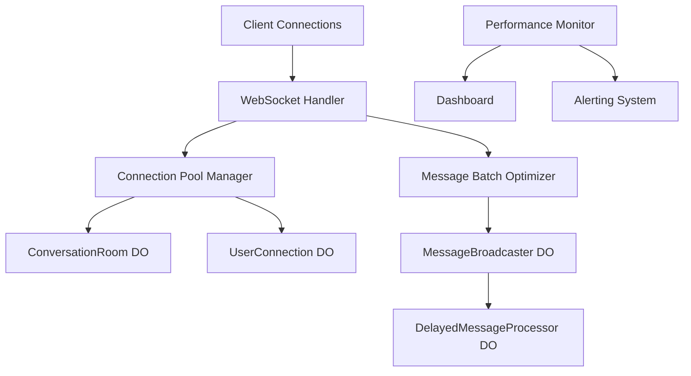

# Load Testing and Performance Optimization Guide

> **專案名稱**: Multi-Channel Support MVP - WebSocket Real-time System
> **版本**: 2.0.0
> **更新日期**: 2025-01-XX

## 📋 目錄

1. [概述](#概述)
2. [架構概覽](#架構概覽)
3. [負載測試工具](#負載測試工具)
4. [性能基準測試](#性能基準測試)
5. [壓力測試場景](#壓力測試場景)
6. [優化實施](#優化實施)
7. [生產監控](#生產監控)
8. [故障排除](#故障排除)

## 概述

本指南提供了完整的負載測試和性能優化策略，用於基於 WebSocket + Durable Objects 的實時通信系統。該系統專為企業級部署而設計，支持高並發、低延遲的實時消息傳遞。

### 🎯 性能目標

| 指標 | 目標值 | 關鍵值 |
|------|--------|--------|
| **並發連接** | 1,000+ | 10,000+ |
| **消息吞吐量** | 100+ msg/s | 1,000+ msg/s |
| **延遲 (P95)** | < 500ms | < 1000ms |
| **錯誤率** | < 1% | < 5% |
| **連接成功率** | > 95% | > 90% |
| **內存使用** | < 1MB/conn | < 2MB/conn |

## 架構概覽

### 🏗️ 系統組件



### 🔧 核心優化組件

1. **連接池管理器** (`ConnectionPoolManager`)
   - 智能連接管理和資源優化
   - 自動清理和健康檢查
   - 負載均衡和故障轉移

2. **消息批處理優化器** (`MessageBatchOptimizer`)
   - 智能消息批處理
   - 自適應批處理策略
   - 消息壓縮和去重

3. **性能監控系統** (`PerformanceMonitor`)
   - 實時性能指標收集
   - 自動告警和異常檢測
   - 性能趨勢分析

## 負載測試工具

### 🚀 WebSocket 負載測試

**位置**: `scripts/load-testing/websocket-load-test.ts`

```bash
# 基本負載測試
npm run test:load:websocket -- \
  --url wss://localhost:8787/api/websocket/connect \
  --connections 1000 \
  --rate 50 \
  --messages 100 \
  --duration 300

# 高級測試選項
npm run test:load:websocket -- \
  --url wss://localhost:8787/api/websocket/connect \
  --connections 5000 \
  --rate 100 \
  --messages 500 \
  --duration 600 \
  --rooms 50 \
  --token "your-auth-token"
```

**主要功能**:
- 模擬大量並發 WebSocket 連接
- 測試消息發送和接收性能
- 測量連接建立時間和延遲
- 生成詳細的性能報告

### 🔹 Durable Objects 壓力測試

**位置**: `scripts/load-testing/durable-objects-stress-test.ts`

```bash
# Durable Objects 壓力測試
npm run test:stress:do -- \
  --url https://localhost:8787 \
  --rooms 100 \
  --users 1000 \
  --messages 500 \
  --duration 300 \
  --concurrency 50

# 分散式鎖定測試
npm run test:stress:do -- \
  --url https://localhost:8787 \
  --rooms 20 \
  --users 200 \
  --messages 100 \
  --enable-locks true \
  --lock-contention true
```

**測試範圍**:
- ConversationRoom 性能和擴展性
- MessageBroadcaster 事件分發
- UserConnection 管理效率
- 分散式鎖定機制
- 跨房間事件處理

## 性能基準測試

### 📊 基準測試套件

**位置**: `tools/performance/benchmark-suite.ts`

```bash
# 完整基準測試
npm run benchmark -- \
  --url https://localhost:8787 \
  --websocket-url wss://localhost:8787/api/websocket/connect \
  --iterations 1000 \
  --suites latency,throughput,memory,websocket,durableobjects

# 特定測試套件
npm run benchmark -- \
  --suites latency,websocket \
  --iterations 500 \
  --format json \
  --output benchmark-results.json
```

### 🧠 記憶體分析

**位置**: `tools/performance/memory-profiler.ts`

```bash
# 記憶體分析
npm run profile:memory -- \
  --url https://localhost:8787 \
  --websocket-url wss://localhost:8787/api/websocket/connect \
  --duration 300 \
  --connections 10 \
  --messages 1000 \
  --threshold 50

# 啟用垃圾回收
npm run profile:memory -- \
  --gc true \
  --output ./memory-profiles
```

**分析項目**:
- 連接內存使用模式
- 消息歷史記錄內存
- Durable Objects 內存消耗
- 內存洩漏檢測
- 清理效率分析

## 壓力測試場景

### ⛈️ 連接風暴測試

**位置**: `scripts/stress-testing/connection-storm-test.ts`

```bash
# 連接風暴測試
npm run test:storm:connections -- \
  --url wss://localhost:8787/api/websocket/connect \
  --waves 10 \
  --connections 100 \
  --interval 5000 \
  --hold-time 2000 \
  --rapid-ratio 0.3

# 極端壓力測試
npm run test:storm:connections -- \
  --waves 20 \
  --connections 500 \
  --interval 1000 \
  --rapid-ratio 0.5 \
  --concurrent-waves 5
```

**測試場景**:
- 快速連接/斷開波次
- 網絡延遲模擬
- 連接池壓力測試
- 系統恢復時間測量
- 資源清理效率

### 🌊 消息洪流測試

**位置**: `scripts/stress-testing/message-flood-test.ts`

```bash
# 消息洪流測試
npm run test:flood:messages -- \
  --url https://localhost:8787 \
  --websocket-url wss://localhost:8787/api/websocket/connect \
  --messages 10000 \
  --rate 100 \
  --connections 50 \
  --size 1024

# 突發流量測試
npm run test:flood:messages -- \
  --messages 50000 \
  --rate 500 \
  --connections 100 \
  --burst-intervals true \
  --burst-multiplier 10
```

**壓力場景**:
- 高頻率消息發送
- 消息隊列壓力
- 廣播性能測試
- 延遲消息處理
- 系統負載測試

## 優化實施

### 🔧 連接管理優化

**ConnectionPoolManager 配置**:

```typescript
const poolConfig = {
  maxPoolSize: 10000,           // 最大連接池大小
  maxConnectionsPerUser: 10,    // 每用戶連接限制
  connectionTimeoutMs: 30000,   // 連接超時
  idleTimeoutMs: 300000,        // 閒置超時 (5分鐘)
  heartbeatIntervalMs: 30000,   // 心跳間隔
  cleanupIntervalMs: 60000,     // 清理間隔
  enableConnectionReuse: true,  // 啟用連接重用
  enableSmartThrottling: true,  // 智能限流
  enableAutomaticScaling: true  // 自動擴展
};
```

### 📦 消息批處理優化

**MessageBatchOptimizer 配置**:

```typescript
const batchConfig = {
  maxBatchSize: 100,            // 最大批處理大小
  maxBatchDelayMs: 100,         // 最大批處理延遲
  adaptiveBatching: true,       // 自適應批處理
  compressionEnabled: true,     // 啟用壓縮
  deduplicationEnabled: true,   // 啟用去重
  maxMemoryUsageMB: 50,        // 最大內存使用
  strategySwitchThreshold: 0.8  // 策略切換閾值
};
```

### 🚀 性能調優建議

1. **連接優化**
   ```typescript
   // 連接池配置優化
   const optimizedPool = getConnectionPoolManager({
     maxPoolSize: process.env.NODE_ENV === 'production' ? 50000 : 1000,
     heartbeatIntervalMs: 15000,  // 減少心跳頻率
     cleanupIntervalMs: 30000,    // 增加清理頻率
     enableSmartThrottling: true
   });
   ```

2. **消息處理優化**
   ```typescript
   // 批處理優化
   const optimizer = getMessageBatchOptimizer({
     maxBatchSize: 200,           // 增加批處理大小
     maxBatchDelayMs: 50,         // 減少延遲
     compressionEnabled: true,     // 啟用壓縮
     adaptiveBatching: true       // 自適應調整
   });
   ```

3. **Durable Objects 優化**
   ```typescript
   // 房間配置優化
   const roomConfig = {
     MAX_CONNECTIONS: 500,        // 增加房間連接限制
     MAX_MESSAGE_HISTORY: 100,    // 增加消息歷史
     HEARTBEAT_INTERVAL: 20000,   // 調整心跳間隔
     LOCK_TTL: 15000             // 減少鎖定時間
   };
   ```

## 生產監控

### 📊 實時監控儀表板

**位置**: `src/monitoring/performance-dashboard.ts`

**訪問**: `https://your-domain.com/dashboard`

**主要功能**:
- 實時性能指標
- 系統健康狀態
- 活動告警顯示
- 組件狀態監控
- 性能趨勢分析

### 🚨 告警系統

**PerformanceMonitor 配置**:

```typescript
const monitorConfig = {
  monitoringIntervalMs: 10000,  // 10秒監控間隔
  alerting: {
    enabled: true,
    webhookUrl: process.env.ALERT_WEBHOOK,
    emailRecipients: ['admin@company.com']
  },
  thresholds: {
    latency: { warning: 500, critical: 1000, unit: 'ms' },
    throughput: { warning: 50, critical: 25, unit: 'ops/s' },
    errorRate: { warning: 0.05, critical: 0.1, unit: 'ratio' },
    memoryUsage: { warning: 80, critical: 95, unit: 'percent' },
    connectionCount: { warning: 8000, critical: 9500, unit: 'count' }
  }
};
```

### 📈 關鍵指標監控

1. **WebSocket 指標**
   - 活動連接數
   - 連接建立延遲
   - 消息吞吐量
   - 錯誤率
   - 連接生命週期

2. **Durable Objects 指標**
   - 事件處理速度
   - 隊列深度
   - 分發成功率
   - 房間活動狀態
   - 鎖定競爭情況

3. **系統指標**
   - CPU 使用率
   - 內存消耗
   - 網絡吞吐量
   - 錯誤日誌
   - 系統可用性

## 故障排除

### 🔍 常見性能問題

1. **高延遲問題**
   ```bash
   # 檢查延遲分佈
   npm run benchmark -- --suites latency --iterations 1000

   # 分析網絡延遲
   npm run test:network-latency

   # 檢查 Durable Objects 性能
   npm run test:stress:do -- --rooms 10 --users 100
   ```

2. **連接問題**
   ```bash
   # 連接池狀態檢查
   curl https://your-domain.com/api/websocket/metrics

   # 連接風暴測試
   npm run test:storm:connections -- --waves 5 --connections 50
   ```

3. **內存問題**
   ```bash
   # 內存分析
   npm run profile:memory -- --duration 180 --connections 5

   # 垃圾回收分析
   npm run profile:memory -- --gc true --threshold 30
   ```

### 🛠️ 性能調優步驟

1. **基線建立**
   ```bash
   # 建立性能基線
   npm run benchmark:baseline
   ```

2. **瓶頸識別**
   ```bash
   # 全面性能分析
   npm run analyze:performance
   ```

3. **優化驗證**
   ```bash
   # 優化後測試
   npm run benchmark:compare
   ```

### 📋 性能檢查清單

- [ ] WebSocket 連接池配置優化
- [ ] 消息批處理設置調整
- [ ] Durable Objects 參數調優
- [ ] 監控告警閾值設置
- [ ] 負載測試基準建立
- [ ] 壓力測試場景驗證
- [ ] 內存使用分析完成
- [ ] 生產環境監控部署
- [ ] 告警通知配置測試
- [ ] 性能回歸測試自動化

## 🚀 部署和維護

### 生產部署前檢查

1. **性能驗證**
   ```bash
   # 完整負載測試
   npm run test:production-readiness

   # 性能基準驗證
   npm run benchmark:production
   ```

2. **監控部署**
   ```bash
   # 部署監控系統
   npm run deploy:monitoring

   # 驗證告警系統
   npm run test:alerts
   ```

3. **持續監控**
   - 設置自動化性能測試
   - 配置性能回歸檢測
   - 建立性能趨勢分析
   - 實施預防性維護

### 性能維護建議

1. **定期測試** (每周)
   - 運行基準測試套件
   - 檢查性能趨勢
   - 驗證系統健康狀態

2. **深度分析** (每月)
   - 執行完整負載測試
   - 分析內存使用模式
   - 評估優化機會

3. **系統調優** (每季度)
   - 更新配置參數
   - 實施性能優化
   - 驗證調優效果

---

**📞 支援聯絡**: [技術支援團隊](mailto:tech-support@company.com)
**📚 相關文檔**: [系統架構文檔](../architecture/) | [API 文檔](../api/) | [部署指南](../deployment/)