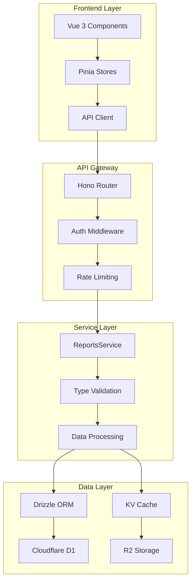

- **** - API
- **** -
- **DevOps** -
- **** -





```
src/modules/reports/
 types/
 report-types.ts #
 api-types.ts # API
 validation-types.ts #
 services/
 reports-service.ts #
 cache-service.ts #
 export-service.ts #
 handlers/
 reports-main.ts # API
 admin-reports.ts #
 scheduled-reports.ts #
 middleware/
 auth-middleware.ts #
 validation-middleware.ts #
 utils/
 data-processors.ts #
 formatters.ts #
 validators.ts #
 tests/
 unit/ #
 integration/ #
 e2e/ #
```


```bash

Node.js >= 18.0.0
npm >= 9.0.0
TypeScript >= 5.0.0
Cloudflare CLI (Wrangler) >= 3.0.0


VS Code +
 - TypeScript and JavaScript Language Features
 - Cloudflare Workers
 - Vue Language Features (Volar)
 - ESLint
 - Prettier
```


```bash
# 1.
git clone <repository-url>
cd Multi_Channel_Integration_System

# 2.
npm install

# 3.
cp .env.example .env.local
# .env.local

# 4.
npm run db:migrate #
npm run db:seed #

# 5.
npm run dev #
cd frontend && npm run dev #
```


#### TypeScript (tsconfig.json)
```json
{
 "compilerOptions": {
 "strict": true,
 "noUncheckedIndexedAccess": true,
 "exactOptionalPropertyTypes": true,
 "noImplicitReturns": true,
 "noFallthroughCasesInSwitch": true,
 "paths": {
 "@/*": ["./src/*"],
 "@shared/*": ["./src/shared/*"],
 "@modules/*": ["./src/modules/*"]
 }
 },
 "include": [
 "src/**/*",
 "tests/**/*"
 ]
}
```

#### ESLint
```json
{
 "extends": [
 "@typescript-eslint/recommended",
 "@typescript-eslint/recommended-requiring-type-checking"
 ],
 "rules": {
 "@typescript-eslint/no-unused-vars": "error",
 "@typescript-eslint/explicit-function-return-type": "warn",
 "@typescript-eslint/no-explicit-any": "error"
 }
}
```


### 1:
```typescript
// src/modules/reports/types/report-types.ts

// 1. ReportType
export type ReportType =
 // ...
 | 'my_new_report'; //

// 2.
export interface MyNewReportData {
 summary: {
 totalRecords: number;
 analysisDate: string;
 version: string;
 };

 metrics: Array<{
 metricName: string;
 value: number;
 unit: string;
 trend: 'up' | 'down' | 'stable';
 comparison: {
 previousValue: number;
 changePercentage: number;
 };
 }>;

 insights: Array<{
 category: string;
 insight: string;
 priority: 'high' | 'medium' | 'low';
 actionable: boolean;
 recommendations: string[];
 }>;
}

// 3.
export const REPORT_TYPE_CONFIG: Record<ReportType, ReportConfig> = {
 // ...
 my_new_report: {
 name: '',
 description: '',
 category: 'business_intelligence',
 requiredPermissions: ['reports:read', 'business:read'],
 supportedFormats: ['json', 'excel', 'pdf'],
 defaultFormat: 'json',
 maxDateRange: 90,
 estimatedExecutionTime: 6000,
 cacheTimeout: 3600,
 requiredFilters: [],
 optionalFilters: ['department', 'priority'],
 sampleDataGenerator: 'generateSampleMyNewReportData',
 },
};
```

### 2:
```typescript
// src/modules/reports/services/reports-service.ts

export class ReportsService implements ReportsServiceInterface {
 // ...

 /**
 *
 */
 private generateSampleMyNewReportData(): MyNewReportData {
 return {
 summary: {
 totalRecords: Math.floor(Math.random() * 10000) + 1000,
 analysisDate: new Date().toISOString(),
 version: '1.0.0'
 },

 metrics: [
 {
 metricName: '',
 value: Math.random() * 100,
 unit: '%',
 trend: Math.random() > 0.5 ? 'up' : 'down',
 comparison: {
 previousValue: Math.random() * 100,
 changePercentage: (Math.random() - 0.5) * 20
 }
 },
 {
 metricName: '',
 value: Math.random() * 5 + 3, // 3-8
 unit: '',
 trend: 'stable',
 comparison: {
 previousValue: Math.random() * 5 + 3,
 changePercentage: (Math.random() - 0.5) * 10
 }
 }
 ],

 insights: [
 {
 category: '',
 insight: '',
 priority: 'medium',
 actionable: true,
 recommendations: [
 '',
 ''
 ]
 },
 {
 category: '',
 insight: '',
 priority: 'high',
 actionable: true,
 recommendations: [
 '',
 ''
 ]
 }
 ]
 };
 }

 /**
 *
 */
 private async generateMyNewReportData(
 params: ReportGenerationParams
 ): Promise<MyNewReportData> {
 try {
 // 1.
 this.validateReportParams(params);

 // 2.
 const rawData = await this.db
 .select()
 .from(businessMetricsTable)
 .where(
 and(
 gte(businessMetricsTable.createdAt, params.dateRange.startDate),
 lte(businessMetricsTable.createdAt, params.dateRange.endDate)
 )
 );

 // 3.
 const processedData = this.processBusinessMetrics(rawData);

 // 4.
 const insights = await this.generateBusinessInsights(processedData);

 // 5.
 return {
 summary: {
 totalRecords: rawData.length,
 analysisDate: new Date().toISOString(),
 version: '1.0.0'
 },
 metrics: processedData,
 insights: insights
 };

 } catch (error) {
 console.error('Generate my new report error:', error);
 throw new ReportGenerationError('Failed to generate my new report');
 }
 }
}
```

### 3: API
```typescript
// src/modules/reports/handlers/reports-main.ts

export class ReportsHandler {
 // ...

 /**
 *
 */
 private async handleMyNewReport(
 params: ReportGenerationParams,
 userId: string
 ): Promise<GeneratedReport> {
 // 1.
 await this.checkReportPermission(userId, 'my_new_report');

 // 2.
 this.validateMyNewReportParams(params);

 // 3.
 const reportData = await this.reportsService.generateReport(params, userId);

 // 4.
 if (params.format === 'excel') {
 reportData.data = await this.formatForExcel(reportData.data);
 }

 return reportData;
 }

 /**
 *
 */
 private validateMyNewReportParams(params: ReportGenerationParams): void {
 //
 const daysDiff = this.calculateDaysDifference(
 params.dateRange.startDate,
 params.dateRange.endDate
 );

 if (daysDiff > 90) {
 throw new InvalidReportParamsError(
 'My new report supports maximum 90 days range'
 );
 }

 //
 if (params.filters?.department &&
 !this.isValidDepartment(params.filters.department)) {
 throw new InvalidReportParamsError('Invalid department filter');
 }
 }
}
```

### 4:
```vue
<!-- frontend/src/components/reports/MyNewReportViewer.vue -->
<template>
 <div class="my-new-report-viewer">
 <!-- -->
 <div class="report-summary">
 <h2>{{ reportData.summary.totalRecords }} </h2>
 <p>: {{ formatDate(reportData.summary.analysisDate) }}</p>
 </div>

 <!-- -->
 <div class="metrics-grid">
 <MetricCard
 v-for="metric in reportData.metrics"
 :key="metric.metricName"
 :metric="metric"
 @click="showMetricDetail(metric)"
 />
 </div>

 <!-- -->
 <div class="insights-section">
 <h3></h3>
 <InsightCard
 v-for="(insight, index) in reportData.insights"
 :key="index"
 :insight="insight"
 @action-clicked="handleInsightAction"
 />
 </div>
 </div>
</template>

<script setup lang="ts">
import { ref, computed } from 'vue';
import type { MyNewReportData } from '@/types/report-types';
import MetricCard from './components/MetricCard.vue';
import InsightCard from './components/InsightCard.vue';

interface Props {
 reportData: MyNewReportData;
}

const props = defineProps<Props>();

//
const formatDate = (dateString: string): string => {
 return new Date(dateString).toLocaleDateString('zh-TW');
};

//
const showMetricDetail = (metric: any): void => {
 //
 console.log('Show metric detail:', metric);
};

//
const handleInsightAction = (insight: any, action: string): void => {
 //
 console.log('Handle insight action:', insight, action);
};
</script>
```

### 5:
```typescript
// tests/unit/reports/my-new-report.test.ts

import { describe, it, expect, beforeEach } from 'vitest';
import { ReportsService } from '@/modules/reports/services/reports-service';
import type { MyNewReportData } from '@/modules/reports/types/report-types';

describe('MyNewReport', () => {
 let reportsService: ReportsService;

 beforeEach(() => {
 reportsService = new ReportsService(mockBindings);
 });

 describe('generateSampleMyNewReportData', () => {
 it('should generate valid sample data structure', () => {
 const sampleData = reportsService['generateSampleMyNewReportData']();

 expect(sampleData).toMatchObject({
 summary: {
 totalRecords: expect.any(Number),
 analysisDate: expect.any(String),
 version: expect.any(String)
 },
 metrics: expect.arrayContaining([
 expect.objectContaining({
 metricName: expect.any(String),
 value: expect.any(Number),
 unit: expect.any(String),
 trend: expect.stringMatching(/^(up|down|stable)$/),
 comparison: expect.objectContaining({
 previousValue: expect.any(Number),
 changePercentage: expect.any(Number)
 })
 })
 ]),
 insights: expect.arrayContaining([
 expect.objectContaining({
 category: expect.any(String),
 insight: expect.any(String),
 priority: expect.stringMatching(/^(high|medium|low)$/),
 actionable: expect.any(Boolean),
 recommendations: expect.any(Array)
 })
 ])
 });
 });

 it('should generate metrics with valid trends', () => {
 const sampleData = reportsService['generateSampleMyNewReportData']();

 sampleData.metrics.forEach(metric => {
 expect(['up', 'down', 'stable']).toContain(metric.trend);
 expect(metric.value).toBeGreaterThanOrEqual(0);
 expect(metric.comparison.changePercentage).toBeTypeOf('number');
 });
 });

 it('should generate actionable insights', () => {
 const sampleData = reportsService['generateSampleMyNewReportData']();

 const actionableInsights = sampleData.insights.filter(i => i.actionable);
 expect(actionableInsights.length).toBeGreaterThan(0);

 actionableInsights.forEach(insight => {
 expect(insight.recommendations).toBeInstanceOf(Array);
 expect(insight.recommendations.length).toBeGreaterThan(0);
 });
 });
 });

 describe('report generation validation', () => {
 it('should validate date range limits', async () => {
 const invalidParams = {
 type: 'my_new_report' as const,
 format: 'json' as const,
 dateRange: {
 startDate: '2025-01-01',
 endDate: '2025-06-01' // 90
 }
 };

 await expect(
 reportsService.generateReport(invalidParams, 'test-user')
 ).rejects.toThrow('maximum 90 days range');
 });

 it('should handle valid parameters', async () => {
 const validParams = {
 type: 'my_new_report' as const,
 format: 'json' as const,
 dateRange: {
 startDate: '2025-09-01',
 endDate: '2025-09-30'
 }
 };

 const result = await reportsService.generateReport(validParams, 'test-user');

 expect(result).toMatchObject({
 id: expect.any(String),
 type: 'my_new_report',
 status: 'completed',
 data: expect.any(Object)
 });
 });
 });
});
```

## API


```typescript
//
export async function handleReportRequest(
 c: Context,
 params: ReportGenerationParams
): Promise<Response> {
 try {
 // 1.
 const validatedParams = await validateReportParams(params);

 // 2.
 const userId = await getUserFromContext(c);
 await checkReportPermission(userId, params.type);

 // 3.
 const result = await processReportGeneration(validatedParams, userId);

 // 4.
 return c.json({
 success: true,
 data: result,
 timestamp: new Date().toISOString()
 });

 } catch (error) {
 // 5.
 return handleReportError(c, error);
 }
}

//
function handleReportError(c: Context, error: any): Response {
 if (error instanceof ReportNotFoundError) {
 return c.json({ error: error.toJSON() }, 404);
 }

 if (error instanceof InvalidReportParamsError) {
 return c.json({ error: error.toJSON() }, 400);
 }

 if (error instanceof ReportAccessDeniedError) {
 return c.json({ error: error.toJSON() }, 403);
 }

 //
 console.error('Unexpected report error:', error);
 return c.json({
 error: {
 code: 'INTERNAL_ERROR',
 message: 'An unexpected error occurred',
 timestamp: new Date().toISOString()
 }
 }, 500);
}
```


```typescript
// Zod
import { z } from 'zod';

const ReportGenerationParamsSchema = z.object({
 type: z.enum([
 'conversation_summary',
 'agent_performance',
 // ...
 'my_new_report'
 ]),
 format: z.enum(['excel', 'pdf', 'json', 'csv', 'html']),
 dateRange: z.object({
 startDate: z.string().regex(/^\d{4}-\d{2}-\d{2}$/),
 endDate: z.string().regex(/^\d{4}-\d{2}-\d{2}$/)
 }).refine(
 data => new Date(data.endDate) >= new Date(data.startDate),
 { message: "End date must be after start date" }
 ),
 filters: z.record(z.any()).optional(),
 options: z.object({
 includeCharts: z.boolean().optional(),
 includeSummary: z.boolean().optional(),
 template: z.string().optional()
 }).optional()
});

export async function validateReportParams(
 params: unknown
): Promise<ReportGenerationParams> {
 try {
 return ReportGenerationParamsSchema.parse(params);
 } catch (error) {
 if (error instanceof z.ZodError) {
 throw new InvalidReportParamsError(
 'Invalid request parameters',
 error.issues.map(issue => `${issue.path.join('.')}: ${issue.message}`)
 );
 }
 throw error;
 }
}
```


```typescript
//
export class ReportCacheService {
 constructor(
 private kv: KVNamespace,
 private r2: R2Bucket
 ) {}

 /**
 *
 */
 async getCachedReport(cacheKey: string): Promise<any | null> {
 try {
 // 1. KV
 const kvCached = await this.kv.get(cacheKey, { type: 'json' });
 if (kvCached) {
 return kvCached;
 }

 // 2. R2
 const r2Object = await this.r2.get(cacheKey);
 if (r2Object) {
 const data = await r2Object.json();
 // KV
 await this.kv.put(cacheKey, JSON.stringify(data), {
 expirationTtl: 3600 // 1
 });
 return data;
 }

 return null;
 } catch (error) {
 console.error('Cache get error:', error);
 return null;
 }
 }

 /**
 *
 */
 async setCachedReport(
 cacheKey: string,
 data: any,
 ttl: number = 3600
 ): Promise<void> {
 try {
 const serializedData = JSON.stringify(data);

 // 1. KV
 await this.kv.put(cacheKey, serializedData, {
 expirationTtl: ttl
 });

 // 2. R2
 await this.r2.put(cacheKey, serializedData, {
 customMetadata: {
 cachedAt: new Date().toISOString(),
 ttl: ttl.toString()
 }
 });
 } catch (error) {
 console.error('Cache set error:', error);
 //
 }
 }

 /**
 *
 */
 generateCacheKey(params: ReportGenerationParams, userId?: string): string {
 const keyParts = [
 params.type,
 params.format,
 params.dateRange.startDate,
 params.dateRange.endDate,
 userId ? `user:${userId}` : 'public'
 ];

 if (params.filters && Object.keys(params.filters).length > 0) {
 const filtersHash = this.hashObject(params.filters);
 keyParts.push(`filters:${filtersHash}`);
 }

 return `report:${keyParts.join(':')}`;
 }

 private hashObject(obj: any): string {
 return btoa(JSON.stringify(obj)).replace(/[/+=]/g, '');
 }
}
```


### Vue
```
frontend/src/components/reports/
 ReportDashboard.vue #
 ReportGenerator.vue #
 ReportViewer.vue #
 ReportList.vue #
 common/
 ReportCard.vue #
 LoadingSpinner.vue #
 ErrorMessage.vue #
 charts/
 LineChart.vue #
 BarChart.vue #
 PieChart.vue #
 MetricCard.vue #
 types/
 ConversationSummaryReport.vue
 AgentPerformanceReport.vue
 MyNewReport.vue #
```

### (Pinia)
```typescript
// frontend/src/stores/reportsStore.ts
import { defineStore } from 'pinia';
import type {
 ReportGenerationParams,
 GeneratedReport,
 ReportListResponse
} from '@/types/report-types';

export const useReportsStore = defineStore('reports', () => {
 //
 const reports = ref<GeneratedReport[]>([]);
 const currentReport = ref<GeneratedReport | null>(null);
 const isGenerating = ref(false);
 const generationProgress = ref(0);
 const error = ref<string | null>(null);

 // Getters
 const getReportById = computed(() => {
 return (id: string) => reports.value.find(r => r.id === id);
 });

 const reportsByType = computed(() => {
 return (type: string) => reports.value.filter(r => r.type === type);
 });

 // Actions
 async function generateReport(params: ReportGenerationParams): Promise<string> {
 try {
 isGenerating.value = true;
 error.value = null;
 generationProgress.value = 0;

 const response = await reportsApi.generateReport(params);
 const reportId = response.data.id;

 //
 await pollReportStatus(reportId);

 return reportId;
 } catch (err) {
 error.value = err instanceof Error ? err.message : 'Unknown error';
 throw err;
 } finally {
 isGenerating.value = false;
 }
 }

 async function pollReportStatus(reportId: string): Promise<void> {
 const maxAttempts = 60; // 5
 let attempts = 0;

 while (attempts < maxAttempts) {
 try {
 const status = await reportsApi.getReportStatus(reportId);

 if (status.progress !== undefined) {
 generationProgress.value = status.progress;
 }

 if (status.status === 'completed') {
 await fetchReportById(reportId);
 break;
 }

 if (status.status === 'failed') {
 throw new Error(status.error || 'Report generation failed');
 }

 // 5
 await new Promise(resolve => setTimeout(resolve, 5000));
 attempts++;
 } catch (err) {
 console.error('Poll status error:', err);
 attempts++;
 }
 }

 if (attempts >= maxAttempts) {
 throw new Error('Report generation timeout');
 }
 }

 async function fetchReportById(id: string): Promise<void> {
 try {
 const response = await reportsApi.getReport(id);
 const report = response.data;

 //
 const index = reports.value.findIndex(r => r.id === id);
 if (index >= 0) {
 reports.value[index] = report;
 } else {
 reports.value.unshift(report);
 }

 currentReport.value = report;
 } catch (err) {
 error.value = err instanceof Error ? err.message : 'Failed to fetch report';
 throw err;
 }
 }

 async function fetchReports(params?: any): Promise<void> {
 try {
 const response = await reportsApi.getReports(params);
 reports.value = response.data.reports;
 } catch (err) {
 error.value = err instanceof Error ? err.message : 'Failed to fetch reports';
 throw err;
 }
 }

 async function deleteReport(id: string): Promise<void> {
 try {
 await reportsApi.deleteReport(id);
 reports.value = reports.value.filter(r => r.id !== id);

 if (currentReport.value?.id === id) {
 currentReport.value = null;
 }
 } catch (err) {
 error.value = err instanceof Error ? err.message : 'Failed to delete report';
 throw err;
 }
 }

 function clearError(): void {
 error.value = null;
 }

 return {
 //
 reports: readonly(reports),
 currentReport: readonly(currentReport),
 isGenerating: readonly(isGenerating),
 generationProgress: readonly(generationProgress),
 error: readonly(error),

 // Getters
 getReportById,
 reportsByType,

 // Actions
 generateReport,
 fetchReportById,
 fetchReports,
 deleteReport,
 clearError
 };
});
```


```vue
<!-- frontend/src/components/reports/charts/LineChart.vue -->
<template>
 <div class="line-chart-container">
 <canvas ref="chartCanvas" />
 </div>
</template>

<script setup lang="ts">
import { ref, onMounted, onUnmounted, watch } from 'vue';
import {
 Chart,
 LineElement,
 PointElement,
 LinearScale,
 CategoryScale,
 Title,
 Tooltip,
 Legend,
 type ChartConfiguration
} from 'chart.js';

// Chart.js
Chart.register(
 LineElement,
 PointElement,
 LinearScale,
 CategoryScale,
 Title,
 Tooltip,
 Legend
);

interface ChartDataPoint {
 x: string;
 y: number;
}

interface Props {
 data: ChartDataPoint[];
 title?: string;
 xAxisLabel?: string;
 yAxisLabel?: string;
 color?: string;
}

const props = withDefaults(defineProps<Props>(), {
 title: '',
 xAxisLabel: '',
 yAxisLabel: '',
 color: '#3B82F6'
});

const chartCanvas = ref<HTMLCanvasElement | null>(null);
let chartInstance: Chart | null = null;

onMounted(() => {
 createChart();
});

onUnmounted(() => {
 if (chartInstance) {
 chartInstance.destroy();
 }
});

watch(() => props.data, () => {
 updateChart();
}, { deep: true });

function createChart(): void {
 if (!chartCanvas.value) return;

 const config: ChartConfiguration = {
 type: 'line',
 data: {
 labels: props.data.map(d => d.x),
 datasets: [{
 label: props.title,
 data: props.data.map(d => d.y),
 borderColor: props.color,
 backgroundColor: props.color + '20',
 fill: true,
 tension: 0.4
 }]
 },
 options: {
 responsive: true,
 maintainAspectRatio: false,
 scales: {
 x: {
 display: true,
 title: {
 display: !!props.xAxisLabel,
 text: props.xAxisLabel
 }
 },
 y: {
 display: true,
 title: {
 display: !!props.yAxisLabel,
 text: props.yAxisLabel
 }
 }
 },
 plugins: {
 title: {
 display: !!props.title,
 text: props.title
 },
 legend: {
 display: false
 }
 }
 }
 };

 chartInstance = new Chart(chartCanvas.value, config);
}

function updateChart(): void {
 if (!chartInstance) return;

 chartInstance.data.labels = props.data.map(d => d.x);
 chartInstance.data.datasets[0].data = props.data.map(d => d.y);
 chartInstance.update();
}
</script>

<style scoped>
.line-chart-container {
 position: relative;
 height: 300px;
 width: 100%;
}
</style>
```

## DevOps

### CI/CD
```yaml
# .github/workflows/reports-module.yml
name: Reports Module CI/CD

on:
 push:
 paths:
 - 'src/modules/reports/**'
 - 'frontend/src/components/reports/**'
 - 'docs/reports/**'
 pull_request:
 paths:
 - 'src/modules/reports/**'
 - 'frontend/src/components/reports/**'

jobs:
 test:
 runs-on: ubuntu-latest
 steps:
 - uses: actions/checkout@v4

 - name: Setup Node.js
 uses: actions/setup-node@v4
 with:
 node-version: '18'
 cache: 'npm'

 - name: Install dependencies
 run: npm ci

 - name: Type check
 run: npm run build

 - name: Run unit tests
 run: npm run test:reports

 - name: Run integration tests
 run: npm run test:integration:reports

 - name: Frontend tests
 run: |
 cd frontend
 npm ci
 npm run test:reports

 deploy-staging:
 needs: test
 if: github.ref == 'refs/heads/develop'
 runs-on: ubuntu-latest
 steps:
 - uses: actions/checkout@v4

 - name: Deploy to staging
 run: |
 npm run deploy:staging
 npm run test:e2e:reports
 env:
 CLOUDFLARE_API_TOKEN: ${{ secrets.CLOUDFLARE_API_TOKEN }}

 deploy-production:
 needs: test
 if: github.ref == 'refs/heads/main'
 runs-on: ubuntu-latest
 steps:
 - uses: actions/checkout@v4

 - name: Deploy to production
 run: npm run deploy:production
 env:
 CLOUDFLARE_API_TOKEN: ${{ secrets.CLOUDFLARE_API_TOKEN }}

 - name: Run smoke tests
 run: npm run test:smoke:reports
```


```typescript
// src/modules/reports/monitoring/reports-monitor.ts

export class ReportsMonitor {
 constructor(private analytics: AnalyticsEngine) {}

 /**
 *
 */
 async recordReportGeneration(
 reportType: string,
 userId: string,
 executionTime: number,
 status: 'success' | 'error',
 errorCode?: string
 ): Promise<void> {
 await this.analytics.writeDataPoint({
 blobs: [reportType, userId, status, errorCode || ''],
 doubles: [executionTime],
 indexes: [`report_type:${reportType}`, `status:${status}`]
 });
 }

 /**
 *
 */
 async recordPerformanceMetric(
 metric: 'response_time' | 'memory_usage' | 'cpu_usage',
 value: number,
 tags: Record<string, string> = {}
 ): Promise<void> {
 await this.analytics.writeDataPoint({
 blobs: [metric, ...Object.values(tags)],
 doubles: [value],
 indexes: Object.entries(tags).map(([k, v]) => `${k}:${v}`)
 });
 }

 /**
 *
 */
 async checkHealth(): Promise<{
 status: 'healthy' | 'degraded' | 'unhealthy';
 metrics: Record<string, any>;
 }> {
 try {
 const metrics = await this.gatherMetrics();
 const status = this.evaluateHealth(metrics);

 return { status, metrics };
 } catch (error) {
 console.error('Health check failed:', error);
 return {
 status: 'unhealthy',
 metrics: { error: error.message }
 };
 }
 }

 private async gatherMetrics(): Promise<Record<string, any>> {
 //
 return {
 uptime: process.uptime(),
 memoryUsage: process.memoryUsage(),
 timestamp: new Date().toISOString()
 };
 }

 private evaluateHealth(metrics: Record<string, any>): 'healthy' | 'degraded' | 'unhealthy' {
 //
 if (metrics.memoryUsage.heapUsed > 500 * 1024 * 1024) { // 500MB
 return 'degraded';
 }

 return 'healthy';
 }
}
```


```typescript
// src/modules/reports/optimization/performance-optimizer.ts

export class ReportPerformanceOptimizer {
 /**
 *
 */
 async processLargeDataset<T>(
 data: T[],
 batchSize: number = 1000,
 processor: (batch: T[]) => Promise<any>
 ): Promise<any[]> {
 const results = [];

 for (let i = 0; i < data.length; i += batchSize) {
 const batch = data.slice(i, i + batchSize);
 const result = await processor(batch);
 results.push(result);

 //
 if (i % (batchSize * 10) === 0) {
 await new Promise(resolve => setTimeout(resolve, 0));
 }
 }

 return results;
 }

 /**
 *
 */
 async streamProcess<T, R>(
 dataStream: AsyncIterable<T>,
 processor: (item: T) => R | Promise<R>
 ): Promise<R[]> {
 const results: R[] = [];

 for await (const item of dataStream) {
 const result = await processor(item);
 results.push(result);
 }

 return results;
 }

 /**
 *
 */
 async parallelProcess<T, R>(
 items: T[],
 processor: (item: T) => Promise<R>,
 concurrency: number = 5
 ): Promise<R[]> {
 const results: R[] = [];
 const executing: Promise<void>[] = [];

 for (const item of items) {
 const promise = processor(item).then(result => {
 results.push(result);
 });

 executing.push(promise);

 if (executing.length >= concurrency) {
 await Promise.race(executing);
 // Promise
 const completed = executing.filter(p =>
 p.constructor.name === 'Promise' &&
 (p as any).state === 'fulfilled'
 );
 executing.splice(0, completed.length);
 }
 }

 await Promise.all(executing);
 return results;
 }
}
```


```
tests/
 unit/ #
 services/
 handlers/
 utils/
 types/
 integration/ #
 api/
 database/
 cache/
 e2e/ #
 report-generation/
 user-workflows/
 performance/
 fixtures/ #
 sample-data/
 mock-responses/
 helpers/ #
 test-utils.ts
 mock-factory.ts
 assertions.ts
```


```typescript
// tests/unit/services/reports-service.test.ts
import { describe, it, expect, beforeEach, vi } from 'vitest';
import { ReportsService } from '@/modules/reports/services/reports-service';
import { createMockBindings } from '../helpers/mock-factory';

describe('ReportsService', () => {
 let service: ReportsService;
 let mockBindings: any;

 beforeEach(() => {
 mockBindings = createMockBindings();
 service = new ReportsService(mockBindings);
 });

 describe('generateReport', () => {
 it('should generate conversation summary report', async () => {
 const params = {
 type: 'conversation_summary' as const,
 format: 'json' as const,
 dateRange: {
 startDate: '2025-09-01',
 endDate: '2025-09-30'
 }
 };

 const result = await service.generateReport(params, 'test-user');

 expect(result).toMatchObject({
 id: expect.any(String),
 type: 'conversation_summary',
 format: 'json',
 status: 'completed',
 data: expect.any(Object)
 });
 });

 it('should handle invalid date range', async () => {
 const params = {
 type: 'conversation_summary' as const,
 format: 'json' as const,
 dateRange: {
 startDate: '2025-09-30',
 endDate: '2025-09-01' //
 }
 };

 await expect(
 service.generateReport(params, 'test-user')
 ).rejects.toThrow('Invalid date range');
 });

 it('should cache report results', async () => {
 const params = {
 type: 'conversation_summary' as const,
 format: 'json' as const,
 dateRange: {
 startDate: '2025-09-01',
 endDate: '2025-09-30'
 }
 };

 //
 await service.generateReport(params, 'test-user');

 //
 const spy = vi.spyOn(mockBindings.DB, 'prepare');
 await service.generateReport(params, 'test-user');

 expect(spy).not.toHaveBeenCalled();
 });
 });

 describe('getReportPreview', () => {
 it('should return valid preview data', async () => {
 const preview = await service.getReportPreview('trend_forecast');

 expect(preview).toMatchObject({
 type: 'trend_forecast',
 title: expect.any(String),
 description: expect.any(String),
 estimatedSize: expect.any(Number),
 availableFormats: expect.arrayContaining(['json', 'excel']),
 sampleData: expect.any(Object)
 });
 });
 });
});
```


```typescript
// tests/integration/api/reports-api.test.ts
import { describe, it, expect, beforeAll, afterAll } from 'vitest';
import { testClient } from '../helpers/test-client';

describe('Reports API Integration', () => {
 let client: any;
 let authToken: string;

 beforeAll(async () => {
 client = await testClient.create();
 authToken = await testClient.getAuthToken('test-user');
 });

 afterAll(async () => {
 await testClient.cleanup();
 });

 describe('POST /api/reports/generate', () => {
 it('should generate report successfully', async () => {
 const response = await client
 .post('/api/reports/generate')
 .set('Authorization', `Bearer ${authToken}`)
 .send({
 type: 'conversation_summary',
 format: 'json',
 dateRange: {
 startDate: '2025-09-01',
 endDate: '2025-09-30'
 }
 });

 expect(response.status).toBe(200);
 expect(response.body).toMatchObject({
 success: true,
 data: {
 id: expect.any(String),
 type: 'conversation_summary',
 status: expect.stringMatching(/^(pending|generating|completed)$/)
 }
 });
 });

 it('should return 401 for unauthorized request', async () => {
 const response = await client
 .post('/api/reports/generate')
 .send({
 type: 'conversation_summary',
 format: 'json',
 dateRange: {
 startDate: '2025-09-01',
 endDate: '2025-09-30'
 }
 });

 expect(response.status).toBe(401);
 });
 });

 describe('GET /api/reports/:id/status', () => {
 it('should return report status', async () => {
 //
 const generateResponse = await client
 .post('/api/reports/generate')
 .set('Authorization', `Bearer ${authToken}`)
 .send({
 type: 'conversation_summary',
 format: 'json',
 dateRange: {
 startDate: '2025-09-01',
 endDate: '2025-09-30'
 }
 });

 const reportId = generateResponse.body.data.id;

 //
 const statusResponse = await client
 .get(`/api/reports/${reportId}/status`)
 .set('Authorization', `Bearer ${authToken}`);

 expect(statusResponse.status).toBe(200);
 expect(statusResponse.body).toMatchObject({
 id: reportId,
 status: expect.stringMatching(/^(pending|generating|completed|failed)$/),
 progress: expect.any(Number)
 });
 });
 });
});
```

### E2E
```typescript
// tests/e2e/report-generation-workflow.test.ts
import { test, expect } from '@playwright/test';

test.describe('Report Generation Workflow', () => {
 test('complete report generation flow', async ({ page }) => {
 // 1.
 await page.goto('/login');
 await page.fill('[data-testid="username"]', 'test-user');
 await page.fill('[data-testid="password"]', 'password');
 await page.click('[data-testid="login-button"]');

 // 2.
 await page.click('[data-testid="reports-menu"]');
 await expect(page).toHaveURL('/reports');

 // 3.
 await page.click('[data-testid="conversation-summary-card"]');
 await expect(page.locator('[data-testid="report-form"]')).toBeVisible();

 // 4.
 await page.fill('[data-testid="start-date"]', '2025-09-01');
 await page.fill('[data-testid="end-date"]', '2025-09-30');
 await page.selectOption('[data-testid="format-select"]', 'excel');

 // 5.
 await page.click('[data-testid="generate-button"]');

 // 6.
 await expect(page.locator('[data-testid="progress-bar"]')).toBeVisible();
 await expect(page.locator('[data-testid="download-link"]')).toBeVisible({
 timeout: 60000 // 1
 });

 // 7.
 const downloadLink = page.locator('[data-testid="download-link"]');
 await expect(downloadLink).toHaveAttribute('href', /\.xlsx$/);
 });

 test('handle report generation failure', async ({ page }) => {
 await page.goto('/reports');

 //
 await page.click('[data-testid="conversation-summary-card"]');
 await page.fill('[data-testid="start-date"]', '2025-12-31');
 await page.fill('[data-testid="end-date"]', '2025-01-01'); //

 await page.click('[data-testid="generate-button"]');

 //
 await expect(page.locator('[data-testid="error-message"]')).toBeVisible();
 await expect(page.locator('[data-testid="error-message"]')).toContainText('Invalid date range');
 });
});
```


```typescript
/**
 *
 *
 * 19
 *
 *
 * @example
 * ```typescript
 * const service = new ReportsService(bindings);
 * const report = await service.generateReport({
 * type: 'conversation_summary',
 * format: 'excel',
 * dateRange: { startDate: '2025-09-01', endDate: '2025-09-30' }
 * }, 'user-id');
 * ```
 *
 * @see {@link https://docs.company.com/reports}
 * @since 2.0.0
 */
export class ReportsService implements ReportsServiceInterface {

 /**
 *
 *
 * @param params -
 * @param params.type - 19
 * @param params.format - (excel, pdf, json, csv, html)
 * @param params.dateRange -
 * @param params.filters -
 * @param userId - ID
 *
 * @returns Promise<GeneratedReport>
 *
 * @throws {InvalidReportParamsError}
 * @throws {ReportAccessDeniedError}
 * @throws {ReportGenerationError}
 *
 * @example
 * ```typescript
 * //
 * const report = await service.generateReport({
 * type: 'conversation_summary',
 * format: 'excel',
 * dateRange: {
 * startDate: '2025-09-01',
 * endDate: '2025-09-30'
 * }
 * }, 'user123');
 *
 * console.log(`Report ID: ${report.id}`);
 * console.log(`Status: ${report.status}`);
 * ```
 *
 * @see {@link ReportGenerationParams}
 * @see {@link GeneratedReport}
 * @since 2.0.0
 */
 async generateReport(
 params: ReportGenerationParams,
 userId: string
 ): Promise<GeneratedReport> {
 // ...
 }
}
```

### API
```typescript
// scripts/generate-api-docs.ts

import { generateApi } from '@apidevtools/swagger-typescript-api';
import { writeFileSync } from 'fs';
import { resolve } from 'path';

/**
 * API
 */
async function generateApiDocumentation(): Promise<void> {
 try {
 // 1. OpenAPI
 const openApiSpec = await generateOpenApiSpec();

 // 2. TypeScript
 const { files } = await generateApi({
 name: 'ReportsApi',
 url: openApiSpec,
 httpClientType: 'fetch',
 generateRouteTypes: true,
 generateResponses: true,
 generateClient: true
 });

 // 3.
 files.forEach(({ content, name }) => {
 const filePath = resolve(__dirname, '../docs/api/generated', name);
 writeFileSync(filePath, content);
 });

 // 4. Markdown
 await generateMarkdownDocs(openApiSpec);

 console.log(' API documentation generated successfully');
 } catch (error) {
 console.error(' Failed to generate API documentation:', error);
 process.exit(1);
 }
}

async function generateOpenApiSpec(): Promise<any> {
 // OpenAPI
 return {
 openapi: '3.0.0',
 info: {
 title: 'Reports API',
 version: '2.0.0',
 description: 'API'
 },
 paths: {
 //
 },
 components: {
 schemas: {
 // TypeScript
 }
 }
 };
}
```


```bash
#!/bin/bash
# scripts/release.sh

set -e

echo " Starting release process..."

# 1.
if [[ -n $(git status --porcelain) ]]; then
 echo " Working directory is not clean. Please commit or stash changes."
 exit 1
fi

# 2.
echo " Running tests..."
npm run test:all
npm run lint:check

# 3.
echo " Updating version..."
npm version patch

# 4.
echo " Generating changelog..."
npm run changelog:generate

# 5.
echo " Building documentation..."
npm run docs:build

# 6.
VERSION=$(node -p "require('./package.json').version")
git tag -a "v$VERSION" -m "Release v$VERSION"

# 7.
echo " Pushing to remote..."
git push origin main --tags

# 8.
echo " Deploying to production..."
npm run deploy:production

echo " Release v$VERSION completed successfully!"
```


```typescript
// src/modules/reports/diagnostics/report-diagnostics.ts

export class ReportDiagnostics {
 /**
 *
 */
 async diagnoseGenerationIssue(
 reportId: string,
 params: ReportGenerationParams
 ): Promise<DiagnosticResult> {
 const issues: string[] = [];
 const recommendations: string[] = [];

 // 1.
 const paramIssues = this.validateParameters(params);
 issues.push(...paramIssues);

 // 2.
 const dataIssues = await this.checkDataAvailability(params);
 issues.push(...dataIssues);

 // 3.
 const resourceIssues = await this.checkSystemResources();
 issues.push(...resourceIssues);

 // 4.
 const permissionIssues = await this.checkPermissions(params);
 issues.push(...permissionIssues);

 // 5.
 recommendations.push(...this.generateRecommendations(issues));

 return {
 reportId,
 issues,
 recommendations,
 severity: this.calculateSeverity(issues),
 timestamp: new Date().toISOString()
 };
 }

 private validateParameters(params: ReportGenerationParams): string[] {
 const issues: string[] = [];

 //
 const start = new Date(params.dateRange.startDate);
 const end = new Date(params.dateRange.endDate);

 if (start > end) {
 issues.push('');
 }

 if (start > new Date()) {
 issues.push('');
 }

 const daysDiff = Math.ceil((end.getTime() - start.getTime()) / (1000 * 60 * 60 * 24));
 const maxDays = REPORT_TYPE_CONFIG[params.type]?.maxDateRange || 365;

 if (daysDiff > maxDays) {
 issues.push(` (${daysDiff} > ${maxDays} )`);
 }

 return issues;
 }

 private async checkDataAvailability(params: ReportGenerationParams): Promise<string[]> {
 const issues: string[] = [];

 try {
 //
 const dataCount = await this.getDataCount(params);

 if (dataCount === 0) {
 issues.push('');
 }

 if (dataCount < 10) {
 issues.push('');
 }
 } catch (error) {
 issues.push(`: ${error.message}`);
 }

 return issues;
 }

 private async checkSystemResources(): Promise<string[]> {
 const issues: string[] = [];

 //
 const memoryUsage = process.memoryUsage();
 const memoryLimit = 512 * 1024 * 1024; // 512MB

 if (memoryUsage.heapUsed > memoryLimit * 0.8) {
 issues.push('');
 }

 //
 const activeReports = await this.getActiveReportsCount();
 if (activeReports > 10) {
 issues.push('');
 }

 return issues;
 }
}
```


```typescript
// src/modules/reports/performance/performance-profiler.ts

export class ReportPerformanceProfiler {
 private metrics: Map<string, any> = new Map();

 /**
 *
 */
 startProfiling(reportId: string): void {
 this.metrics.set(reportId, {
 startTime: process.hrtime.bigint(),
 memoryStart: process.memoryUsage(),
 checkpoints: []
 });
 }

 /**
 *
 */
 checkpoint(reportId: string, name: string): void {
 const metric = this.metrics.get(reportId);
 if (!metric) return;

 metric.checkpoints.push({
 name,
 timestamp: process.hrtime.bigint(),
 memory: process.memoryUsage()
 });
 }

 /**
 *
 */
 endProfiling(reportId: string): PerformanceReport {
 const metric = this.metrics.get(reportId);
 if (!metric) {
 throw new Error(`No profiling data found for report ${reportId}`);
 }

 const endTime = process.hrtime.bigint();
 const totalTime = Number(endTime - metric.startTime) / 1000000; //

 const report: PerformanceReport = {
 reportId,
 totalExecutionTime: totalTime,
 memoryUsage: {
 start: metric.memoryStart,
 peak: this.calculatePeakMemory(metric),
 end: process.memoryUsage()
 },
 checkpoints: metric.checkpoints.map(cp => ({
 name: cp.name,
 elapsedTime: Number(cp.timestamp - metric.startTime) / 1000000,
 memoryDelta: cp.memory.heapUsed - metric.memoryStart.heapUsed
 })),
 recommendations: this.generatePerformanceRecommendations(metric, totalTime)
 };

 this.metrics.delete(reportId);
 return report;
 }

 private calculatePeakMemory(metric: any): NodeJS.MemoryUsage {
 let peak = metric.memoryStart;

 for (const checkpoint of metric.checkpoints) {
 if (checkpoint.memory.heapUsed > peak.heapUsed) {
 peak = checkpoint.memory;
 }
 }

 return peak;
 }

 private generatePerformanceRecommendations(
 metric: any,
 totalTime: number
 ): string[] {
 const recommendations: string[] = [];

 if (totalTime > 30000) { // 30
 recommendations.push('');
 }

 const memoryIncrease = process.memoryUsage().heapUsed - metric.memoryStart.heapUsed;
 if (memoryIncrease > 100 * 1024 * 1024) { // 100MB
 recommendations.push('');
 }

 //
 let maxStepTime = 0;
 let slowestStep = '';

 for (let i = 1; i < metric.checkpoints.length; i++) {
 const stepTime = Number(
 metric.checkpoints[i].timestamp - metric.checkpoints[i-1].timestamp
 ) / 1000000;

 if (stepTime > maxStepTime) {
 maxStepTime = stepTime;
 slowestStep = metric.checkpoints[i].name;
 }
 }

 if (maxStepTime > totalTime * 0.5) {
 recommendations.push(` "${slowestStep}" `);
 }

 return recommendations;
 }
}
```

---


1. **** (`TECHNICAL_SPECIFICATION.md`) - API
2. **** (`USER_MANUAL.md`) -
3. **** (`DEVELOPER_GUIDE.md`) -


<function_calls>
<invoke name="TodoWrite">
<parameter name="todos">[{"content": "\u5b8c\u6210\u6587\u6a94\u64b0\u5beb - \u6280\u8853\u898f\u683c\u548c\u4f7f\u7528\u624b\u518a", "status": "completed", "activeForm": "\u5b8c\u6210\u6587\u6a94\u64b0\u5beb - \u6280\u8853\u898f\u683c\u548c\u4f7f\u7528\u624b\u518a"}, {"content": "\u6574\u5408\u6e2c\u8a66 - \u5728\u958b\u767c\u74b0\u5883\u9032\u884c\u5b8c\u6574\u6e2c\u8a66", "status": "in_progress", "activeForm": "\u6574\u5408\u6e2c\u8a66 - \u5728\u958b\u767c\u74b0\u5883\u9032\u884c\u5b8c\u6574\u6e2c\u8a66"}, {"content": "\u6027\u80fd\u512a\u5316 - \u78ba\u4fdd\u5927\u8cc7\u6599\u91cf\u6642\u7684\u6027\u80fd\u8868\u73fe", "status": "pending", "activeForm": "\u6027\u80fd\u512a\u5316 - \u78ba\u4fdd\u5927\u8cc7\u6599\u91cf\u6642\u7684\u6027\u80fd\u8868\u73fe"}, {"content": "\u524d\u7aef\u6574\u5408 - Vue\u7d44\u4ef6\u958b\u767c\u652f\u63f4\u65b0\u5831\u8868\u985e\u578b", "status": "pending", "activeForm": "\u524d\u7aef\u6574\u5408 - Vue\u7d44\u4ef6\u958b\u767c\u652f\u63f4\u65b0\u5831\u8868\u985e\u578b"}, {"content": "API\u7aef\u9ede\u6e2c\u8a66 - \u78ba\u4fdd\u6240\u6709\u5831\u8868\u985e\u578b\u7684API\u6b63\u5e38\u904b\u4f5c", "status": "pending", "activeForm": "API\u7aef\u9ede\u6e2c\u8a66 - \u78ba\u4fdd\u6240\u6709\u5831\u8868\u985e\u578b\u7684API\u6b63\u5e38\u904b\u4f5c"}, {"content": "\u7528\u6236\u6b0a\u9650 - \u4e0d\u540c\u89d2\u8272\u7684\u5831\u8868\u8a2a\u554f\u63a7\u5236", "status": "pending", "activeForm": "\u7528\u6236\u6b0a\u9650 - \u4e0d\u540c\u89d2\u8272\u7684\u5831\u8868\u8a2a\u554f\u63a7\u5236"}, {"content": "\u8cc7\u6599\u5eab\u512a\u5316 - \u70ba\u65b0\u5831\u8868\u985e\u578b\u512a\u5316\u67e5\u8a62\u6027\u80fd", "status": "pending", "activeForm": "\u8cc7\u6599\u5eab\u512a\u5316 - \u70ba\u65b0\u5831\u8868\u985e\u578b\u512a\u5316\u67e5\u8a62\u6027\u80fd"}, {"content": "\u5feb\u53d6\u7b56\u7565 - \u5be6\u65bd\u5831\u8868\u5feb\u53d6\u6a5f\u5236", "status": "pending", "activeForm": "\u5feb\u53d6\u7b56\u7565 - \u5be6\u65bd\u5831\u8868\u5feb\u53d6\u6a5f\u5236"}, {"content": "\u76e3\u63a7\u544a\u8b66 - \u6dfb\u52a0\u5831\u8868\u7cfb\u7d71\u76e3\u63a7\u548c\u544a\u8b66", "status": "pending", "activeForm": "\u76e3\u63a7\u544a\u8b66 - \u6dfb\u52a0\u5831\u8868\u7cfb\u7d71\u76e3\u63a7\u548c\u544a\u8b66"}]