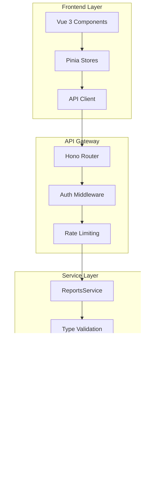

# 報表系統開發者指南

## 🎯 指南概覽

本開發者指南面向需要擴展、維護或整合報表系統的開發人員，提供詳細的技術實作指導和最佳實務。

### 🧑‍💻 目標讀者
- **後端開發者** - 新增報表類型、API開發
- **前端開發者** - 報表視覺化、用戶介面整合
- **DevOps工程師** - 部署、監控、性能優化
- **架構師** - 系統設計、擴展規劃

## 🏗️ 系統架構深度解析

### 整體架構圖


### 模組依賴關係
```
src/modules/reports/
├── types/
│   ├── report-types.ts         # 核心類型定義
│   ├── api-types.ts           # API介面類型
│   └── validation-types.ts    # 驗證相關類型
├── services/
│   ├── reports-service.ts     # 主要服務類
│   ├── cache-service.ts       # 快取服務
│   └── export-service.ts      # 匯出服務
├── handlers/
│   ├── reports-main.ts        # 主要API處理器
│   ├── admin-reports.ts       # 管理員專用處理器
│   └── scheduled-reports.ts   # 排程報表處理器
├── middleware/
│   ├── auth-middleware.ts     # 認證中介軟體
│   └── validation-middleware.ts # 驗證中介軟體
├── utils/
│   ├── data-processors.ts     # 資料處理工具
│   ├── formatters.ts          # 格式化工具
│   └── validators.ts          # 驗證工具
└── tests/
    ├── unit/                  # 單元測試
    ├── integration/           # 整合測試
    └── e2e/                   # 端到端測試
```

## 🔧 開發環境設置

### 先決條件
```bash
# 系統要求
Node.js >= 18.0.0
npm >= 9.0.0
TypeScript >= 5.0.0
Cloudflare CLI (Wrangler) >= 3.0.0

# 開發工具
VS Code + 推薦擴展
  - TypeScript and JavaScript Language Features
  - Cloudflare Workers
  - Vue Language Features (Volar)
  - ESLint
  - Prettier
```

### 本地開發設置
```bash
# 1. 克隆專案
git clone <repository-url>
cd Multi_Channel_Integration_System

# 2. 安裝依賴
npm install

# 3. 設置環境變數
cp .env.example .env.local
# 編輯 .env.local 填入必要配置

# 4. 數據庫設置
npm run db:migrate        # 本地數據庫遷移
npm run db:seed           # 載入測試資料

# 5. 啟動開發環境
npm run dev               # 後端開發服務器
cd frontend && npm run dev # 前端開發服務器（另一個終端）
```

### 開發工具配置

#### TypeScript 配置 (tsconfig.json)
```json
{
  "compilerOptions": {
    "strict": true,
    "noUncheckedIndexedAccess": true,
    "exactOptionalPropertyTypes": true,
    "noImplicitReturns": true,
    "noFallthroughCasesInSwitch": true,
    "paths": {
      "@/*": ["./src/*"],
      "@shared/*": ["./src/shared/*"],
      "@modules/*": ["./src/modules/*"]
    }
  },
  "include": [
    "src/**/*",
    "tests/**/*"
  ]
}
```

#### ESLint 配置
```json
{
  "extends": [
    "@typescript-eslint/recommended",
    "@typescript-eslint/recommended-requiring-type-checking"
  ],
  "rules": {
    "@typescript-eslint/no-unused-vars": "error",
    "@typescript-eslint/explicit-function-return-type": "warn",
    "@typescript-eslint/no-explicit-any": "error"
  }
}
```

## 📝 新增報表類型開發指南

### 步驟1: 類型定義
```typescript
// src/modules/reports/types/report-types.ts

// 1. 擴展 ReportType 聯合類型
export type ReportType =
  // ... 現有類型
  | 'my_new_report';      // 新報表類型

// 2. 定義資料介面
export interface MyNewReportData {
  summary: {
    totalRecords: number;
    analysisDate: string;
    version: string;
  };

  metrics: Array<{
    metricName: string;
    value: number;
    unit: string;
    trend: 'up' | 'down' | 'stable';
    comparison: {
      previousValue: number;
      changePercentage: number;
    };
  }>;

  insights: Array<{
    category: string;
    insight: string;
    priority: 'high' | 'medium' | 'low';
    actionable: boolean;
    recommendations: string[];
  }>;
}

// 3. 更新配置
export const REPORT_TYPE_CONFIG: Record<ReportType, ReportConfig> = {
  // ... 現有配置
  my_new_report: {
    name: '我的新報表',
    description: '提供特定業務指標的深度分析',
    category: 'business_intelligence',
    requiredPermissions: ['reports:read', 'business:read'],
    supportedFormats: ['json', 'excel', 'pdf'],
    defaultFormat: 'json',
    maxDateRange: 90,
    estimatedExecutionTime: 6000,
    cacheTimeout: 3600,
    requiredFilters: [],
    optionalFilters: ['department', 'priority'],
    sampleDataGenerator: 'generateSampleMyNewReportData',
  },
};
```

### 步驟2: 服務層實現
```typescript
// src/modules/reports/services/reports-service.ts

export class ReportsService implements ReportsServiceInterface {
  // ... 現有方法

  /**
   * 生成我的新報表樣本資料
   */
  private generateSampleMyNewReportData(): MyNewReportData {
    return {
      summary: {
        totalRecords: Math.floor(Math.random() * 10000) + 1000,
        analysisDate: new Date().toISOString(),
        version: '1.0.0'
      },

      metrics: [
        {
          metricName: '轉換率',
          value: Math.random() * 100,
          unit: '%',
          trend: Math.random() > 0.5 ? 'up' : 'down',
          comparison: {
            previousValue: Math.random() * 100,
            changePercentage: (Math.random() - 0.5) * 20
          }
        },
        {
          metricName: '客戶滿意度',
          value: Math.random() * 5 + 3, // 3-8 分
          unit: '分',
          trend: 'stable',
          comparison: {
            previousValue: Math.random() * 5 + 3,
            changePercentage: (Math.random() - 0.5) * 10
          }
        }
      ],

      insights: [
        {
          category: '效率改善',
          insight: '檢測到週二和週四的處理效率較高',
          priority: 'medium',
          actionable: true,
          recommendations: [
            '考慮調整人力分配，在高效率日增加工作量',
            '分析高效率日的工作模式，推廣到其他日期'
          ]
        },
        {
          category: '風險警示',
          insight: '客戶投訴率在月末有上升趨勢',
          priority: 'high',
          actionable: true,
          recommendations: [
            '月末前進行客戶滿意度主動調查',
            '增加月末時期的品質監控頻率'
          ]
        }
      ]
    };
  }

  /**
   * 生成實際報表資料（連接真實資料來源）
   */
  private async generateMyNewReportData(
    params: ReportGenerationParams
  ): Promise<MyNewReportData> {
    try {
      // 1. 驗證參數
      this.validateReportParams(params);

      // 2. 查詢資料庫
      const rawData = await this.db
        .select()
        .from(businessMetricsTable)
        .where(
          and(
            gte(businessMetricsTable.createdAt, params.dateRange.startDate),
            lte(businessMetricsTable.createdAt, params.dateRange.endDate)
          )
        );

      // 3. 處理和轉換資料
      const processedData = this.processBusinessMetrics(rawData);

      // 4. 生成洞察和建議
      const insights = await this.generateBusinessInsights(processedData);

      // 5. 組裝最終結果
      return {
        summary: {
          totalRecords: rawData.length,
          analysisDate: new Date().toISOString(),
          version: '1.0.0'
        },
        metrics: processedData,
        insights: insights
      };

    } catch (error) {
      console.error('Generate my new report error:', error);
      throw new ReportGenerationError('Failed to generate my new report');
    }
  }
}
```

### 步驟3: API 端點實現
```typescript
// src/modules/reports/handlers/reports-main.ts

export class ReportsHandler {
  // ... 現有方法

  /**
   * 處理新報表類型的特殊邏輯
   */
  private async handleMyNewReport(
    params: ReportGenerationParams,
    userId: string
  ): Promise<GeneratedReport> {
    // 1. 權限檢查
    await this.checkReportPermission(userId, 'my_new_report');

    // 2. 參數驗證
    this.validateMyNewReportParams(params);

    // 3. 生成報表
    const reportData = await this.reportsService.generateReport(params, userId);

    // 4. 特殊後處理（如果需要）
    if (params.format === 'excel') {
      reportData.data = await this.formatForExcel(reportData.data);
    }

    return reportData;
  }

  /**
   * 驗證新報表類型的特殊參數
   */
  private validateMyNewReportParams(params: ReportGenerationParams): void {
    // 檢查日期範圍
    const daysDiff = this.calculateDaysDifference(
      params.dateRange.startDate,
      params.dateRange.endDate
    );

    if (daysDiff > 90) {
      throw new InvalidReportParamsError(
        'My new report supports maximum 90 days range'
      );
    }

    // 檢查必要篩選條件
    if (params.filters?.department &&
        !this.isValidDepartment(params.filters.department)) {
      throw new InvalidReportParamsError('Invalid department filter');
    }
  }
}
```

### 步驟4: 前端整合
```vue
<!-- frontend/src/components/reports/MyNewReportViewer.vue -->
<template>
  <div class="my-new-report-viewer">
    <!-- 報表摘要 -->
    <div class="report-summary">
      <h2>{{ reportData.summary.totalRecords }} 筆資料分析</h2>
      <p>分析時間: {{ formatDate(reportData.summary.analysisDate) }}</p>
    </div>

    <!-- 指標卡片 -->
    <div class="metrics-grid">
      <MetricCard
        v-for="metric in reportData.metrics"
        :key="metric.metricName"
        :metric="metric"
        @click="showMetricDetail(metric)"
      />
    </div>

    <!-- 洞察列表 -->
    <div class="insights-section">
      <h3>重要洞察</h3>
      <InsightCard
        v-for="(insight, index) in reportData.insights"
        :key="index"
        :insight="insight"
        @action-clicked="handleInsightAction"
      />
    </div>
  </div>
</template>

<script setup lang="ts">
import { ref, computed } from 'vue';
import type { MyNewReportData } from '@/types/report-types';
import MetricCard from './components/MetricCard.vue';
import InsightCard from './components/InsightCard.vue';

interface Props {
  reportData: MyNewReportData;
}

const props = defineProps<Props>();

// 格式化日期
const formatDate = (dateString: string): string => {
  return new Date(dateString).toLocaleDateString('zh-TW');
};

// 顯示指標詳情
const showMetricDetail = (metric: any): void => {
  // 實現指標詳情顯示邏輯
  console.log('Show metric detail:', metric);
};

// 處理洞察行動
const handleInsightAction = (insight: any, action: string): void => {
  // 實現洞察行動處理邏輯
  console.log('Handle insight action:', insight, action);
};
</script>
```

### 步驟5: 測試實現
```typescript
// tests/unit/reports/my-new-report.test.ts

import { describe, it, expect, beforeEach } from 'vitest';
import { ReportsService } from '@/modules/reports/services/reports-service';
import type { MyNewReportData } from '@/modules/reports/types/report-types';

describe('MyNewReport', () => {
  let reportsService: ReportsService;

  beforeEach(() => {
    reportsService = new ReportsService(mockBindings);
  });

  describe('generateSampleMyNewReportData', () => {
    it('should generate valid sample data structure', () => {
      const sampleData = reportsService['generateSampleMyNewReportData']();

      expect(sampleData).toMatchObject({
        summary: {
          totalRecords: expect.any(Number),
          analysisDate: expect.any(String),
          version: expect.any(String)
        },
        metrics: expect.arrayContaining([
          expect.objectContaining({
            metricName: expect.any(String),
            value: expect.any(Number),
            unit: expect.any(String),
            trend: expect.stringMatching(/^(up|down|stable)$/),
            comparison: expect.objectContaining({
              previousValue: expect.any(Number),
              changePercentage: expect.any(Number)
            })
          })
        ]),
        insights: expect.arrayContaining([
          expect.objectContaining({
            category: expect.any(String),
            insight: expect.any(String),
            priority: expect.stringMatching(/^(high|medium|low)$/),
            actionable: expect.any(Boolean),
            recommendations: expect.any(Array)
          })
        ])
      });
    });

    it('should generate metrics with valid trends', () => {
      const sampleData = reportsService['generateSampleMyNewReportData']();

      sampleData.metrics.forEach(metric => {
        expect(['up', 'down', 'stable']).toContain(metric.trend);
        expect(metric.value).toBeGreaterThanOrEqual(0);
        expect(metric.comparison.changePercentage).toBeTypeOf('number');
      });
    });

    it('should generate actionable insights', () => {
      const sampleData = reportsService['generateSampleMyNewReportData']();

      const actionableInsights = sampleData.insights.filter(i => i.actionable);
      expect(actionableInsights.length).toBeGreaterThan(0);

      actionableInsights.forEach(insight => {
        expect(insight.recommendations).toBeInstanceOf(Array);
        expect(insight.recommendations.length).toBeGreaterThan(0);
      });
    });
  });

  describe('report generation validation', () => {
    it('should validate date range limits', async () => {
      const invalidParams = {
        type: 'my_new_report' as const,
        format: 'json' as const,
        dateRange: {
          startDate: '2025-01-01',
          endDate: '2025-06-01' // 超過90天限制
        }
      };

      await expect(
        reportsService.generateReport(invalidParams, 'test-user')
      ).rejects.toThrow('maximum 90 days range');
    });

    it('should handle valid parameters', async () => {
      const validParams = {
        type: 'my_new_report' as const,
        format: 'json' as const,
        dateRange: {
          startDate: '2025-09-01',
          endDate: '2025-09-30'
        }
      };

      const result = await reportsService.generateReport(validParams, 'test-user');

      expect(result).toMatchObject({
        id: expect.any(String),
        type: 'my_new_report',
        status: 'completed',
        data: expect.any(Object)
      });
    });
  });
});
```

## 🔧 API 開發最佳實務

### 錯誤處理模式
```typescript
// 標準錯誤處理流程
export async function handleReportRequest(
  c: Context,
  params: ReportGenerationParams
): Promise<Response> {
  try {
    // 1. 輸入驗證
    const validatedParams = await validateReportParams(params);

    // 2. 權限檢查
    const userId = await getUserFromContext(c);
    await checkReportPermission(userId, params.type);

    // 3. 業務邏輯處理
    const result = await processReportGeneration(validatedParams, userId);

    // 4. 成功回應
    return c.json({
      success: true,
      data: result,
      timestamp: new Date().toISOString()
    });

  } catch (error) {
    // 5. 錯誤處理
    return handleReportError(c, error);
  }
}

// 專用錯誤處理器
function handleReportError(c: Context, error: any): Response {
  if (error instanceof ReportNotFoundError) {
    return c.json({ error: error.toJSON() }, 404);
  }

  if (error instanceof InvalidReportParamsError) {
    return c.json({ error: error.toJSON() }, 400);
  }

  if (error instanceof ReportAccessDeniedError) {
    return c.json({ error: error.toJSON() }, 403);
  }

  // 未知錯誤
  console.error('Unexpected report error:', error);
  return c.json({
    error: {
      code: 'INTERNAL_ERROR',
      message: 'An unexpected error occurred',
      timestamp: new Date().toISOString()
    }
  }, 500);
}
```

### 參數驗證模式
```typescript
// 使用 Zod 進行類型安全的驗證
import { z } from 'zod';

const ReportGenerationParamsSchema = z.object({
  type: z.enum([
    'conversation_summary',
    'agent_performance',
    // ... 所有報表類型
    'my_new_report'
  ]),
  format: z.enum(['excel', 'pdf', 'json', 'csv', 'html']),
  dateRange: z.object({
    startDate: z.string().regex(/^\d{4}-\d{2}-\d{2}$/),
    endDate: z.string().regex(/^\d{4}-\d{2}-\d{2}$/)
  }).refine(
    data => new Date(data.endDate) >= new Date(data.startDate),
    { message: "End date must be after start date" }
  ),
  filters: z.record(z.any()).optional(),
  options: z.object({
    includeCharts: z.boolean().optional(),
    includeSummary: z.boolean().optional(),
    template: z.string().optional()
  }).optional()
});

export async function validateReportParams(
  params: unknown
): Promise<ReportGenerationParams> {
  try {
    return ReportGenerationParamsSchema.parse(params);
  } catch (error) {
    if (error instanceof z.ZodError) {
      throw new InvalidReportParamsError(
        'Invalid request parameters',
        error.issues.map(issue => `${issue.path.join('.')}: ${issue.message}`)
      );
    }
    throw error;
  }
}
```

### 快取策略實現
```typescript
// 多層次快取策略
export class ReportCacheService {
  constructor(
    private kv: KVNamespace,
    private r2: R2Bucket
  ) {}

  /**
   * 獲取快取的報表資料
   */
  async getCachedReport(cacheKey: string): Promise<any | null> {
    try {
      // 1. 先檢查記憶體快取（KV）
      const kvCached = await this.kv.get(cacheKey, { type: 'json' });
      if (kvCached) {
        return kvCached;
      }

      // 2. 檢查物件儲存快取（R2）
      const r2Object = await this.r2.get(cacheKey);
      if (r2Object) {
        const data = await r2Object.json();
        // 回填到 KV 快取
        await this.kv.put(cacheKey, JSON.stringify(data), {
          expirationTtl: 3600 // 1小時
        });
        return data;
      }

      return null;
    } catch (error) {
      console.error('Cache get error:', error);
      return null;
    }
  }

  /**
   * 儲存報表到快取
   */
  async setCachedReport(
    cacheKey: string,
    data: any,
    ttl: number = 3600
  ): Promise<void> {
    try {
      const serializedData = JSON.stringify(data);

      // 1. 儲存到 KV（快速存取）
      await this.kv.put(cacheKey, serializedData, {
        expirationTtl: ttl
      });

      // 2. 儲存到 R2（長期儲存）
      await this.r2.put(cacheKey, serializedData, {
        customMetadata: {
          cachedAt: new Date().toISOString(),
          ttl: ttl.toString()
        }
      });
    } catch (error) {
      console.error('Cache set error:', error);
      // 快取失敗不應該影響主要功能
    }
  }

  /**
   * 生成快取鍵
   */
  generateCacheKey(params: ReportGenerationParams, userId?: string): string {
    const keyParts = [
      params.type,
      params.format,
      params.dateRange.startDate,
      params.dateRange.endDate,
      userId ? `user:${userId}` : 'public'
    ];

    if (params.filters && Object.keys(params.filters).length > 0) {
      const filtersHash = this.hashObject(params.filters);
      keyParts.push(`filters:${filtersHash}`);
    }

    return `report:${keyParts.join(':')}`;
  }

  private hashObject(obj: any): string {
    return btoa(JSON.stringify(obj)).replace(/[/+=]/g, '');
  }
}
```

## 🎨 前端開發指南

### Vue 組件架構
```
frontend/src/components/reports/
├── ReportDashboard.vue        # 報表儀表板主頁
├── ReportGenerator.vue        # 報表生成器
├── ReportViewer.vue          # 報表檢視器
├── ReportList.vue            # 報表列表
├── common/
│   ├── ReportCard.vue        # 報表卡片組件
│   ├── LoadingSpinner.vue    # 載入動畫
│   └── ErrorMessage.vue      # 錯誤訊息
├── charts/
│   ├── LineChart.vue         # 線圖組件
│   ├── BarChart.vue          # 柱狀圖組件
│   ├── PieChart.vue          # 圓餅圖組件
│   └── MetricCard.vue        # 指標卡片
└── types/
    ├── ConversationSummaryReport.vue
    ├── AgentPerformanceReport.vue
    └── MyNewReport.vue       # 新報表類型組件
```

### 狀態管理 (Pinia)
```typescript
// frontend/src/stores/reportsStore.ts
import { defineStore } from 'pinia';
import type {
  ReportGenerationParams,
  GeneratedReport,
  ReportListResponse
} from '@/types/report-types';

export const useReportsStore = defineStore('reports', () => {
  // 狀態
  const reports = ref<GeneratedReport[]>([]);
  const currentReport = ref<GeneratedReport | null>(null);
  const isGenerating = ref(false);
  const generationProgress = ref(0);
  const error = ref<string | null>(null);

  // Getters
  const getReportById = computed(() => {
    return (id: string) => reports.value.find(r => r.id === id);
  });

  const reportsByType = computed(() => {
    return (type: string) => reports.value.filter(r => r.type === type);
  });

  // Actions
  async function generateReport(params: ReportGenerationParams): Promise<string> {
    try {
      isGenerating.value = true;
      error.value = null;
      generationProgress.value = 0;

      const response = await reportsApi.generateReport(params);
      const reportId = response.data.id;

      // 輪詢檢查生成狀態
      await pollReportStatus(reportId);

      return reportId;
    } catch (err) {
      error.value = err instanceof Error ? err.message : 'Unknown error';
      throw err;
    } finally {
      isGenerating.value = false;
    }
  }

  async function pollReportStatus(reportId: string): Promise<void> {
    const maxAttempts = 60; // 最多等待5分鐘
    let attempts = 0;

    while (attempts < maxAttempts) {
      try {
        const status = await reportsApi.getReportStatus(reportId);

        if (status.progress !== undefined) {
          generationProgress.value = status.progress;
        }

        if (status.status === 'completed') {
          await fetchReportById(reportId);
          break;
        }

        if (status.status === 'failed') {
          throw new Error(status.error || 'Report generation failed');
        }

        // 等待5秒後重新檢查
        await new Promise(resolve => setTimeout(resolve, 5000));
        attempts++;
      } catch (err) {
        console.error('Poll status error:', err);
        attempts++;
      }
    }

    if (attempts >= maxAttempts) {
      throw new Error('Report generation timeout');
    }
  }

  async function fetchReportById(id: string): Promise<void> {
    try {
      const response = await reportsApi.getReport(id);
      const report = response.data;

      // 更新或新增報表到列表
      const index = reports.value.findIndex(r => r.id === id);
      if (index >= 0) {
        reports.value[index] = report;
      } else {
        reports.value.unshift(report);
      }

      currentReport.value = report;
    } catch (err) {
      error.value = err instanceof Error ? err.message : 'Failed to fetch report';
      throw err;
    }
  }

  async function fetchReports(params?: any): Promise<void> {
    try {
      const response = await reportsApi.getReports(params);
      reports.value = response.data.reports;
    } catch (err) {
      error.value = err instanceof Error ? err.message : 'Failed to fetch reports';
      throw err;
    }
  }

  async function deleteReport(id: string): Promise<void> {
    try {
      await reportsApi.deleteReport(id);
      reports.value = reports.value.filter(r => r.id !== id);

      if (currentReport.value?.id === id) {
        currentReport.value = null;
      }
    } catch (err) {
      error.value = err instanceof Error ? err.message : 'Failed to delete report';
      throw err;
    }
  }

  function clearError(): void {
    error.value = null;
  }

  return {
    // 狀態
    reports: readonly(reports),
    currentReport: readonly(currentReport),
    isGenerating: readonly(isGenerating),
    generationProgress: readonly(generationProgress),
    error: readonly(error),

    // Getters
    getReportById,
    reportsByType,

    // Actions
    generateReport,
    fetchReportById,
    fetchReports,
    deleteReport,
    clearError
  };
});
```

### 圖表組件開發
```vue
<!-- frontend/src/components/reports/charts/LineChart.vue -->
<template>
  <div class="line-chart-container">
    <canvas ref="chartCanvas" />
  </div>
</template>

<script setup lang="ts">
import { ref, onMounted, onUnmounted, watch } from 'vue';
import {
  Chart,
  LineElement,
  PointElement,
  LinearScale,
  CategoryScale,
  Title,
  Tooltip,
  Legend,
  type ChartConfiguration
} from 'chart.js';

// 註冊 Chart.js 組件
Chart.register(
  LineElement,
  PointElement,
  LinearScale,
  CategoryScale,
  Title,
  Tooltip,
  Legend
);

interface ChartDataPoint {
  x: string;
  y: number;
}

interface Props {
  data: ChartDataPoint[];
  title?: string;
  xAxisLabel?: string;
  yAxisLabel?: string;
  color?: string;
}

const props = withDefaults(defineProps<Props>(), {
  title: '',
  xAxisLabel: '',
  yAxisLabel: '',
  color: '#3B82F6'
});

const chartCanvas = ref<HTMLCanvasElement | null>(null);
let chartInstance: Chart | null = null;

onMounted(() => {
  createChart();
});

onUnmounted(() => {
  if (chartInstance) {
    chartInstance.destroy();
  }
});

watch(() => props.data, () => {
  updateChart();
}, { deep: true });

function createChart(): void {
  if (!chartCanvas.value) return;

  const config: ChartConfiguration = {
    type: 'line',
    data: {
      labels: props.data.map(d => d.x),
      datasets: [{
        label: props.title,
        data: props.data.map(d => d.y),
        borderColor: props.color,
        backgroundColor: props.color + '20',
        fill: true,
        tension: 0.4
      }]
    },
    options: {
      responsive: true,
      maintainAspectRatio: false,
      scales: {
        x: {
          display: true,
          title: {
            display: !!props.xAxisLabel,
            text: props.xAxisLabel
          }
        },
        y: {
          display: true,
          title: {
            display: !!props.yAxisLabel,
            text: props.yAxisLabel
          }
        }
      },
      plugins: {
        title: {
          display: !!props.title,
          text: props.title
        },
        legend: {
          display: false
        }
      }
    }
  };

  chartInstance = new Chart(chartCanvas.value, config);
}

function updateChart(): void {
  if (!chartInstance) return;

  chartInstance.data.labels = props.data.map(d => d.x);
  chartInstance.data.datasets[0].data = props.data.map(d => d.y);
  chartInstance.update();
}
</script>

<style scoped>
.line-chart-container {
  position: relative;
  height: 300px;
  width: 100%;
}
</style>
```

## 🚀 部署和 DevOps

### CI/CD 流水線配置
```yaml
# .github/workflows/reports-module.yml
name: Reports Module CI/CD

on:
  push:
    paths:
      - 'src/modules/reports/**'
      - 'frontend/src/components/reports/**'
      - 'docs/reports/**'
  pull_request:
    paths:
      - 'src/modules/reports/**'
      - 'frontend/src/components/reports/**'

jobs:
  test:
    runs-on: ubuntu-latest
    steps:
      - uses: actions/checkout@v4

      - name: Setup Node.js
        uses: actions/setup-node@v4
        with:
          node-version: '18'
          cache: 'npm'

      - name: Install dependencies
        run: npm ci

      - name: Type check
        run: npm run build

      - name: Run unit tests
        run: npm run test:reports

      - name: Run integration tests
        run: npm run test:integration:reports

      - name: Frontend tests
        run: |
          cd frontend
          npm ci
          npm run test:reports

  deploy-staging:
    needs: test
    if: github.ref == 'refs/heads/develop'
    runs-on: ubuntu-latest
    steps:
      - uses: actions/checkout@v4

      - name: Deploy to staging
        run: |
          npm run deploy:staging
          npm run test:e2e:reports
        env:
          CLOUDFLARE_API_TOKEN: ${{ secrets.CLOUDFLARE_API_TOKEN }}

  deploy-production:
    needs: test
    if: github.ref == 'refs/heads/main'
    runs-on: ubuntu-latest
    steps:
      - uses: actions/checkout@v4

      - name: Deploy to production
        run: npm run deploy:production
        env:
          CLOUDFLARE_API_TOKEN: ${{ secrets.CLOUDFLARE_API_TOKEN }}

      - name: Run smoke tests
        run: npm run test:smoke:reports
```

### 監控和日誌
```typescript
// src/modules/reports/monitoring/reports-monitor.ts

export class ReportsMonitor {
  constructor(private analytics: AnalyticsEngine) {}

  /**
   * 記錄報表生成指標
   */
  async recordReportGeneration(
    reportType: string,
    userId: string,
    executionTime: number,
    status: 'success' | 'error',
    errorCode?: string
  ): Promise<void> {
    await this.analytics.writeDataPoint({
      blobs: [reportType, userId, status, errorCode || ''],
      doubles: [executionTime],
      indexes: [`report_type:${reportType}`, `status:${status}`]
    });
  }

  /**
   * 記錄性能指標
   */
  async recordPerformanceMetric(
    metric: 'response_time' | 'memory_usage' | 'cpu_usage',
    value: number,
    tags: Record<string, string> = {}
  ): Promise<void> {
    await this.analytics.writeDataPoint({
      blobs: [metric, ...Object.values(tags)],
      doubles: [value],
      indexes: Object.entries(tags).map(([k, v]) => `${k}:${v}`)
    });
  }

  /**
   * 檢查系統健康狀況
   */
  async checkHealth(): Promise<{
    status: 'healthy' | 'degraded' | 'unhealthy';
    metrics: Record<string, any>;
  }> {
    try {
      const metrics = await this.gatherMetrics();
      const status = this.evaluateHealth(metrics);

      return { status, metrics };
    } catch (error) {
      console.error('Health check failed:', error);
      return {
        status: 'unhealthy',
        metrics: { error: error.message }
      };
    }
  }

  private async gatherMetrics(): Promise<Record<string, any>> {
    // 收集各種系統指標
    return {
      uptime: process.uptime(),
      memoryUsage: process.memoryUsage(),
      timestamp: new Date().toISOString()
    };
  }

  private evaluateHealth(metrics: Record<string, any>): 'healthy' | 'degraded' | 'unhealthy' {
    // 根據指標評估健康狀況
    if (metrics.memoryUsage.heapUsed > 500 * 1024 * 1024) { // 500MB
      return 'degraded';
    }

    return 'healthy';
  }
}
```

### 性能優化
```typescript
// src/modules/reports/optimization/performance-optimizer.ts

export class ReportPerformanceOptimizer {
  /**
   * 資料分頁處理
   */
  async processLargeDataset<T>(
    data: T[],
    batchSize: number = 1000,
    processor: (batch: T[]) => Promise<any>
  ): Promise<any[]> {
    const results = [];

    for (let i = 0; i < data.length; i += batchSize) {
      const batch = data.slice(i, i + batchSize);
      const result = await processor(batch);
      results.push(result);

      // 避免阻塞事件循環
      if (i % (batchSize * 10) === 0) {
        await new Promise(resolve => setTimeout(resolve, 0));
      }
    }

    return results;
  }

  /**
   * 記憶體優化的資料流處理
   */
  async streamProcess<T, R>(
    dataStream: AsyncIterable<T>,
    processor: (item: T) => R | Promise<R>
  ): Promise<R[]> {
    const results: R[] = [];

    for await (const item of dataStream) {
      const result = await processor(item);
      results.push(result);
    }

    return results;
  }

  /**
   * 並行處理優化
   */
  async parallelProcess<T, R>(
    items: T[],
    processor: (item: T) => Promise<R>,
    concurrency: number = 5
  ): Promise<R[]> {
    const results: R[] = [];
    const executing: Promise<void>[] = [];

    for (const item of items) {
      const promise = processor(item).then(result => {
        results.push(result);
      });

      executing.push(promise);

      if (executing.length >= concurrency) {
        await Promise.race(executing);
        // 移除已完成的 Promise
        const completed = executing.filter(p =>
          p.constructor.name === 'Promise' &&
          (p as any).state === 'fulfilled'
        );
        executing.splice(0, completed.length);
      }
    }

    await Promise.all(executing);
    return results;
  }
}
```

## 🧪 測試策略

### 測試層次架構
```
tests/
├── unit/                    # 單元測試
│   ├── services/
│   ├── handlers/
│   ├── utils/
│   └── types/
├── integration/             # 整合測試
│   ├── api/
│   ├── database/
│   └── cache/
├── e2e/                     # 端到端測試
│   ├── report-generation/
│   ├── user-workflows/
│   └── performance/
├── fixtures/                # 測試資料
│   ├── sample-data/
│   └── mock-responses/
└── helpers/                 # 測試工具
    ├── test-utils.ts
    ├── mock-factory.ts
    └── assertions.ts
```

### 單元測試範例
```typescript
// tests/unit/services/reports-service.test.ts
import { describe, it, expect, beforeEach, vi } from 'vitest';
import { ReportsService } from '@/modules/reports/services/reports-service';
import { createMockBindings } from '../helpers/mock-factory';

describe('ReportsService', () => {
  let service: ReportsService;
  let mockBindings: any;

  beforeEach(() => {
    mockBindings = createMockBindings();
    service = new ReportsService(mockBindings);
  });

  describe('generateReport', () => {
    it('should generate conversation summary report', async () => {
      const params = {
        type: 'conversation_summary' as const,
        format: 'json' as const,
        dateRange: {
          startDate: '2025-09-01',
          endDate: '2025-09-30'
        }
      };

      const result = await service.generateReport(params, 'test-user');

      expect(result).toMatchObject({
        id: expect.any(String),
        type: 'conversation_summary',
        format: 'json',
        status: 'completed',
        data: expect.any(Object)
      });
    });

    it('should handle invalid date range', async () => {
      const params = {
        type: 'conversation_summary' as const,
        format: 'json' as const,
        dateRange: {
          startDate: '2025-09-30',
          endDate: '2025-09-01' // 結束日期早於開始日期
        }
      };

      await expect(
        service.generateReport(params, 'test-user')
      ).rejects.toThrow('Invalid date range');
    });

    it('should cache report results', async () => {
      const params = {
        type: 'conversation_summary' as const,
        format: 'json' as const,
        dateRange: {
          startDate: '2025-09-01',
          endDate: '2025-09-30'
        }
      };

      // 第一次呼叫
      await service.generateReport(params, 'test-user');

      // 第二次呼叫應該使用快取
      const spy = vi.spyOn(mockBindings.DB, 'prepare');
      await service.generateReport(params, 'test-user');

      expect(spy).not.toHaveBeenCalled();
    });
  });

  describe('getReportPreview', () => {
    it('should return valid preview data', async () => {
      const preview = await service.getReportPreview('trend_forecast');

      expect(preview).toMatchObject({
        type: 'trend_forecast',
        title: expect.any(String),
        description: expect.any(String),
        estimatedSize: expect.any(Number),
        availableFormats: expect.arrayContaining(['json', 'excel']),
        sampleData: expect.any(Object)
      });
    });
  });
});
```

### 整合測試範例
```typescript
// tests/integration/api/reports-api.test.ts
import { describe, it, expect, beforeAll, afterAll } from 'vitest';
import { testClient } from '../helpers/test-client';

describe('Reports API Integration', () => {
  let client: any;
  let authToken: string;

  beforeAll(async () => {
    client = await testClient.create();
    authToken = await testClient.getAuthToken('test-user');
  });

  afterAll(async () => {
    await testClient.cleanup();
  });

  describe('POST /api/reports/generate', () => {
    it('should generate report successfully', async () => {
      const response = await client
        .post('/api/reports/generate')
        .set('Authorization', `Bearer ${authToken}`)
        .send({
          type: 'conversation_summary',
          format: 'json',
          dateRange: {
            startDate: '2025-09-01',
            endDate: '2025-09-30'
          }
        });

      expect(response.status).toBe(200);
      expect(response.body).toMatchObject({
        success: true,
        data: {
          id: expect.any(String),
          type: 'conversation_summary',
          status: expect.stringMatching(/^(pending|generating|completed)$/)
        }
      });
    });

    it('should return 401 for unauthorized request', async () => {
      const response = await client
        .post('/api/reports/generate')
        .send({
          type: 'conversation_summary',
          format: 'json',
          dateRange: {
            startDate: '2025-09-01',
            endDate: '2025-09-30'
          }
        });

      expect(response.status).toBe(401);
    });
  });

  describe('GET /api/reports/:id/status', () => {
    it('should return report status', async () => {
      // 先生成一個報表
      const generateResponse = await client
        .post('/api/reports/generate')
        .set('Authorization', `Bearer ${authToken}`)
        .send({
          type: 'conversation_summary',
          format: 'json',
          dateRange: {
            startDate: '2025-09-01',
            endDate: '2025-09-30'
          }
        });

      const reportId = generateResponse.body.data.id;

      // 查詢狀態
      const statusResponse = await client
        .get(`/api/reports/${reportId}/status`)
        .set('Authorization', `Bearer ${authToken}`);

      expect(statusResponse.status).toBe(200);
      expect(statusResponse.body).toMatchObject({
        id: reportId,
        status: expect.stringMatching(/^(pending|generating|completed|failed)$/),
        progress: expect.any(Number)
      });
    });
  });
});
```

### E2E 測試範例
```typescript
// tests/e2e/report-generation-workflow.test.ts
import { test, expect } from '@playwright/test';

test.describe('Report Generation Workflow', () => {
  test('complete report generation flow', async ({ page }) => {
    // 1. 登入系統
    await page.goto('/login');
    await page.fill('[data-testid="username"]', 'test-user');
    await page.fill('[data-testid="password"]', 'password');
    await page.click('[data-testid="login-button"]');

    // 2. 導航到報表頁面
    await page.click('[data-testid="reports-menu"]');
    await expect(page).toHaveURL('/reports');

    // 3. 選擇報表類型
    await page.click('[data-testid="conversation-summary-card"]');
    await expect(page.locator('[data-testid="report-form"]')).toBeVisible();

    // 4. 設定參數
    await page.fill('[data-testid="start-date"]', '2025-09-01');
    await page.fill('[data-testid="end-date"]', '2025-09-30');
    await page.selectOption('[data-testid="format-select"]', 'excel');

    // 5. 生成報表
    await page.click('[data-testid="generate-button"]');

    // 6. 等待生成完成
    await expect(page.locator('[data-testid="progress-bar"]')).toBeVisible();
    await expect(page.locator('[data-testid="download-link"]')).toBeVisible({
      timeout: 60000 // 最多等待1分鐘
    });

    // 7. 驗證下載連結
    const downloadLink = page.locator('[data-testid="download-link"]');
    await expect(downloadLink).toHaveAttribute('href', /\.xlsx$/);
  });

  test('handle report generation failure', async ({ page }) => {
    await page.goto('/reports');

    // 設定會導致失敗的參數
    await page.click('[data-testid="conversation-summary-card"]');
    await page.fill('[data-testid="start-date"]', '2025-12-31');
    await page.fill('[data-testid="end-date"]', '2025-01-01'); // 無效的日期範圍

    await page.click('[data-testid="generate-button"]');

    // 驗證錯誤訊息
    await expect(page.locator('[data-testid="error-message"]')).toBeVisible();
    await expect(page.locator('[data-testid="error-message"]')).toContainText('Invalid date range');
  });
});
```

## 📚 文檔和維護

### 程式碼文檔標準
```typescript
/**
 * 報表服務主類別
 *
 * 提供完整的報表生成、管理和分析功能，支援19種不同類型的企業級報表。
 * 包括基礎營運報表、商業智能報表和高級分析報表。
 *
 * @example
 * ```typescript
 * const service = new ReportsService(bindings);
 * const report = await service.generateReport({
 *   type: 'conversation_summary',
 *   format: 'excel',
 *   dateRange: { startDate: '2025-09-01', endDate: '2025-09-30' }
 * }, 'user-id');
 * ```
 *
 * @see {@link https://docs.company.com/reports} 完整文檔
 * @since 2.0.0
 */
export class ReportsService implements ReportsServiceInterface {

  /**
   * 生成指定類型的報表
   *
   * @param params - 報表生成參數
   * @param params.type - 報表類型，支援19種不同類型
   * @param params.format - 輸出格式 (excel, pdf, json, csv, html)
   * @param params.dateRange - 日期範圍，影響資料查詢範圍
   * @param params.filters - 可選的過濾條件
   * @param userId - 用戶ID，用於權限檢查和審計
   *
   * @returns Promise<GeneratedReport> 生成的報表物件
   *
   * @throws {InvalidReportParamsError} 當參數無效時拋出
   * @throws {ReportAccessDeniedError} 當用戶無權限時拋出
   * @throws {ReportGenerationError} 當生成過程出錯時拋出
   *
   * @example
   * ```typescript
   * // 生成對話摘要報表
   * const report = await service.generateReport({
   *   type: 'conversation_summary',
   *   format: 'excel',
   *   dateRange: {
   *     startDate: '2025-09-01',
   *     endDate: '2025-09-30'
   *   }
   * }, 'user123');
   *
   * console.log(`Report ID: ${report.id}`);
   * console.log(`Status: ${report.status}`);
   * ```
   *
   * @see {@link ReportGenerationParams} 參數詳細說明
   * @see {@link GeneratedReport} 回傳值詳細說明
   * @since 2.0.0
   */
  async generateReport(
    params: ReportGenerationParams,
    userId: string
  ): Promise<GeneratedReport> {
    // 實作內容...
  }
}
```

### API 文檔自動生成
```typescript
// scripts/generate-api-docs.ts

import { generateApi } from '@apidevtools/swagger-typescript-api';
import { writeFileSync } from 'fs';
import { resolve } from 'path';

/**
 * 自動生成 API 文檔和類型定義
 */
async function generateApiDocumentation(): Promise<void> {
  try {
    // 1. 從程式碼生成 OpenAPI 規範
    const openApiSpec = await generateOpenApiSpec();

    // 2. 生成 TypeScript 類型
    const { files } = await generateApi({
      name: 'ReportsApi',
      url: openApiSpec,
      httpClientType: 'fetch',
      generateRouteTypes: true,
      generateResponses: true,
      generateClient: true
    });

    // 3. 寫入檔案
    files.forEach(({ content, name }) => {
      const filePath = resolve(__dirname, '../docs/api/generated', name);
      writeFileSync(filePath, content);
    });

    // 4. 生成 Markdown 文檔
    await generateMarkdownDocs(openApiSpec);

    console.log('✅ API documentation generated successfully');
  } catch (error) {
    console.error('❌ Failed to generate API documentation:', error);
    process.exit(1);
  }
}

async function generateOpenApiSpec(): Promise<any> {
  // 從程式碼註解和類型定義生成 OpenAPI 規範
  return {
    openapi: '3.0.0',
    info: {
      title: 'Reports API',
      version: '2.0.0',
      description: '多通道客服系統報表API'
    },
    paths: {
      // 自動從處理器生成
    },
    components: {
      schemas: {
        // 自動從 TypeScript 類型生成
      }
    }
  };
}
```

### 版本發布流程
```bash
#!/bin/bash
# scripts/release.sh

set -e

echo "🚀 Starting release process..."

# 1. 檢查工作目錄是否乾淨
if [[ -n $(git status --porcelain) ]]; then
  echo "❌ Working directory is not clean. Please commit or stash changes."
  exit 1
fi

# 2. 運行所有測試
echo "📋 Running tests..."
npm run test:all
npm run lint:check

# 3. 更新版本號
echo "📦 Updating version..."
npm version patch

# 4. 生成變更日誌
echo "📝 Generating changelog..."
npm run changelog:generate

# 5. 構建文檔
echo "📚 Building documentation..."
npm run docs:build

# 6. 創建發布標籤
VERSION=$(node -p "require('./package.json').version")
git tag -a "v$VERSION" -m "Release v$VERSION"

# 7. 推送到遠端
echo "🌐 Pushing to remote..."
git push origin main --tags

# 8. 部署到生產環境
echo "🚀 Deploying to production..."
npm run deploy:production

echo "✅ Release v$VERSION completed successfully!"
```

## 🔍 除錯和問題排解

### 常見問題診斷
```typescript
// src/modules/reports/diagnostics/report-diagnostics.ts

export class ReportDiagnostics {
  /**
   * 診斷報表生成問題
   */
  async diagnoseGenerationIssue(
    reportId: string,
    params: ReportGenerationParams
  ): Promise<DiagnosticResult> {
    const issues: string[] = [];
    const recommendations: string[] = [];

    // 1. 檢查參數有效性
    const paramIssues = this.validateParameters(params);
    issues.push(...paramIssues);

    // 2. 檢查資料可用性
    const dataIssues = await this.checkDataAvailability(params);
    issues.push(...dataIssues);

    // 3. 檢查系統資源
    const resourceIssues = await this.checkSystemResources();
    issues.push(...resourceIssues);

    // 4. 檢查權限
    const permissionIssues = await this.checkPermissions(params);
    issues.push(...permissionIssues);

    // 5. 生成建議
    recommendations.push(...this.generateRecommendations(issues));

    return {
      reportId,
      issues,
      recommendations,
      severity: this.calculateSeverity(issues),
      timestamp: new Date().toISOString()
    };
  }

  private validateParameters(params: ReportGenerationParams): string[] {
    const issues: string[] = [];

    // 檢查日期範圍
    const start = new Date(params.dateRange.startDate);
    const end = new Date(params.dateRange.endDate);

    if (start > end) {
      issues.push('開始日期晚於結束日期');
    }

    if (start > new Date()) {
      issues.push('開始日期為未來日期');
    }

    const daysDiff = Math.ceil((end.getTime() - start.getTime()) / (1000 * 60 * 60 * 24));
    const maxDays = REPORT_TYPE_CONFIG[params.type]?.maxDateRange || 365;

    if (daysDiff > maxDays) {
      issues.push(`日期範圍超過限制 (${daysDiff} > ${maxDays} 天)`);
    }

    return issues;
  }

  private async checkDataAvailability(params: ReportGenerationParams): Promise<string[]> {
    const issues: string[] = [];

    try {
      // 檢查資料表是否存在資料
      const dataCount = await this.getDataCount(params);

      if (dataCount === 0) {
        issues.push('指定日期範圍內無可用資料');
      }

      if (dataCount < 10) {
        issues.push('資料量過少，可能影響報表品質');
      }
    } catch (error) {
      issues.push(`資料查詢失敗: ${error.message}`);
    }

    return issues;
  }

  private async checkSystemResources(): Promise<string[]> {
    const issues: string[] = [];

    // 檢查記憶體使用
    const memoryUsage = process.memoryUsage();
    const memoryLimit = 512 * 1024 * 1024; // 512MB

    if (memoryUsage.heapUsed > memoryLimit * 0.8) {
      issues.push('系統記憶體使用率過高');
    }

    // 檢查並發報表數量
    const activeReports = await this.getActiveReportsCount();
    if (activeReports > 10) {
      issues.push('並發報表數量過多，建議稍後重試');
    }

    return issues;
  }
}
```

### 效能分析工具
```typescript
// src/modules/reports/performance/performance-profiler.ts

export class ReportPerformanceProfiler {
  private metrics: Map<string, any> = new Map();

  /**
   * 開始性能分析
   */
  startProfiling(reportId: string): void {
    this.metrics.set(reportId, {
      startTime: process.hrtime.bigint(),
      memoryStart: process.memoryUsage(),
      checkpoints: []
    });
  }

  /**
   * 記錄檢查點
   */
  checkpoint(reportId: string, name: string): void {
    const metric = this.metrics.get(reportId);
    if (!metric) return;

    metric.checkpoints.push({
      name,
      timestamp: process.hrtime.bigint(),
      memory: process.memoryUsage()
    });
  }

  /**
   * 結束分析並生成報告
   */
  endProfiling(reportId: string): PerformanceReport {
    const metric = this.metrics.get(reportId);
    if (!metric) {
      throw new Error(`No profiling data found for report ${reportId}`);
    }

    const endTime = process.hrtime.bigint();
    const totalTime = Number(endTime - metric.startTime) / 1000000; // 轉換為毫秒

    const report: PerformanceReport = {
      reportId,
      totalExecutionTime: totalTime,
      memoryUsage: {
        start: metric.memoryStart,
        peak: this.calculatePeakMemory(metric),
        end: process.memoryUsage()
      },
      checkpoints: metric.checkpoints.map(cp => ({
        name: cp.name,
        elapsedTime: Number(cp.timestamp - metric.startTime) / 1000000,
        memoryDelta: cp.memory.heapUsed - metric.memoryStart.heapUsed
      })),
      recommendations: this.generatePerformanceRecommendations(metric, totalTime)
    };

    this.metrics.delete(reportId);
    return report;
  }

  private calculatePeakMemory(metric: any): NodeJS.MemoryUsage {
    let peak = metric.memoryStart;

    for (const checkpoint of metric.checkpoints) {
      if (checkpoint.memory.heapUsed > peak.heapUsed) {
        peak = checkpoint.memory;
      }
    }

    return peak;
  }

  private generatePerformanceRecommendations(
    metric: any,
    totalTime: number
  ): string[] {
    const recommendations: string[] = [];

    if (totalTime > 30000) { // 超過30秒
      recommendations.push('執行時間過長，建議優化查詢或增加快取');
    }

    const memoryIncrease = process.memoryUsage().heapUsed - metric.memoryStart.heapUsed;
    if (memoryIncrease > 100 * 1024 * 1024) { // 超過100MB
      recommendations.push('記憶體使用量大，建議實施流式處理');
    }

    // 分析瓶頸步驟
    let maxStepTime = 0;
    let slowestStep = '';

    for (let i = 1; i < metric.checkpoints.length; i++) {
      const stepTime = Number(
        metric.checkpoints[i].timestamp - metric.checkpoints[i-1].timestamp
      ) / 1000000;

      if (stepTime > maxStepTime) {
        maxStepTime = stepTime;
        slowestStep = metric.checkpoints[i].name;
      }
    }

    if (maxStepTime > totalTime * 0.5) {
      recommendations.push(`步驟 "${slowestStep}" 佔用過多時間，建議優化`);
    }

    return recommendations;
  }
}
```

---

完成第一步文檔撰寫！我已經創建了三個完整的技術文檔：

1. **技術規格文檔** (`TECHNICAL_SPECIFICATION.md`) - 完整的API規格、資料結構和技術實作細節
2. **使用手冊** (`USER_MANUAL.md`) - 面向最終用戶的詳細操作指南
3. **開發者指南** (`DEVELOPER_GUIDE.md`) - 面向開發人員的技術實作和擴展指南

讓我更新待辦清單並準備進入第二步：

<function_calls>
<invoke name="TodoWrite">
<parameter name="todos">[{"content": "\u5b8c\u6210\u6587\u6a94\u64b0\u5beb - \u6280\u8853\u898f\u683c\u548c\u4f7f\u7528\u624b\u518a", "status": "completed", "activeForm": "\u5b8c\u6210\u6587\u6a94\u64b0\u5beb - \u6280\u8853\u898f\u683c\u548c\u4f7f\u7528\u624b\u518a"}, {"content": "\u6574\u5408\u6e2c\u8a66 - \u5728\u958b\u767c\u74b0\u5883\u9032\u884c\u5b8c\u6574\u6e2c\u8a66", "status": "in_progress", "activeForm": "\u6574\u5408\u6e2c\u8a66 - \u5728\u958b\u767c\u74b0\u5883\u9032\u884c\u5b8c\u6574\u6e2c\u8a66"}, {"content": "\u6027\u80fd\u512a\u5316 - \u78ba\u4fdd\u5927\u8cc7\u6599\u91cf\u6642\u7684\u6027\u80fd\u8868\u73fe", "status": "pending", "activeForm": "\u6027\u80fd\u512a\u5316 - \u78ba\u4fdd\u5927\u8cc7\u6599\u91cf\u6642\u7684\u6027\u80fd\u8868\u73fe"}, {"content": "\u524d\u7aef\u6574\u5408 - Vue\u7d44\u4ef6\u958b\u767c\u652f\u63f4\u65b0\u5831\u8868\u985e\u578b", "status": "pending", "activeForm": "\u524d\u7aef\u6574\u5408 - Vue\u7d44\u4ef6\u958b\u767c\u652f\u63f4\u65b0\u5831\u8868\u985e\u578b"}, {"content": "API\u7aef\u9ede\u6e2c\u8a66 - \u78ba\u4fdd\u6240\u6709\u5831\u8868\u985e\u578b\u7684API\u6b63\u5e38\u904b\u4f5c", "status": "pending", "activeForm": "API\u7aef\u9ede\u6e2c\u8a66 - \u78ba\u4fdd\u6240\u6709\u5831\u8868\u985e\u578b\u7684API\u6b63\u5e38\u904b\u4f5c"}, {"content": "\u7528\u6236\u6b0a\u9650 - \u4e0d\u540c\u89d2\u8272\u7684\u5831\u8868\u8a2a\u554f\u63a7\u5236", "status": "pending", "activeForm": "\u7528\u6236\u6b0a\u9650 - \u4e0d\u540c\u89d2\u8272\u7684\u5831\u8868\u8a2a\u554f\u63a7\u5236"}, {"content": "\u8cc7\u6599\u5eab\u512a\u5316 - \u70ba\u65b0\u5831\u8868\u985e\u578b\u512a\u5316\u67e5\u8a62\u6027\u80fd", "status": "pending", "activeForm": "\u8cc7\u6599\u5eab\u512a\u5316 - \u70ba\u65b0\u5831\u8868\u985e\u578b\u512a\u5316\u67e5\u8a62\u6027\u80fd"}, {"content": "\u5feb\u53d6\u7b56\u7565 - \u5be6\u65bd\u5831\u8868\u5feb\u53d6\u6a5f\u5236", "status": "pending", "activeForm": "\u5feb\u53d6\u7b56\u7565 - \u5be6\u65bd\u5831\u8868\u5feb\u53d6\u6a5f\u5236"}, {"content": "\u76e3\u63a7\u544a\u8b66 - \u6dfb\u52a0\u5831\u8868\u7cfb\u7d71\u76e3\u63a7\u548c\u544a\u8b66", "status": "pending", "activeForm": "\u76e3\u63a7\u544a\u8b66 - \u6dfb\u52a0\u5831\u8868\u7cfb\u7d71\u76e3\u63a7\u548c\u544a\u8b66"}]