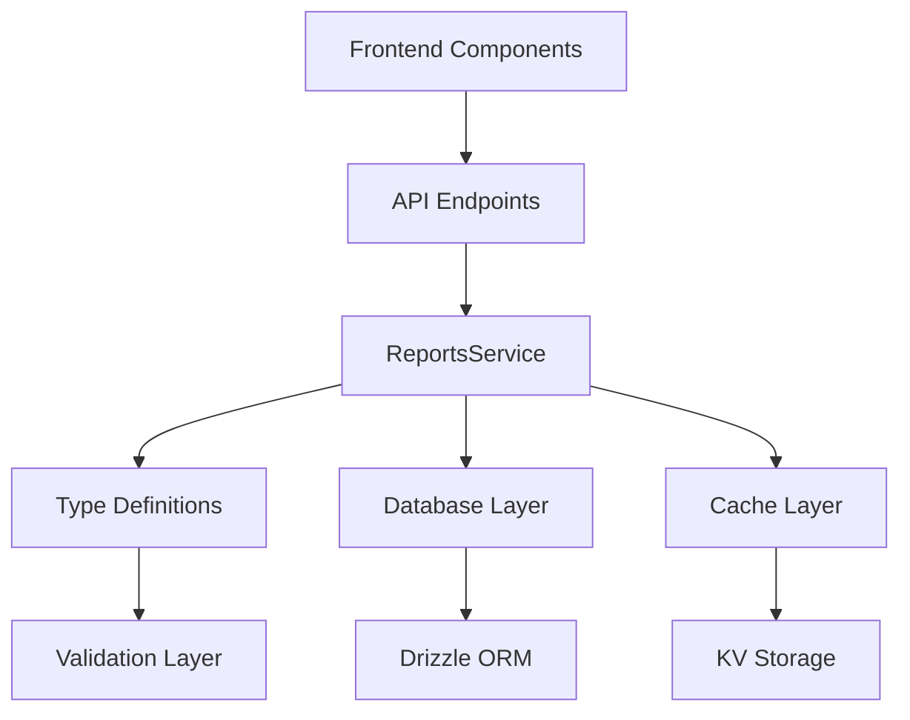

# 報表系統技術規格文檔

## 📋 文檔概覽

本文檔提供多通道客服系統報表模組的完整技術規格，包含所有 19 種報表類型的詳細API規範、資料結構定義和實作指南。

### 版本資訊
- **系統版本**: v2.0.0
- **文檔版本**: v1.0.0
- **最後更新**: 2025-09-26
- **維護者**: 開發團隊

## 🏗️ 系統架構

### 核心架構圖
```
┌─────────────────────────────────────────────────────────────┐
│                    Frontend Layer                           │
│  Vue 3 Components + TypeScript + 報表視覺化                  │
├─────────────────────────────────────────────────────────────┤
│                    API Gateway                              │
│  Hono Router + Authentication + Rate Limiting               │
├─────────────────────────────────────────────────────────────┤
│                    Service Layer                            │
│  ReportsService.ts - 統一報表生成和管理服務                   │
├─────────────────────────────────────────────────────────────┤
│                    Type System                              │
│  TypeScript 嚴格類型定義 + Zod 驗證                          │
├─────────────────────────────────────────────────────────────┤
│                    Data Layer                               │
│  Cloudflare D1 (SQLite) + Drizzle ORM                      │
├─────────────────────────────────────────────────────────────┤
│                    Cache Layer                              │
│  Cloudflare KV + R2 Storage                                │
└─────────────────────────────────────────────────────────────┘
```

### 模組依賴關係


## 📊 報表類型完整清單

### Phase 1: 基礎報表 (10種)
| 類型 | 代碼 | 狀態 | 描述 |
|------|------|------|------|
| 對話摘要 | `conversation_summary` | ✅ | 對話統計和摘要分析 |
| 客服績效 | `agent_performance` | ✅ | 客服人員績效評估 |
| 團隊分析 | `team_analytics` | ✅ | 團隊整體表現分析 |
| 客戶滿意度 | `customer_satisfaction` | ✅ | 滿意度調查結果 |
| 平台使用 | `platform_usage` | ✅ | 平台功能使用統計 |
| 訊息統計 | `message_statistics` | ✅ | 訊息數量和類型統計 |
| 回應時間 | `response_time_analysis` | ✅ | 回應時間分析 |
| 工作負載 | `workload_distribution` | ✅ | 工作負載分配分析 |
| 系統健康 | `system_health` | ✅ | 系統狀態監控 |
| 自定義 | `custom` | ✅ | 用戶自定義報表 |
| 成本分析 | `cost_analysis` | ✅ | 營運成本分析 |
| SLA合規 | `sla_compliance` | ✅ | 服務等級協議合規性 |
| 異常檢測 | `anomaly_detection` | ✅ | 系統異常檢測 |
| 審計追蹤 | `audit_trail` | ✅ | 操作審計記錄 |
| 資源使用 | `resource_utilization` | ✅ | 資源使用效率 |

### Phase 2: 商業智能增強 (5種)
| 類型 | 代碼 | 狀態 | 描述 |
|------|------|------|------|
| 趨勢預測 | `trend_forecast` | ✅ | 30天趨勢和需求預測 |
| 客戶洞察 | `customer_insights` | ✅ | 客戶區段和行為分析 |
| 通道整合 | `channel_integration` | ✅ | 多通道整合效果分析 |
| 目標達成 | `goal_achievement` | ✅ | KPI目標追蹤分析 |
| 自動化成效 | `automation_effectiveness` | ✅ | 自動化ROI分析 |

### Phase 3: 高級分析功能 (4種)
| 類型 | 代碼 | 狀態 | 描述 |
|------|------|------|------|
| 資安風險 | `security_risk` | ✅ | 安全風險評估 |
| 知識庫效能 | `knowledge_base` | ✅ | 知識庫使用分析 |
| 通話品質 | `call_quality` | ✅ | 語音品質分析 |
| 高管摘要 | `executive_summary` | ✅ | 戰略決策支援 |

## 🔧 API 規格

### 基礎端點結構
```
Base URL: /api/reports
Authentication: Bearer Token (JWT)
Content-Type: application/json
```

### 1. 報表生成 API
```http
POST /api/reports/generate
```

#### 請求格式
```typescript
interface ReportGenerationParams {
  type: ReportType;                    // 報表類型
  format: ReportFormat;                // 輸出格式: 'excel' | 'pdf' | 'json' | 'csv' | 'html'
  dateRange: {
    startDate: string;                 // ISO 8601 格式
    endDate: string;                   // ISO 8601 格式
  };
  filters?: Record<string, any>;       // 可選過濾條件
  options?: {
    includeCharts?: boolean;           // 是否包含圖表
    includeSummary?: boolean;          // 是否包含摘要
    template?: string;                 // 模板名稱
  };
}
```

#### 回應格式
```typescript
interface GeneratedReport {
  id: string;                          // 報表唯一ID
  type: ReportType;                    // 報表類型
  format: ReportFormat;                // 輸出格式
  status: ReportStatus;                // 狀態: 'pending' | 'generating' | 'completed' | 'failed' | 'expired'
  title: string;                       // 報表標題
  description?: string;                // 報表描述
  generatedAt: string;                 // 生成時間
  expiresAt: string;                   // 過期時間
  downloadUrl?: string;                // 下載連結
  fileSize?: number;                   // 檔案大小（位元組）
  data?: any;                          // 報表資料（JSON格式時）
  metadata: {
    generatedBy: string;               // 生成者
    executionTime: number;             // 執行時間（毫秒）
    recordCount: number;               // 記錄數量
    version: string;                   // 版本號
  };
  errors?: string[];                   // 錯誤訊息
}
```

### 2. 報表預覽 API
```http
GET /api/reports/preview/{type}
```

#### 回應格式
```typescript
interface ReportPreview {
  type: ReportType;
  title: string;
  description: string;
  estimatedSize: number;               // 預估記錄數量
  availableFormats: ReportFormat[];    // 支援的格式
  requiredPermissions: string[];       // 需要的權限
  sampleData: any;                     // 樣本資料
  config: {
    defaultFilters: Record<string, any>;
    supportedDateRanges: string[];
    maxDateRange: number;              // 最大日期範圍（天）
  };
}
```

### 3. 報表狀態查詢 API
```http
GET /api/reports/{reportId}/status
```

#### 回應格式
```typescript
interface ReportStatus {
  id: string;
  status: 'pending' | 'generating' | 'completed' | 'failed' | 'expired';
  progress?: number;                   // 進度百分比 (0-100)
  estimatedCompletion?: string;        // 預估完成時間
  error?: string;                      // 錯誤訊息
  createdAt: string;
  updatedAt: string;
}
```

### 4. 報表列表 API
```http
GET /api/reports?page=1&limit=20&type=conversation_summary&status=completed
```

#### 查詢參數
```typescript
interface ReportListQuery {
  page?: number;                       // 頁碼（預設: 1）
  limit?: number;                      // 每頁數量（預設: 20）
  type?: ReportType;                   // 過濾報表類型
  status?: ReportStatus;               // 過濾狀態
  startDate?: string;                  // 開始日期
  endDate?: string;                    // 結束日期
  createdBy?: string;                  // 創建者
  sortBy?: 'createdAt' | 'updatedAt' | 'type' | 'status';
  sortOrder?: 'asc' | 'desc';
}
```

#### 回應格式
```typescript
interface ReportListResponse {
  reports: ReportBase[];
  pagination: {
    total: number;                     // 總數量
    totalPages: number;                // 總頁數
    currentPage: number;               // 當前頁碼
    limit: number;                     // 每頁數量
    hasNext: boolean;                  // 是否有下一頁
    hasPrev: boolean;                  // 是否有上一頁
  };
  filters: {
    appliedFilters: Record<string, any>;
    availableFilters: Record<string, any[]>;
  };
}
```

### 5. 報表刪除 API
```http
DELETE /api/reports/{reportId}
```

#### 回應格式
```typescript
interface DeleteResponse {
  success: boolean;
  message: string;
  deletedAt: string;
}
```

### 6. 報表統計 API
```http
GET /api/reports/statistics?timeRange=last_30_days
```

#### 回應格式
```typescript
interface ReportStatistics {
  totalReports: number;
  reportsByType: Record<ReportType, number>;
  reportsByFormat: Record<ReportFormat, number>;
  reportsByStatus: Record<ReportStatus, number>;
  generationTrends: Array<{
    date: string;
    count: number;
    avgExecutionTime: number;
  }>;
  topUsers: Array<{
    userId: string;
    username: string;
    reportCount: number;
  }>;
  systemMetrics: {
    avgExecutionTime: number;          // 平均執行時間（毫秒）
    successRate: number;               // 成功率（百分比）
    totalStorage: number;              // 總儲存空間（位元組）
    peakUsageTime: string;             // 使用高峰時間
  };
}
```

## 📋 資料結構規範

### Phase 2 報表資料結構

#### 1. 趨勢預測報告 (TrendForecastReportData)
```typescript
interface TrendForecastReportData {
  forecastSummary: {
    forecastPeriod: number;            // 預測期間（天）
    confidence: number;                // 信心度百分比 (0-100)
    accuracy: number;                  // 歷史準確度 (0-100)
    lastUpdate: string;                // 最後更新時間 ISO 8601
  };

  conversationTrends: {
    historical: Array<{
      date: string;                    // 日期 YYYY-MM-DD
      actual: number;                  // 實際對話數量
      trend: 'increasing' | 'stable' | 'decreasing';
    }>;
    predicted: Array<{
      date: string;                    // 預測日期
      predicted: number;               // 預測對話數量
      confidenceLow: number;           // 信心區間下限
      confidenceHigh: number;          // 信心區間上限
      scenario: 'optimistic' | 'realistic' | 'pessimistic';
    }>;
  };

  demandForecast: {
    peakHours: Array<{
      hour: number;                    // 小時 (0-23)
      predictedVolume: number;         // 預測流量
      requiredAgents: number;          // 建議客服人數
    }>;
    seasonalPatterns: Array<{
      period: string;                  // 季節/期間
      pattern: string;                 // 模式描述
      multiplier: number;              // 流量倍數
    }>;
    specialEvents: Array<{
      date: string;                    // 事件日期
      event: string;                   // 事件名稱
      expectedImpact: number;          // 預期影響倍數
      type: string;                    // 事件類型
    }>;
  };

  riskAssessment: {
    overloadRisk: number;              // 過載風險百分比
    understaffingRisk: number;         // 人力不足風險
    systemCapacityRisk: number;        // 系統容量風險
    mitigationSuggestions: Array<{
      risk: string;                    // 風險描述
      suggestion: string;              // 建議措施
      priority: 'high' | 'medium' | 'low';
    }>;
  };

  modelPerformance: {
    mape: number;                      // 平均絕對百分比誤差
    rmse: number;                      // 均方根誤差
    lastTraining: string;              // 最後訓練時間
    dataQuality: number;               // 資料品質評分 (0-100)
  };
}
```

#### 2. 客戶洞察報告 (CustomerInsightsReportData)
```typescript
interface CustomerInsightsReportData {
  segmentAnalysis: {
    segments: Array<{
      name: string;                    // 區段名稱
      size: number;                    // 區段大小
      characteristics: string[];       // 特徵描述
      averageValue: number;            // 平均價值
      satisfactionScore: number;       // 滿意度評分
    }>;
    segmentationCriteria: {
      behavioral: string[];            // 行為標準
      demographic: string[];           // 人口統計標準
      psychographic: string[];         // 心理統計標準
    };
  };

  churnPrediction: {
    overallChurnRate: number;          // 整體流失率
    riskCustomers: number;             // 高風險客戶數量
    retentionStrategies: Array<{
      riskLevel: 'high' | 'medium' | 'low';
      customerCount: number;
      recommendedActions: string[];
    }>;
    predictiveFactors: Array<{
      factor: string;                  // 預測因子
      weight: number;                  // 權重 (0-1)
    }>;
  };

  lifecycleAnalysis: {
    newCustomers: number;
    activeCustomers: number;
    returningCustomers: number;
    dormantCustomers: number;
    lifecycleStages: Array<{
      stage: string;                   // 生命週期階段
      count: number;                   // 客戶數量
      conversionRate?: number;         // 轉換率
      retentionRate?: number;          // 保留率
      satisfactionScore?: number;      // 滿意度
      churnRisk?: number;              // 流失風險
    }>;
  };

  behaviorPatterns: {
    commonJourneys: Array<{
      name: string;                    // 旅程名稱
      frequency: number;               // 發生頻率
      steps: string[];                 // 旅程步驟
      conversionRate: number;          // 轉換率
    }>;
    interactionPreferences: Array<{
      channel: string;                 // 通道名稱
      preference: number;              // 偏好度百分比
    }>;
  };
}
```

#### 3. 通道整合報告 (ChannelIntegrationReportData)
```typescript
interface ChannelIntegrationReportData {
  channelMetrics: Array<{
    channelId: string;                 // 通道ID
    channelName: string;               // 通道名稱
    platform: string;                 // 平台名稱 (LINE, Facebook, etc.)
    isActive: boolean;                 // 是否啟用
    connectionStatus: 'connected' | 'disconnected' | 'error';
    performance: {
      messageVolume: number;           // 訊息量
      responseTime: number;            // 回應時間（毫秒）
      successRate: number;             // 成功率
      errorRate: number;               // 錯誤率
    };
    customerSatisfaction: number;      // 客戶滿意度
    lastSyncTime: string;              // 最後同步時間
  }>;

  synchronizationStatus: {
    overallHealth: number;             // 整體健康度百分比
    lastFullSync: string;              // 最後完整同步時間
    pendingSyncs: number;              // 待同步項目數量
    failedSyncs: number;               // 失敗同步數量
    syncErrors: Array<{
      channelId: string;
      error: string;
      timestamp: string;
      retryCount: number;
    }>;
  };

  crossChannelAnalysis: {
    customerJourneys: Array<{
      customerId: string;
      channels: string[];              // 使用的通道
      journeyLength: number;           // 旅程長度（小時）
      touchPoints: number;             // 接觸點數量
      conversionStatus: 'converted' | 'in_progress' | 'abandoned';
    }>;
    channelSwitching: {
      switchingRate: number;           // 通道切換率
      commonPaths: Array<{
        fromChannel: string;
        toChannel: string;
        frequency: number;
        reason: string;
      }>;
    };
  };

  integrationQuality: {
    dataConsistency: number;           // 資料一致性百分比
    messageDelivery: number;           // 訊息傳遞成功率
    realTimeSync: number;              // 即時同步率
    apiLatency: number;                // API延遲（毫秒）
  };
}
```

#### 4. 目標達成報告 (GoalAchievementReportData)
```typescript
interface GoalAchievementReportData {
  goalTracking: Array<{
    goalId: string;                    // 目標ID
    goalName: string;                  // 目標名稱
    category: string;                  // 目標類別
    targetValue: number;               // 目標值
    currentValue: number;              // 當前值
    unit: string;                      // 單位
    completionPercentage: number;      // 完成百分比
    deadline: string;                  // 截止日期
    status: 'on_track' | 'at_risk' | 'behind' | 'completed' | 'failed';
    owner: {
      userId: string;
      name: string;
      department: string;
    };
  }>;

  overallProgress: {
    totalGoals: number;                // 總目標數
    completedGoals: number;            // 已完成目標數
    completionPercentage: number;      // 整體完成率
    averageProgress: number;           // 平均進度
    goalsAtRisk: number;               // 風險目標數
  };

  performanceTrends: {
    monthlyProgress: Array<{
      month: string;                   // 月份 YYYY-MM
      completionRate: number;          // 完成率
      newGoals: number;                // 新增目標數
      achievedGoals: number;           // 達成目標數
    }>;
    departmentPerformance: Array<{
      department: string;
      goalsCount: number;
      completionRate: number;
      averageProgress: number;
    }>;
  };

  recommendations: Array<{
    goalId: string;
    recommendation: string;
    actionItems: string[];
    priority: 'high' | 'medium' | 'low';
    estimatedImpact: string;
  }>;
}
```

#### 5. 自動化成效報告 (AutomationEffectivenessReportData)
```typescript
interface AutomationEffectivenessReportData {
  automationMetrics: {
    totalRules: number;                // 總規則數
    activeRules: number;               // 啟用規則數
    triggeredRules: number;            // 觸發規則數
    successfulExecutions: number;      // 成功執行數
    failedExecutions: number;          // 失敗執行數
    averageExecutionTime: number;      // 平均執行時間（毫秒）
  };

  rulePerformance: Array<{
    ruleId: string;                    // 規則ID
    ruleName: string;                  // 規則名稱
    category: string;                  // 規則類別
    triggerCount: number;              // 觸發次數
    successRate: number;               // 成功率
    averageExecutionTime: number;      // 平均執行時間
    lastTriggered: string;             // 最後觸發時間
    status: 'active' | 'inactive' | 'error';
  }>;

  costSavings: {
    totalSavings: number;              // 總節省金額
    currency: string;                  // 貨幣單位
    savingsByCategory: Array<{
      category: string;                // 節省類別
      amount: number;                  // 節省金額
      percentage: number;              // 佔比
    }>;
    laborSavings: {
      hoursAutomated: number;          // 自動化小時數
      hourlyRate: number;              // 時薪
      totalLaborSaving: number;        // 總人力節省
    };
  };

  roiAnalysis: {
    totalInvestment: number;           // 總投資
    totalReturns: number;              // 總回報
    overallROI: number;                // 整體ROI百分比
    paybackPeriod: number;             // 回本期間（月）
    netPresentValue: number;           // 淨現值
  };

  improvementOpportunities: Array<{
    area: string;                      // 改善領域
    currentState: string;              // 現狀描述
    proposedSolution: string;          // 建議解決方案
    estimatedSavings: number;          // 預估節省
    implementationComplexity: 'low' | 'medium' | 'high';
  }>;
}
```

### Phase 3 報表資料結構

#### 1. 資安風險報告 (SecurityRiskReportData)
```typescript
interface SecurityRiskReportData {
  riskSummary: {
    overallRiskLevel: 'low' | 'medium' | 'high' | 'critical';
    riskScore: number;                 // 風險評分 (0-100)
    lastAssessment: string;            // 最後評估時間
    totalVulnerabilities: number;      // 總漏洞數
    criticalVulnerabilities: number;   // 重大漏洞數
  };

  threatAnalysis: {
    detectedThreats: number;           // 檢測到的威脅數
    activeThreats: number;             // 活躍威脅數
    mitigatedThreats: number;          // 已緩解威脅數
    threatTypes: Array<{
      type: string;                    // 威脅類型
      count: number;                   // 數量
      severity: 'low' | 'medium' | 'high' | 'critical';
      lastDetected: string;            // 最後檢測時間
    }>;
  };

  vulnerabilityAssessment: {
    systemVulnerabilities: Array<{
      vulnerabilityId: string;         // 漏洞ID
      type: string;                    // 漏洞類型
      severity: 'low' | 'medium' | 'high' | 'critical';
      affectedSystems: string[];       // 受影響系統
      discoveredDate: string;          // 發現日期
      status: 'open' | 'in_progress' | 'resolved' | 'accepted';
      cvssScore?: number;              // CVSS評分
    }>;
    complianceStatus: {
      framework: string;               // 合規框架
      overallCompliance: number;       // 整體合規百分比
      requirements: Array<{
        requirement: string;
        status: 'compliant' | 'non_compliant' | 'partial';
        lastChecked: string;
      }>;
    };
  };

  incidentHistory: Array<{
    incidentId: string;                // 事件ID
    type: string;                      // 事件類型
    severity: 'low' | 'medium' | 'high' | 'critical';
    description: string;               // 事件描述
    occurredAt: string;                // 發生時間
    resolvedAt?: string;               // 解決時間
    impact: string;                    // 影響描述
    rootCause?: string;                // 根本原因
  }>;

  recommendedActions: Array<{
    action: string;                    // 建議行動
    priority: 'high' | 'medium' | 'low';
    estimatedEffort: string;           // 預估工作量
    expectedOutcome: string;           // 預期結果
    dueDate?: string;                  // 建議完成日期
  }>;
}
```

#### 2. 知識庫效能報告 (KnowledgeBaseReportData)
```typescript
interface KnowledgeBaseReportData {
  contentMetrics: {
    totalArticles: number;             // 總文章數
    publishedArticles: number;         // 已發布文章數
    draftArticles: number;             // 草稿文章數
    archivedArticles: number;          // 已歸檔文章數
    averageArticleLength: number;      // 平均文章長度（字）
    lastUpdated: string;               // 最後更新時間
  };

  usageAnalytics: {
    totalSearches: number;             // 總搜尋次數
    successfulSearches: number;        // 成功搜尋次數
    searchSuccessRate: number;         // 搜尋成功率
    averageSearchTime: number;         // 平均搜尋時間（毫秒）
    topSearchTerms: Array<{
      term: string;                    // 搜尋詞
      frequency: number;               // 頻率
      successRate: number;             // 成功率
    }>;
    noResultSearches: Array<{
      term: string;                    // 無結果搜尋詞
      frequency: number;               // 頻率
      suggestions?: string[];          // 建議
    }>;
  };

  articlePerformance: Array<{
    articleId: string;                 // 文章ID
    title: string;                     // 標題
    category: string;                  // 分類
    views: number;                     // 瀏覽數
    searches: number;                  // 搜尋命中數
    helpfulVotes: number;              // 有用投票數
    unhelpfulVotes: number;            // 無用投票數
    lastModified: string;              // 最後修改時間
    authorId: string;                  // 作者ID
  }>;

  contentQuality: {
    overallQualityScore: number;       // 整體品質評分 (0-100)
    outdatedContent: number;           // 過期內容數量
    contentGaps: Array<{
      topic: string;                   // 主題
      searchFrequency: number;         // 搜尋頻率
      availableContent: number;        // 可用內容數
      priority: 'high' | 'medium' | 'low';
    }>;
    duplicateContent: Array<{
      articles: string[];              // 重複文章ID
      similarity: number;              // 相似度百分比
    }>;
  };

  maintenanceRecommendations: Array<{
    type: 'update' | 'create' | 'archive' | 'merge';
    articleId?: string;                // 相關文章ID（如適用）
    description: string;               // 描述
    priority: 'high' | 'medium' | 'low';
    estimatedEffort: string;           // 預估工作量
  }>;
}
```

#### 3. 通話品質分析報告 (CallQualityReportData)
```typescript
interface CallQualityReportData {
  qualityMetrics: {
    totalCalls: number;                // 總通話數
    completedCalls: number;            // 完成通話數
    droppedCalls: number;              // 掉話數
    callCompletionRate: number;        // 通話完成率
    averageCallDuration: number;       // 平均通話時長（秒）
    overallScore: number;              // 整體品質評分 (0-10)
  };

  audioAnalysis: {
    clarity: number;                   // 清晰度百分比 (0-100)
    volume: number;                    // 音量適中率 (0-100)
    echo: number;                      // 回音問題率 (0-100)
    backgroundNoise: number;           // 背景噪音率 (0-100)
    audioCodecPerformance: Array<{
      codec: string;                   // 編解碼器
      usage: number;                   // 使用率
      qualityScore: number;            // 品質評分
    }>;
  };

  networkPerformance: {
    latency: {
      average: number;                 // 平均延遲（毫秒）
      p95: number;                     // 95分位延遲
      maximum: number;                 // 最大延遲
    };
    jitter: {
      average: number;                 // 平均抖動（毫秒）
      maximum: number;                 // 最大抖動
    };
    packetLoss: {
      average: number;                 // 平均丟包率
      maximum: number;                 // 最大丟包率
    };
    bandwidth: {
      averageUsage: number;            // 平均頻寬使用（Kbps）
      peakUsage: number;               // 峰值頻寬使用
    };
  };

  deviceAnalysis: Array<{
    deviceType: string;                // 設備類型
    deviceModel?: string;              // 設備型號
    userCount: number;                 // 用戶數量
    callCount: number;                 // 通話數量
    qualityScore: number;              // 品質評分
    commonIssues: string[];            // 常見問題
  }>;

  geographicAnalysis: Array<{
    region: string;                    // 地區
    callCount: number;                 // 通話數量
    qualityScore: number;              // 品質評分
    latency: number;                   // 平均延遲
    connectionIssues: number;          // 連接問題數
  }>;

  improvementRecommendations: Array<{
    category: 'network' | 'audio' | 'device' | 'infrastructure';
    issue: string;                     // 問題描述
    recommendation: string;            // 建議
    priority: 'high' | 'medium' | 'low';
    estimatedImpact: string;           // 預期影響
  }>;
}
```

#### 4. 高管摘要報告 (ExecutiveSummaryReportData)
```typescript
interface ExecutiveSummaryReportData {
  keyMetrics: Array<{
    metric: string;                    // 指標名稱
    currentValue: number;              // 當前值
    previousValue: number;             // 前期值
    changePercentage: number;          // 變化百分比
    trend: 'increasing' | 'decreasing' | 'stable';
    unit: string;                      // 單位
    status: 'good' | 'warning' | 'critical';
  }>;

  businessHighlights: {
    customerSatisfaction: {
      score: number;                   // 滿意度評分
      trend: 'up' | 'down' | 'stable';
      topPositives: string[];          // 主要正面反饋
      topConcerns: string[];           // 主要關注點
    };
    operationalEfficiency: {
      responseTime: number;            // 平均回應時間
      resolutionRate: number;          // 解決率
      costPerContact: number;          // 每次聯繫成本
      agentUtilization: number;        // 客服利用率
    };
    growthMetrics: {
      newCustomers: number;            // 新客戶數
      customerRetention: number;       // 客戶保留率
      revenueGrowth: number;           // 收入成長率
      marketShare: number;             // 市場佔有率
    };
  };

  financialProjections: {
    quarterlyForecast: Array<{
      quarter: string;                 // 季度
      projectedRevenue: number;        // 預測收入
      projectedCosts: number;          // 預測成本
      projectedProfit: number;         // 預測利潤
    }>;
    revenueGrowth: number;             // 收入成長百分比
    costOptimization: number;          // 成本優化百分比
    roi: number;                       // 投資報酬率
  };

  strategicInsights: Array<{
    category: 'opportunity' | 'risk' | 'trend' | 'recommendation';
    title: string;                     // 洞察標題
    description: string;               // 描述
    impact: 'high' | 'medium' | 'low';
    timeframe: 'immediate' | 'short_term' | 'long_term';
    actionRequired: boolean;           // 是否需要行動
  }>;

  competitiveAnalysis: {
    marketPosition: string;            // 市場地位
    competitiveAdvantages: string[];   // 競爭優勢
    marketThreats: string[];           // 市場威脅
    recommendedActions: Array<{
      action: string;                  // 建議行動
      timeline: string;                // 時間線
      expectedOutcome: string;         // 預期結果
    }>;
  };

  nextSteps: Array<{
    priority: 'critical' | 'high' | 'medium' | 'low';
    action: string;                    // 行動項目
    owner: string;                     // 負責人
    deadline: string;                  // 截止日期
    success_criteria: string;          // 成功標準
  }>;
}
```

## 🔒 錯誤處理規範

### 錯誤類別定義
```typescript
// 基礎錯誤類
export class ReportError extends Error {
  constructor(
    message: string,
    public code: string,
    public statusCode: number = 500,
    public details?: any
  ) {
    super(message);
    this.name = 'ReportError';
  }
}

// 具體錯誤類
export class ReportNotFoundError extends ReportError {
  constructor(reportId: string) {
    super(
      `Report with ID ${reportId} not found`,
      'REPORT_NOT_FOUND',
      404,
      { reportId }
    );
  }
}

export class ReportGenerationError extends ReportError {
  constructor(message: string, details?: any) {
    super(message, 'REPORT_GENERATION_ERROR', 500, details);
  }
}

export class InvalidReportParamsError extends ReportError {
  constructor(message: string, invalidParams?: string[]) {
    super(message, 'INVALID_PARAMS', 400, { invalidParams });
  }
}

export class ReportAccessDeniedError extends ReportError {
  constructor(userId: string, reportType: string) {
    super(
      `User ${userId} does not have permission to access ${reportType} reports`,
      'ACCESS_DENIED',
      403,
      { userId, reportType }
    );
  }
}
```

### 標準錯誤回應格式
```typescript
interface ErrorResponse {
  error: {
    code: string;                      // 錯誤代碼
    message: string;                   // 錯誤訊息
    details?: any;                     // 詳細資訊
    timestamp: string;                 // 錯誤時間
    requestId: string;                 // 請求ID
    documentation?: string;            // 文檔連結
  };
}
```

### 常見錯誤代碼
| 代碼 | HTTP狀態 | 描述 | 解決方案 |
|------|----------|------|----------|
| `REPORT_NOT_FOUND` | 404 | 報表不存在 | 檢查報表ID是否正確 |
| `INVALID_PARAMS` | 400 | 參數無效 | 檢查請求參數格式 |
| `ACCESS_DENIED` | 403 | 權限不足 | 檢查用戶權限設定 |
| `REPORT_GENERATION_ERROR` | 500 | 生成失敗 | 檢查系統狀態和資料來源 |
| `RATE_LIMIT_EXCEEDED` | 429 | 請求過於頻繁 | 降低請求頻率 |
| `INVALID_DATE_RANGE` | 400 | 日期範圍無效 | 調整日期範圍參數 |
| `UNSUPPORTED_FORMAT` | 400 | 不支援的格式 | 使用支援的輸出格式 |
| `QUOTA_EXCEEDED` | 429 | 配額超出 | 升級服務計劃或等待配額重置 |

## 🔧 配置管理

### 報表類型配置
```typescript
export const REPORT_TYPE_CONFIG: Record<ReportType, ReportConfig> = {
  // Phase 2 配置範例
  trend_forecast: {
    name: '趨勢預測報告',
    description: '基於歷史資料預測未來30天的對話趨勢和需求',
    category: 'business_intelligence',
    requiredPermissions: ['reports:read', 'analytics:read'],
    supportedFormats: ['json', 'excel', 'pdf'],
    defaultFormat: 'json',
    maxDateRange: 90,                  // 最大日期範圍（天）
    estimatedExecutionTime: 5000,      // 預估執行時間（毫秒）
    cacheTimeout: 3600,                // 快取超時（秒）
    requiredFilters: [],
    optionalFilters: ['teamId', 'channelId'],
    sampleDataGenerator: 'generateSampleTrendForecastData',
  },

  customer_insights: {
    name: '客戶洞察報告',
    description: '深入分析客戶行為、區段和流失預測',
    category: 'business_intelligence',
    requiredPermissions: ['reports:read', 'customers:read'],
    supportedFormats: ['json', 'excel', 'pdf'],
    defaultFormat: 'json',
    maxDateRange: 365,
    estimatedExecutionTime: 8000,
    cacheTimeout: 7200,
    requiredFilters: [],
    optionalFilters: ['customerSegment', 'riskLevel'],
    sampleDataGenerator: 'generateSampleCustomerInsightsData',
  },

  // ... 其他報表類型配置
};
```

### 環境配置
```typescript
interface ReportSystemConfig {
  database: {
    connectionString: string;
    poolSize: number;
    timeout: number;
  };
  cache: {
    provider: 'kv' | 'redis';
    ttl: number;
    namespace: string;
  };
  storage: {
    provider: 'r2' | 's3';
    bucket: string;
    region: string;
  };
  performance: {
    maxConcurrentReports: number;
    reportTimeout: number;
    maxFileSize: number;
  };
  security: {
    enableRateLimit: boolean;
    maxRequestsPerMinute: number;
    requireAuth: boolean;
  };
}
```

## 📝 版本控制

### API版本管理
- **當前版本**: v2.0.0
- **版本格式**: Semantic Versioning (MAJOR.MINOR.PATCH)
- **向後相容性**: 保持至少2個主要版本的相容性
- **廢棄政策**: 提前6個月通知API廢棄

### 變更日誌格式
```markdown
## [2.0.0] - 2025-09-26
### Added
- Phase 2: 5種商業智能報表類型
- Phase 3: 4種高級分析報表類型
- 完整的TypeScript類型定義
- 樣本資料生成器

### Changed
- 擴展ReportType聯合類型
- 更新報表統計API回應格式

### Deprecated
- 無

### Removed
- 無

### Fixed
- 修復報表服務import問題
- 修復統計資料類型不匹配問題
```

---

## 📞 技術支援

### 文檔維護
- **負責團隊**: 後端開發組
- **更新頻率**: 每次主要功能發布
- **審核流程**: 技術經理審核 → 產品經理確認 → 發布

### 問題回報
- **Bug回報**: 使用 GitHub Issues
- **功能請求**: 使用 GitHub Discussions
- **緊急問題**: 聯繫技術負責人

### 相關資源
- [API測試工具](./api-testing-guide.md)
- [部署指南](./deployment-guide.md)
- [故障排除手冊](./troubleshooting-guide.md)
- [性能優化指南](./performance-optimization.md)

---

**文檔版本**: v1.0.0
**最後更新**: 2025-09-26
**下次審核**: 2025-10-26